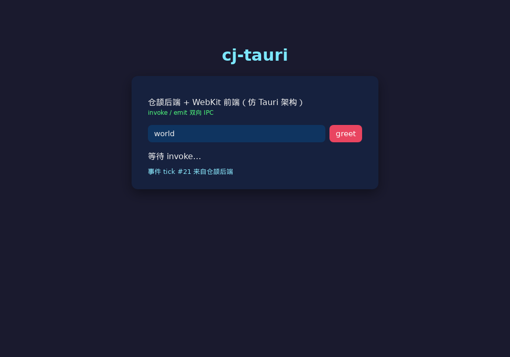
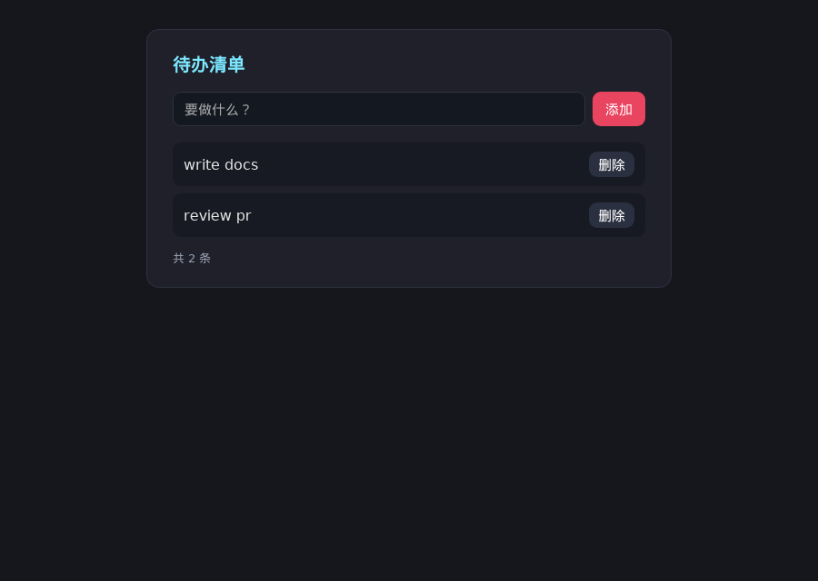
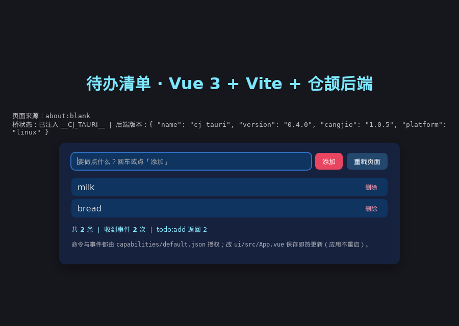
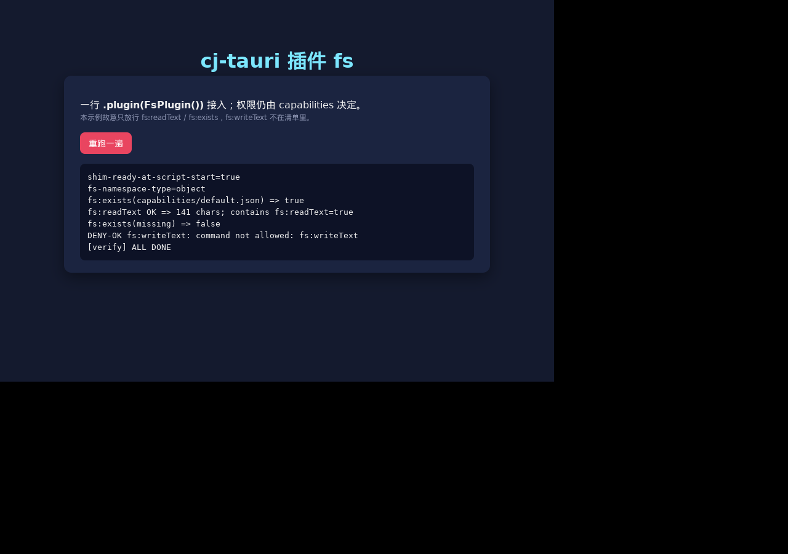
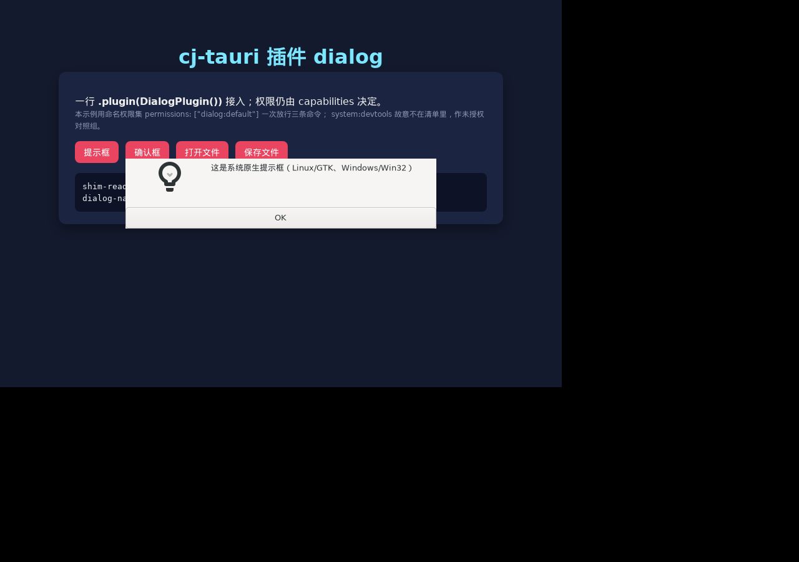
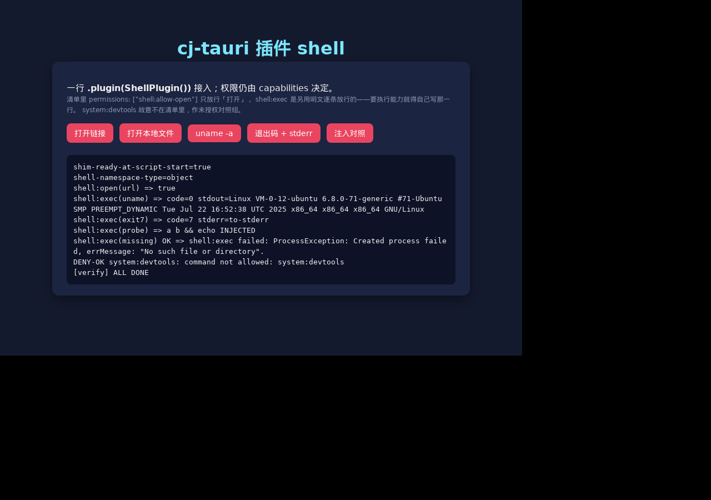
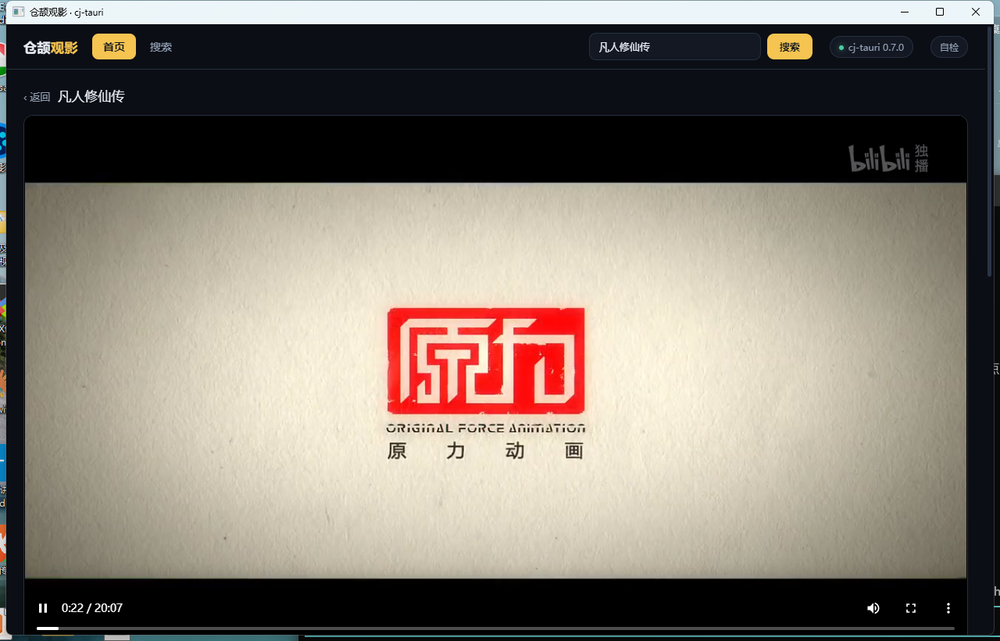
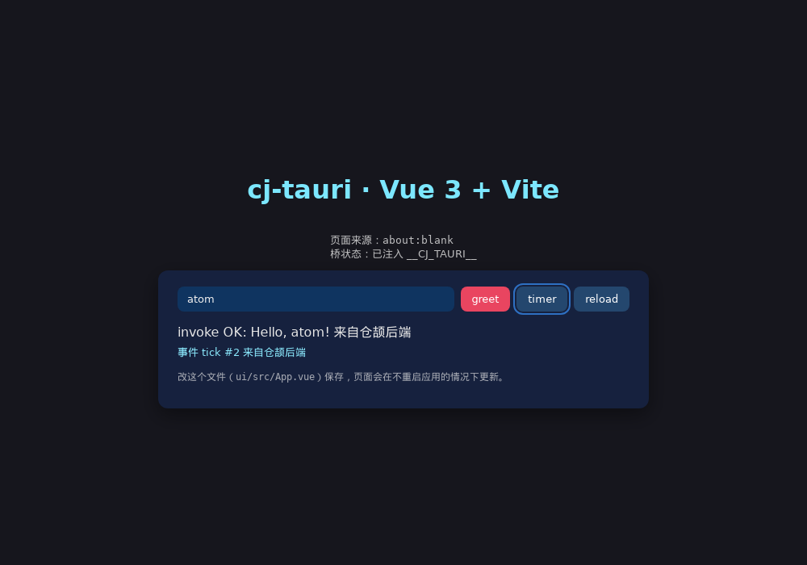

# cj-tauri：仓颉版 Tauri

用华为仓颉语言实现的轻量混合开发框架——仿 Tauri（Rust 后端 + 系统 WebView 前端）架构：
**WebView 宿主 + IPC 双向桥 + 能力安全模型**。前端用任意 Web 技术，后端用仓颉静态编译。

> **第一次用？先看教程：[docs/前端入门教程.md](docs/前端入门教程.md)**——零基础把前端跑起来：
> 目录约定 → 桥 API → 事件 → 能力清单 → 调试 → 完整实战（一个待办清单应用）。
> **使用指南：[docs/使用文档.md](docs/使用文档.md)**——环境准备 → 创建应用 → 开发 → 排障。
> **插件体系教程：[docs/插件体系教程.md](docs/插件体系教程.md)**——插件是干嘛的 → 一行接入官方 `fs` 插件 → 自己写一个 → 排错。
> 可行性论证见 `docs/技术方案.md`；开发过程踩坑与已验证成果见 `docs/踩坑与实施记录.md`。
> **IPC 通信机制：[docs/IPC-通信机制.md](docs/IPC-通信机制.md)**——协议报文 → 完整时序 → 实测性能
> （含与 WebSocket / 裸 TCP 的同机对照）→ 已知限制与优化空间。
>
> **延伸阅读（CSDN）：[用仓颉写桌面应用：一个类 Tauri 框架的实现与使用](https://blog.csdn.net/qq8864/article/details/166944044)**
> ——同主题文档：[docs/仓颉版Tauri-介绍与使用指南.md](docs/仓颉版Tauri-介绍与使用指南.md)（指南体）、`docs/仓颉版Tauri-博客稿.md`（博客体）。
>
> 当前版本 **0.7.0**：变更记录见 [CHANGELOG.md](CHANGELOG.md)，开发规范见 [AGENTS.md](AGENTS.md)，
> 贡献流程见 [CONTRIBUTING.md](CONTRIBUTING.md)，依赖与许可信息见 [README.OpenSource](README.OpenSource)。
>
> 仓库（双托管，一次 `git push` 同步推送两个远端）：
> **AtomGit** <https://atomgit.com/qq8864/cj-tauri> ｜ **GitHub** <https://github.com/yangyongzhen/cj-tauri>
>
> ```bash
> git clone https://atomgit.com/qq8864/cj-tauri.git          # AtomGit（国内直连推荐）
> git clone https://github.com/yangyongzhen/cj-tauri.git     # GitHub
> ```

## 运行效果


*示例应用：深色主题卡片 UI，输入名字点 greet 触发 invoke，底部实时显示仓颉后端推送的 tick 事件。*

## 示例一览

仓内 `examples/` 有八个可直接运行的示例，`cli/templates/` 有三个脚手架工程模板。
下面截图均为**发行态实机截图**（Linux / WebKitGTK，2026-10-02）。

### 示例应用

| 示例 | 说明 | 怎么跑 |
|---|---|---|
| [`examples/hello`](examples/hello) | 最小示例：`greet` 命令（`invoke`）+ `tick` 事件（仓颉 → JS）+ 越权调用被拒。页面 HTML 内联在 `src/main.cj`，**零 Node**。 | `cd examples/hello && cjpm build`，再按上方「运行仓内示例」启动；Windows 可直接 `run_win.bat` |
| [`examples/todo_check`](examples/todo_check) | 《[前端入门教程](docs/前端入门教程.md)》的实战示例：待办清单（添加 / 删除 / 计数）。页面由 `extract.js` 从教程文档抽取，文档与代码同源。 | 同上；Windows 直接双击 `run.bat` |
| [`examples/vue_todo`](examples/vue_todo) | 上面待办的 Vue 3 版：同一套 `todo:add` / `todo:remove` / `todo:list` 命令与 `todo:changed` 事件，前端换成独立的 Vite + Vue 3 工程（`ui/`）。 | 在 `examples/vue_todo` 下用仓库根的 `cli/cj-tauri.sh` 跑 `dev`（接管 Vite dev server，退出自动收掉）或 `build`（`vite-plugin-singlefile` 打成单个 `ui/dist/index.html`） |
| [`examples/plugin-fs`](examples/plugin-fs) | 插件体系示例：一行 `.plugin(FsPlugin())` 接入官方文件读写插件（`fs:readText` / `fs:writeText` / `fs:exists`），并演示**权限仍由 capabilities 决定**——清单故意只放行两条，第三条启动即提示、前端调用被拒。 | `cd examples/plugin-fs && cjpm build`，再按上方「运行仓内示例」启动 |
| [`examples/plugin-dialog`](examples/plugin-dialog) | 插件体系示例：一行 `.plugin(DialogPlugin())` 接入官方**原生对话框**插件（`dialog:open` / `dialog:save` / `dialog:message`），弹的是系统对话框（Linux/GTK、Windows/Win32）；清单用命名权限集一次放行，另带 `system:devtools` 未授权对照组。 | `cd examples/plugin-dialog && cjpm build`，再按上方「运行仓内示例」启动 |
| [`examples/plugin-shell`](examples/plugin-shell) | 插件体系示例：一行 `.plugin(ShellPlugin())` 接入官方 `shell` 插件（`shell:open` / `shell:exec`）——用系统默认程序打开链接、执行子进程取回退出码与输出；**argv 直传不过 shell**（页面拼不出注入），命名集 `shell:allow-open` 只放行打开，另带未授权对照组。 | `cd examples/plugin-shell && cjpm build`，再按上方「运行仓内示例」启动 |
| [`examples/ipc-bench`](examples/ipc-bench) | **IPC 性能探针**：4 组基准（顺序往返延迟 / 管线化吞吐 / payload 放大 / 事件推送成本），前端算完经 `report` 命令回传仓颉侧 stderr；配套 `scripts/bench-ws-vs-tcp.js` 量同机 localhost WebSocket 与裸 TCP 的回环往返做对照。数字与解读见 [docs/IPC-通信机制.md](docs/IPC-通信机制.md)。 | `cd examples/ipc-bench && cjpm build`，再按上方「运行仓内示例」启动（结果在 stderr，以 `BENCH` 开头） |
| [`examples/movie`](examples/movie) | **观影应用**（业务向示例）：后台影视数据（`hotmovie` / `detailmovie` / `mvsource`）全部由**仓颉侧**经 `stdx.net.http` 取回，前端只走 `invoke`——榜单浏览 / 搜索 / 详情 / 播放四个视图，页面是独立 `ui/index.html`（无 Node、无构建）。含页面侧自检（经 `report` 回传 stderr）与 `movie:nope` 未授权对照组。**仅用于学习研究**：影视数据取自第三方公开接口，请先读[用途与免责声明](examples/movie/README.md#用途与免责声明)。 | `cd examples/movie && cjpm build`，再按上方「运行仓内示例」启动；Windows 直接双击 `run.bat` |

`hello`：输入名字点 `greet` → 仓颉返回问候，底部持续显示后端推送的事件（此处 `tick #21`）：



`todo_check`（教程示例）与 `vue_todo`（Vue 3 工程版）——同一套待办命令，前者零 Node、后者用 Vite 工程：





`plugin-fs`：一行接入插件，页面自报验证结果——`shim-ready-at-script-start=true`（插件 JS 早于页面脚本）、
放行过的 `fs:readText` / `fs:exists` 正常返回，未授权的 `fs:writeText` 被拒（对照组）：



`plugin-dialog`：同一个插件体系接系统原生对话框——提示框是宿主弹的模态框（下面这张是它压在主窗口上），
文件框选中的路径经回调回传（`dialog:open => path="/tmp/dialog-pick.txt"`），未授权的 `system:devtools` 仍被拒：



`plugin-shell`：同一个插件体系接系统默认程序与子进程——`shell:open` 把链接交给系统处理器（实测用假浏览器
冒充默认程序，它收到的参数正是 `https://atomgit.com`），`shell:exec` 取回退出码与 stdout / stderr，
参数里的 `&&` 原样输出（argv 直传、不经过 shell）；未授权的 `system:devtools` 仍被拒：



> **`movie` 仅供学习研究**：它只演示「宿主侧取数 + 系统 WebView 前端」这条链路，自身**不提供任何影视资源**；
> 片名、封面、剧集与播放地址均来自互联网上的第三方公开接口，版权归原权利人所有。请勿用于商业用途、
> 批量抓取或二次传播影视内容。完整声明见 [`examples/movie` 的用途与免责声明](examples/movie/README.md#用途与免责声明)。

`movie`：业务向示例——影视数据（榜单 / 搜索 / 详情 / 播放源）全部走**仓颉侧** `stdx.net.http` 取回，
前端只走 `invoke`（连封面图都经宿主取，页面里没有一处 `fetch`）。首页榜单：


播放页——HLS 经 hls.js 真在播，下方是集数按钮与「播放源」胶囊（点一下即切源、保留当前集数）：



### 前端工程模板

| 模板 | 说明 |
|---|---|
| [`cli/templates/app`](cli/templates/app) | 缺省模板：HTML/CSS/JS 内联，零 Node，`cj-tauri create` 默认用它 |
| [`cli/templates/app-vue`](cli/templates/app-vue) | Vue 3 + Vite：`cj-tauri create myapp --template vue` |
| [`cli/templates/app-react`](cli/templates/app-react) | React 18 + Vite：`cj-tauri create myapp --template react` |

两个 UI 模板的示例页面（版面逐像素一致：深色底、内容整列居中、卡片式；`greet` 走 `invoke`，`timer` 演示后端事件回投）：

| Vue 3 模板 | React 18 模板 |
|---|---|
|  |  |

## 架构（对标 Tauri 三件套）

```
前端 (HTML/CSS/JS)  ← window.__CJ_TAURI__.invoke/listen/emit（注入桥接 JS，对标 @tauri-apps/api）
        │  JSON over postMessage（Linux: WebKitUserContentManager script message；Windows: chrome.webview.postMessage）
        ▼
IPC 消息桥（src/ipc_hub.cj）← 命令注册/分发/校验（对标 tauri IPC）
        ▼
能力安全模型（src/capability.cj）← 命令/事件白名单，默认最小权限（对标 capability）
        ▼
内置命令（src/api_system.cj）：system:version / system:ping / system:echo / system:devtools
        ▼
WebView 宿主（src/host.cj 抽象 + 各平台实现）
   ├─ Linux: webkit2gtk-4.1（src/host_webkit.cj + native/bridge_linux.c，C 桥在原生 pthread 运行）
   ├─ Windows: WebView2（src/host_webview2.cj + native/bridge_win.c，Win32 消息循环在宿主线程）
   └─ 鸿蒙: ArkWeb（架构预留，条件编译位）
```

## 目录结构

```
cj-tauri/
├── cj-env.sh              # 仓颉 SDK 环境变量（Linux 用）
├── run_win.bat            # Windows 一键运行仓内示例（配好运行时/stdx/桥 DLL 的 PATH）
├── cjpm.toml              # 框架库（cjTauri，静态库）
├── src/                   # 框架核心（纯仓颉）
│   ├── ipc_message.cj     # IPC 协议模型（invoke/resolve/event）
│   ├── ipc_hub.cj         # 命令注册/分发/校验中心
│   ├── capability.cj      # 能力安全模型
│   ├── capability_loader.cj # capabilities/ 目录自动扫描加载
│   ├── window.cj          # 窗口配置模型（标题/尺寸/devtools/图标）
│   ├── api_system.cj      # 内置系统命令
│   ├── host.cj            # WebViewHost 抽象接口
│   ├── host_webkit.cj     # Linux WebKit 宿主（FFI + C 桥）
│   ├── host_webview2.cj   # Windows WebView2 宿主（FFI + C 桥）
│   └── app.cj             # TauriApp 装配（对标 tauri::Builder）
├── native/
│   ├── bridge_linux.c     # Linux C 桥（GTK/WebKit 原生线程宿主）
│   ├── bridge_win.c       # Windows C 桥（Win32 窗口 + WebView2）
│   ├── build_win.bat      # Windows 桥构建（含 WebView2 SDK / x64 loader 同步）
│   ├── build_linux.sh     # Linux 桥构建
│   ├── test_host_win.c    # Windows 桥隔离测试宿主
│   └── webview2/          # 与本机 Runtime 同代的 WebView2Loader.dll（构建时同步，不入库）
├── examples/hello/        # 示例应用（greet + tick 事件 + 越权演示）
├── examples/todo_check/   # 教程实战示例（待办清单，前端页面由 `extract.js` 从教程文档抽取）
├── examples/vue_todo/     # todo_check 的 Vue 3 版（同一套命令与事件，前端是 Vite 工程）
├── examples/ipc-bench/    # IPC 性能探针（4 组基准，结果打 stderr；数字见 docs/IPC-通信机制.md）
├── examples/movie/        # 观影应用（后台影视数据全由仓颉侧取，前端独立 ui/index.html，四个视图）
├── cli/                   # 脚手架 CLI（仓颉实现，跨平台）
│   ├── cj-tauri.sh        # Linux / macOS / Git Bash 启动器（首次运行自动构建 CLI）
│   ├── cj-tauri.bat       # Windows 启动器
│   ├── src/               # CLI 源码：resolve / scaffold / project / main
│   └── templates/         # 工程模板（占位符渲染，按宿主平台注入依赖与链接段）：app（零 Node）/ app-vue / app-react
└── docs/                  # 使用文档 + 前端入门教程 + 技术方案 + 踩坑记录（截图统一放 docs/images/）
```

> `cli/cj-tauri` 是早期 bash 版 CLI，功能已被 `cli/src` 的仓颉实现完全覆盖，保留仅作参考。

## 快速开始

前提（详见[使用文档](docs/使用文档.md#2-环境准备)）：

- **仓颉 SDK**（验证版本 1.2.0）+ **stdx**；
- PATH 需包含 SDK 的 `runtime/lib/<平台>`、`bin`、`tools/bin`、`tools/lib`（官方 `envsetup` 的布局），
  或只设 `CANGJIE_HOME` 交给 `cli/cj-tauri.sh` / `cli/cj-tauri.bat` 自动补齐；stdx 路径可用 `CANGJIE_STDX` 指定；
- Windows：mingw gcc + WebView2 Runtime（Win11 自带）+ WebView2 SDK（仅编译桥时需要）；
  Linux：`libwebkit2gtk-4.1-dev`、`libgtk-3-dev`。

### 用 npm 安装（跨平台，推荐）

```bash
npx cj-tauri create myapp          # 免安装，直接跑
cd myapp
npx cj-tauri dev

npm i -g cj-tauri                  # 或全局安装，之后直接 cj-tauri <子命令>
```

npm 包把「平台差异 + 仓颉环境自检 + CLI 本体的获取」收进一个入口：Windows / Linux / Git Bash 同一条命令，
不再分 `.bat` 与 `.sh`。CLI 本体优先用包内预编译二进制（`prebuilt/<平台-架构>/`），没有就用本机 `cjpm` 构建一次，
缓存到 `~/.cache/cj-tauri/<版本>/`（Windows 为 `%LOCALAPPDATA%\cj-tauri`），不往安装目录写产物；
找不到仓颉 SDK 时直接给出安装说明与 `CANGJIE_HOME` 示例（退出码 1），而不是 `cjpm: command not found`。
仓库内的 `cli/cj-tauri.sh` / `cli/cj-tauri.bat` 仍然可用（开发 / CI 用）。

打包与发布：**首版手工发**（需要 npm 账号 2FA），此后每次推 `v*` tag 由 GitHub Actions 自动发布
（npm trusted publishing / OIDC，不需要任何 token，自动附 provenance）：

```bash
bash scripts/npm-pack.sh                        # 只打包 → dist-npm/cj-tauri-<版本>.tgz
bash scripts/npm-pack.sh --publish --otp 123456 # 打包并发布（动态码 = 你 2FA 应用里的 6 位码）
```

> `--otp` 不能省：账号开了「写操作需 2FA」时，`npm login` 的浏览器登录态只证明你是谁，发布仍要一次性动态码，
> 否则报 `E403 … granular access token with bypass 2fa enabled is required`。npm 也不给尚不存在的包配置
> trusted publisher，所以**首版只能手工发一次**，自动发布从下一个版本开始。

发布固定走官方 registry（`https://registry.npmjs.org/`，可用 `NPM_PUBLISH_REGISTRY` 覆盖），脚本会先做登录预检。
包在 npm 上需一次性绑定 GitHub 仓库与 workflow 文件名（步骤见 `AGENTS.md` §6）。CI 环境没有仓颉 SDK，
所以 CI 打的包不含预编译 CLI、用户首次运行在本机源码构建；要带 `prebuilt/` 就用本机 `npm-pack.sh`。

### Windows 上跑起来（本机验证组合）

cjc 1.2.0 + WebView2 Runtime 122.0.2365.106 + WebView2 SDK 1.0.2365.46：

```bat
REM 只需指两个目录：SDK 根目录与 stdx；其余 PATH 由启动器按 envsetup 布局补齐
set "CANGJIE_HOME=D:\Program Files (x86)\Cangjie"
set "CANGJIE_STDX=D:\cangjie-stdx\windows_x86_64_cjnative\dynamic\stdx"

cd /d E:\path\to\cj-tauri
cli\cj-tauri.bat info                 REM 先自检：框架/项目/stdx/SDK/cjpm/桥 是否都解析得到
cli\cj-tauri.bat create D:\temp\myapp
cd /d D:\temp\myapp
E:\path\to\cj-tauri\cli\cj-tauri.bat dev
```

> 启动器内置两个默认值，不设也能跑本机验证组合：`CANGJIE_HOME` 默认
> `D:\Program Files (x86)\Cangjie`；桥构建默认 WebView2 SDK `D:\webview2sdk\sdk-1.0.2365.46`
> （改 `native\build_win.bat` 顶部即可换版本）。

用脚手架建一个新应用（首次运行会自动构建 CLI 本体）：

```bash
# Linux / macOS / Git Bash
./cli/cj-tauri.sh create myapp
cd myapp
./cli/cj-tauri.sh dev        # 构建 C 桥 + cjpm build + 启动窗口
```

```bat
REM Windows cmd
cli\cj-tauri.bat create myapp
cd myapp
..\..\cli\cj-tauri.bat dev
```

`cj-tauri` 子命令：`create` / `dev` / `build` / `run` / `info [--json]` / `help`。
`dev`/`build`/`run` 会自动为子进程准备「桥（含 `native/webview2`）+ stdx + 仓颉运行时」的动态库搜索路径，
不必手工拼 `PATH` / `LD_LIBRARY_PATH`；`cj-tauri info` 可打印全部路径解析结果，排障先跑它，
末段还会列出已装配的插件清单（`info --json` 只输出这份 JSON，给工具 / CI 管道用）。

### 运行仓内示例（不用脚手架）

Windows：
```bat
REM 1. 编译 C 桥（SDK 路径与版本要求见 native\build_win.bat 顶部）
native\build_win.bat

REM 2. 编译示例应用
cd examples\hello && cjpm build

REM 3. 运行（run_win.bat 已配好 Cangjie 运行时 / stdx / 桥 DLL 的 PATH）
run_win.bat
```

Linux：
```bash
# 1. 编译 C 桥
cd native && ./build_linux.sh && cd ..

# 2. 编译并运行示例应用（应用以项目根为工作目录）
cd examples/hello && cjpm build
LD_LIBRARY_PATH=../../native:$(stdx路径):$LD_LIBRARY_PATH ./target/release/bin/main
```

> Windows 注意：编译桥所用 WebView2 SDK 版本应与机器上的 WebView2 Runtime 版本兼容
> （SDK 不高于运行时；本机运行时 122.0.2365.106 对应 SDK 1.0.2365.46）。
> 运行时版本查询命令见 `native/build_win.bat` 注释。
>
> Git Bash 注意：往 `PATH` 里塞路径必须用 POSIX 形式（`/d/...`），写成 `D:/...` 会让依赖仓颉运行时
> DLL 的原生进程启动失败（退出码 127 且无输出）；`cli/cj-tauri.sh` 已内置该转换。

## 开发一个应用

```cangjie
import cjTauri.*
import stdx.encoding.json.*

// 1. 实现命令（对标 tauri command）
public class GreetCommand <: CommandHandler {
    public init() {}
    public func handle(cmd: String, args: JsonObject, ipc: IpcContext): JsonValue {
        var name = "world"
        if (let Some(n) <- args.get("name")) {
            match (n.kind()) {
                case JsonKind.JsString => name = n.asString().getValue()
                case _ => ()
            }
        }
        return JsonString("Hello, ${name}!")
    }
}

main(): Int64 {
    // 2. 装配：窗口配置 + 注册命令（对标 tauri::Builder 与 tauri.conf.json 的 app.windows）
    let app = TauriApp()
        .window(WindowConfig("hello", 1000, 700))   // 标题 / 宽 / 高；cfg.devTools = false、cfg.iconPath = "icon.ico"
        .register("greet", GreetCommand())
    // 3. 启动（阻塞）：能力清单由 run() 自动扫描 capabilities/ 目录
    //    （也可显式 app.loadCapabilities(dir) 或 app.addCapabilityJson(json)，见「能力安全模型」）
    app.run(html)
    return 0
}
```

前端侧：

```js
// 注入的桥：window.__CJ_TAURI__
const tauri = window.__CJ_TAURI__;
tauri.invoke('greet', { name: '仓颉' }).then(d => console.log(d));  // JS → 仓颉
tauri.listen('tick', p => console.log(p));                          // 仓颉 → JS 事件
```

> 桥由宿主注入（Linux `DOCUMENT_START`｜Windows document-created，都在页面脚本之前），但**注入时机属于实现细节**：
> 发行态单文件里的内联 `<script type="module">` 与新宿主实现谁先谁后，不该由应用来赌。
> 稳妥做法是初始化时**等桥出现**再 `invoke` / `listen`（`app-vue` / `app-react` 模板的 `waitForBridge` 即范例），
> 不要在模块作用域直接读 `window.__CJ_TAURI__`。

## 能力安全模型

- 应用在 `capabilities/` 声明 `commands`/`events` 白名单；
- `run()` 时若没有显式挂载任何清单，框架会**自动扫描 `capabilities/` 下的所有 `json` 文件**（对标 Tauri）；
- 显式挂载优先：调用过 `loadCapabilities(dir)` 或 `addCapabilityJson(json)` 后就不再自动扫描；
- **未声明命令一律拒绝**（默认最小权限），返回 `command not allowed: xxx`；
- 未声明事件不投递到页面；
- 校验层独立于宿主实现，鸿蒙 ArkWeb 后端复用同一套。

## 关键技术点（务必阅读）

1. **仓颉 cjnative 的 main 运行在 M:N 轻量级线程的堆上协程栈**，
   JSC（WebKit 的 JS 引擎）的 `sanitizeStackForVM` 用 pthread 栈边界校验 SP 会 **abort**。
   → 解决方案：GTK/WebKit 全部调用必须在 **C 桥创建的原生 pthread** 内执行，
   仓颉侧经 FFI 调用，消息回调经 `CFunc` 回到仓颉。
2. 原生→JS 的脚本投递用 **FIFO 队列 + g_idle_add**，不能单槽位覆盖。
3. 仓颉迭代 String 得到的是 **UInt32 码点**（非 Rune），`Rune(cp)` 还原字符。
4. stdx 的 JSON（`JsonValue.fromStr`）是 1.0.5 的 JSON 方案，标准库无 `std.json`。
5. **Windows（WebView2）：回调里拿到的 `ICoreWebView2Environment` / `Controller` 必须自己 AddRef 持有**，
   否则回调返回后对象即被释放，WebView2 会立刻关掉浏览器进程——现象是窗口空白、导航完成事件不触发、
   `ExecuteScript` 返回 `0x8007139F`（E_ILLEGAL_METHOD_CALL）。

## 现状与路线

- ✅ MVP（Linux 桌面）：WebView 宿主 + IPC 双向 + capability + 内置命令 + 示例
- ✅ Windows 桌面：WebView2 后端（`src/host_webview2.cj` + `native/bridge_win.c`），IPC/capability 与 Linux 完全共用
- ✅ 脚手架 CLI（仓颉原生实现，`cli/`）：`create` / `dev` / `build` / `run` / `info`，Windows + Linux
  双平台启动器（`cli/cj-tauri.sh` / `cli/cj-tauri.bat`），首次运行自动构建 CLI 本体
- ✅ 使用文档：`docs/使用文档.md`
- ✅ 介绍与使用指南：`docs/仓颉版Tauri-介绍与使用指南.md`；CSDN 博客版
  [《用仓颉写桌面应用：一个类 Tauri 框架的实现与使用》](https://blog.csdn.net/qq8864/article/details/166944044)
- ✅ P1：capability 文件自动加载、窗口配置化（标题 / 尺寸 / devtools / 图标）
- ✅ 工程化打底：`scripts/test.sh`（`cjpm test` 单元测试，78 个用例）与 `scripts/check-static.sh`
  （不需要仓颉 SDK 的静态门禁，双远端 CI 跑的就是它）
- ✅ P3：热重载与前端框架模板（宿主加 `runUrl` / `loadUrl` / `reload`；`cj-tauri dev` 接管 Vite dev server，
  Vue 3 / React 18 模板，HMR 在窗口内生效）、`cj-tauri build` 打单文件前端产物
- 🔜 P2：鸿蒙 ArkWeb 后端（`host_harmony.cj`，需 DevEco + 真机）、macOS WebView
- ✅ 插件体系 v1：`TauriApp.plugin(...)` + `Plugin` 接口（插件命令统一注册成 `<插件名>:<短名>`，
  与内置 `system:*` 同形，分发与校验零改动；**权限仍由 `capabilities/` 决定**，插件不自动放行）、
  官方 `fs` 插件（`fs:readText` / `fs:writeText` / `fs:exists`）与 `examples/plugin-fs` 示例；
  设计取舍见 [`docs/RFC-插件体系.md`](docs/RFC-插件体系.md)，
  上手教程见 [`docs/插件体系教程.md`](docs/插件体系教程.md)
- ✅ 官方插件三件套：`fs`（文件读写）、`dialog`（系统原生对话框）、`shell`（交给系统默认程序打开 / 执行子进程；
  命名集 `shell:allow-open` / `shell:default`，argv 直传不过 shell）——各带示例（`examples/plugin-*`）与 Linux 实机证据
- ✅ 命令执行异步分发：通过校验的命令在 worker 线程上跑，慢命令（`shell:exec` 跑进程、原生对话框）不再钉住窗口；
  未授权 / 未注册仍在调用线程上同步拒绝，并发调用不保序、按 promise id 匹配。实机 A/B 对照见 `CHANGELOG.md`
- ✅ 插件清单机器可读：框架函数 `describePluginsJson()`（不动 `Plugin` 接口）+ `cj-tauri info [--json]`——
  CLI 让应用「跑到装配完成但不创建窗口」一次取回清单，无显示环境也能拿到真实装配结果
- ✅ 窗口注册表 + label 路由（纯仓颉）：`TauriApp` 持 `WindowRegistry`（label → per-window 宿主 + 配置），
  桥 JS **懒读**宿主注入的 `window.__CJ_TAURI_LABEL__`，上行报文带 `window` 字段（协议增量，旧前端不受影响），
  `emitToWindow` 真正按窗口投递（未注册 label 打 stderr，不静默）；新增应用级 `AppHost`
  （`quit()` / `waitForExit()` / `hostOf(label)`）与 `WebViewHost.label()`。单窗口行为与旧版等价，
  多窗口 UI 与回调身份（架构文档 §7.5）留批次 3
- 🔜 更多官方插件（托盘、全局快捷键等需要宿主层先有对应 API）

## 验证结果

Linux（2026-08-21）：

| 验证项 | 结果 |
|---|---|
| `invoke("greet")` JS→仓颉→JS | ✅ `Hello, 仓颉! 来自仓颉后端` |
| 内置命令 `system:ping` | ✅ `pong` |
| capability 越权 `system:rm` | ✅ 拒绝 `command not allowed` |
| 未注册命令 `no_such_cmd` | ✅ 拒绝 |
| 事件推送 `tick`（仓颉→JS） | ✅ 11+ 条到达前端 |
| UI 真实渲染 | ✅ 截图确认（深色主题卡片 + 按钮） |

Windows / WebView2（2026-10-01，cjc 1.2.0 + Runtime 122.0.2365.106 + SDK 1.0.2365.46）：

| 验证项 | 结果 |
|---|---|
| C 桥构建 `native\build_win.bat` | ✅ `libcjtbridge.dll` + 同步 `webview2\WebView2Loader.dll` |
| 示例应用启动（WebView2） | ✅ 窗口创建、环境/控制器就绪、HTML 导航 `hr=0x0` |
| 脚手架 CLI 构建与自检 | ✅ `cjpm build success`；`cj-tauri info` 正确解析框架/项目/stdx/SDK/cjpm/桥 |
| `cj-tauri create` 生成工程 | ✅ 6 个文件，`cjpm.toml` 路径转义、mingw 链接段、stdx 段均正确 |
| 新工程 `cj-tauri build` | ✅ `target/release/bin/main.exe` |
| 新工程 `cj-tauri run` | ✅ 窗口显示，JS→原生双向通信（62/48 字节消息，`ExecuteScript hr=0x0`） |
| 窗口图标 `cfg.iconPath = "icon.ico"` | ✅ 桥日志 `set icon: path=icon.ico` → `window icon: path=icon.ico loaded (big=0x… small=0x…)`，标题栏 / 任务栏 / Alt-Tab 生效 |
| 单元测试 `bash scripts/test.sh` | ✅ 78/78 通过（IPC 分发、能力校验、版本常量、插件体系 / 命名权限集 / 对话框 / shell / 清单导出） |

Linux / WebKitGTK（2026-10-02，cjc 1.2.0 + stdx 1.0.5.1；证据取自桥的 stderr 日志）：

| 验证项 | 结果 |
|---|---|
| 示例应用 `examples/hello`（本地单文件 HTML） | ✅ 窗口创建、`greet` / `system:ping` / `system:version` 正确、越权 `system:rm` 拒绝、`tick` 事件持续到达前端 |
| `TauriApp.runUrl` 加载 URL 页面（M1） | ✅ `load url: http://127.0.0.1:8123/`，静态服务器侧收到 3 次 GET（首载 + 2 次重载） |
| 后端 `TauriApp.reload()` | ✅ 重载后页面重新加载并再次 `js -> native`，重载后桥仍可用 |
| 前端 `window.__CJ_TAURI__.reload()` | ✅ `frontend requested reload` → 页面第二次加载 |
| 窗口图标 `cfg.iconPath`（GTK） | ✅ `window icon: path=icon.png ok=1` |
| `cj-tauri dev` 接管 Vite dev server（Vue 模板） | ✅ `dev server 就绪` → 注入 `CJ_TAURI_DEV_URL` → 页面来自 5173；应用退出后 `dev server 已收掉（pid=… 及后代）`，vite / esbuild 无残留 |
| HMR 在窗口内生效 | ✅ 改 `App.vue` 后页面标记 `v1-short` → `v2-much-longer-text`，启动计数仍为 1（无整页刷新） |
| Ctrl-C 中止 `cj-tauri dev` | ✅ CLI 与 app 随 SIGINT 退出，dev server 因留在同一进程组被一并收掉，无残留 |
| React 18 模板 `cj-tauri dev` | ✅ 页面探针 3 次上报 `href=http://127.0.0.1:5173/`；退出后相关进程 CLEAN |
| `cj-tauri build`（Vue 模板） | ✅ `npm run build` + `vite-plugin-singlefile` → `ui/dist/` 只有 `index.html`（63.4 KB）→ `cjpm build success` |
| 示例工程构建 | ✅ `examples/hello` / `examples/todo_check` / `examples/vue_todo` 均 `cjpm build success` |
| `examples/ipc-bench`（IPC 基准，Xvfb） | ✅ 6 组基准全部出数：顺序往返 390.5 µs/次、未授权拒绝 349 µs/次、管线化 11905 ops/s、1 MB 回显 19.3 ms（51.8 MB/s）、事件 0.04 ms/条，末行 `BENCH done`；**回投直派 + 批处理**前后对照（同机、同一份应用二进制只换 C 桥，各 3 轮取中位）：吞吐 6024 → 11905 ops/s、事件 0.105 → 0.04 ms/条、顺序往返 386.5 → 390.5 µs（噪声内）；对照 `scripts/bench-ws-vs-tcp.js` 同机 WebSocket 0.151 ms / 裸 TCP 0.077 ms |
| `cj-tauri info` 取插件清单（`DISPLAY` 故意 unset） | ✅ `examples/plugin-shell`：末段 `shell  shell:open, shell:exec`；`info --json` 解析出 `['shell']`；直跑应用 stderr `已导出插件清单（mode=json）：本轮未创建窗口` 且 `set window:` 行数 = 0；陈旧产物 / 非项目目录均明确跳过 |

> 窗口图标是 2026-10-02 补的：Windows 端用 Win32 两档图标（`LoadImageW` + `WM_SETICON`）、
> Linux 端用 GTK 的 `gtk_window_set_icon_from_file`，两端均已实机验证（见上两节末行）。

npm 包（2026-10-02，Node v22.22.0 / npm 10.9.4；`bash scripts/npm-pack.sh` → `npm i ./dist-npm/cj-tauri-0.4.0.tgz`）：

| 验证项 | 结果 |
|---|---|
| 打包 | ✅ `cj-tauri-0.4.0.tgz` 1.2 MB / 55 文件（框架源码 + CLI 源码与模板 + `prebuilt/linux-x64/cj-tauri`）；`node_modules` / `dist` / `target` 未进包 |
| 预编译分支 | ✅ `cj-tauri info` 用包内 `prebuilt/linux-x64/cj-tauri`，框架根解析为安装目录，stdx / SDK / cjpm / 运行时全部就位 |
| 源码构建回落 | ✅ 删掉 `prebuilt/` 并清缓存后：`正在构建 CLI 本体（cjpm build）` → 缓存到 `~/.cache/cj-tauri/0.4.0/linux-x64/`；再次运行命中缓存不再构建 |
| `create` 链路 | ✅ 生成的 `myapp/cjpm.toml` 框架依赖指向安装目录；在生成的工程里 `cj-tauri info` 正常 |
| 缺 SDK 提示 | ✅ SDK 目录里没有 `cjpm` 时给出安装说明 + `CANGJIE_HOME` 示例，退出码 1；`--version` 不依赖 SDK，返回 `cj-tauri 0.4.0` |

## 仓库与推送

同一份代码双托管，**一次 `git push` 同时推送两个远端**——`origin` 挂了两条 pushurl，fetch 仍只走 AtomGit：

| 远端 | 地址 | 说明 |
|---|---|---|
| AtomGit | `https://atomgit.com/qq8864/cj-tauri.git` | 主仓，`origin` 的 fetch 源 |
| GitHub | `https://github.com/yangyongzhen/cj-tauri.git` | 同步备份，走 HTTPS（内网/受限网络可在本地配置 URL 改写走代理） |

```bash
git remote -v                 # origin 会列出两条 push 地址
git push                      # 一次推送 → AtomGit + GitHub 各推一次
git push github main          # 只想推 GitHub 时用命名远端
git ls-remote origin main     # 核对两个仓的 commit SHA 是否一致
git ls-remote github main
```

## License

本项目以 [MIT](LICENSE) 协议开源 © 2026 yangyongzhen
