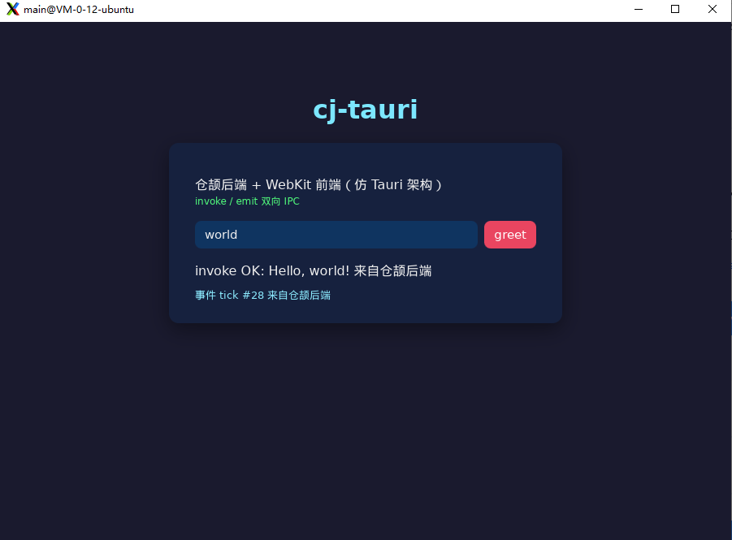

# cj-tauri：仓颉版 Tauri

用华为仓颉语言实现的轻量混合开发框架——仿 Tauri（Rust 后端 + 系统 WebView 前端）架构：
**WebView 宿主 + IPC 双向桥 + 能力安全模型**。前端用任意 Web 技术，后端用仓颉静态编译。

> 可行性论证见 `docs/技术方案.md`；开发过程踩坑与已验证成果见 `docs/踩坑与实施记录.md`。

## 运行效果



*示例应用：深色主题卡片 UI，输入名字点 greet 触发 invoke，底部实时显示仓颉后端推送的 tick 事件。*

## 架构（对标 Tauri 三件套）

```
前端 (HTML/CSS/JS)  ← window.__CJ_TAURI__.invoke/listen/emit（注入桥接 JS，对标 @tauri-apps/api）
        │  JSON over postMessage（WebKitUserContentManager script message）
        ▼
IPC 消息桥（src/ipc_hub.cj）← 命令注册/分发/校验（对标 tauri IPC）
        ▼
能力安全模型（src/capability.cj）← 命令/事件白名单，默认最小权限（对标 capability）
        ▼
内置命令（src/api_system.cj）：system:version / ping / echo
        ▼
WebView 宿主（src/host_webkit.cj + native/bridge.c）
   ├─ Linux: webkit2gtk-4.1（C 桥在原生 pthread 运行，见下方关键点）
   └─ 鸿蒙: ArkWeb（架构预留，条件编译位）
```

## 目录结构

```
tauri_cj/
├── cj-env.sh              # 仓颉 SDK 环境变量
├── cjpm.toml              # 框架库（cjTauri，静态库）
├── src/                   # 框架核心（纯仓颉）
│   ├── ipc_message.cj     # IPC 协议模型（invoke/resolve/event）
│   ├── ipc_hub.cj         # 命令注册/分发/校验中心
│   ├── capability.cj      # 能力安全模型
│   ├── api_system.cj      # 内置系统命令
│   ├── host.cj            # WebViewHost 抽象接口
│   ├── host_webkit.cj     # Linux WebKit 宿主（FFI + C 桥）
│   └── app.cj             # TauriApp 装配（对标 tauri::Builder）
├── native/bridge.c        # C 桥（GTK/WebKit 原生线程宿主）
├── examples/hello/        # 示例应用（greet + tick 事件 + 越权演示）
├── cli/cj-tauri           # 脚手架 CLI
└── docs/                  # 技术方案 + 踩坑记录
```

## 快速开始

```bash
# 1. 环境
source cj-env.sh            # CANGJIE_HOME / PATH / LD_LIBRARY_PATH
# 依赖：libwebkit2gtk-4.1-dev libgtk-3-dev

# 2. 编译 C 桥
cd native && gcc -shared -fPIC -fstack-protector-all bridge.c \
    -o libcjtbridge.so $(pkg-config --cflags --libs webkit2gtk-4.1) && cd ..

# 3. 示例应用
cd examples/hello && cjpm build
LD_LIBRARY_PATH=../../native:$(stdx路径):$LD_LIBRARY_PATH ./target/release/bin/main

# 4. 脚手架创建新项目
cd /tmp && cj-tauri create myapp && cd myapp
cj-tauri dev                 # 构建 + 运行
cj-tauri build               # 仅构建
```

## 开发一个应用

```cangjie
import cjTauri.*
import stdx.encoding.json.*

// 1. 实现命令（对标 tauri command）
public class GreetCommand <: CommandHandler {
    public init() {}
    public func handle(cmd: String, args: JsonObject, ipc: IpcContext): JsonValue {
        var name = "world"
        if (let Some(n) <- args.get("name")) {
            match (n.kind()) {
                case JsonKind.JsString => name = n.asString().getValue()
                case _ => ()
            }
        }
        return JsonString("Hello, ${name}!")
    }
}

main(): Int64 {
    // 2. 装配 + 注册 + 能力清单（对标 capabilities/*.json）
    let app = TauriApp()
        .register("greet", GreetCommand())
    app.addCapabilityJson(JsonValue.fromStr("""
        {"identifier":"default","windows":["main"],
         "commands":["greet","system:version"],
         "events":[]}"""))
    // 3. 启动（阻塞）
    app.run(html)
    return 0
}
```

前端侧：

```js
// 注入的桥：window.__CJ_TAURI__
const tauri = window.__CJ_TAURI__;
tauri.invoke('greet', { name: '仓颉' }).then(d => console.log(d));  // JS → 仓颉
tauri.listen('tick', p => console.log(p));                          // 仓颉 → JS 事件
```

## 能力安全模型

- 应用在 `capabilities/` 声明 `commands`/`events` 白名单；
- **未声明命令一律拒绝**（默认最小权限），返回 `command not allowed: xxx`；
- 未声明事件不投递到页面；
- 校验层独立于宿主实现，鸿蒙 ArkWeb 后端复用同一套。

## 关键技术点（务必阅读）

1. **仓颉 cjnative 的 main 运行在 M:N 轻量级线程的堆上协程栈**，
   JSC（WebKit 的 JS 引擎）的 `sanitizeStackForVM` 用 pthread 栈边界校验 SP 会 **abort**。
   → 解决方案：GTK/WebKit 全部调用必须在 **C 桥创建的原生 pthread** 内执行，
   仓颉侧经 FFI 调用，消息回调经 `CFunc` 回到仓颉。
2. 原生→JS 的脚本投递用 **FIFO 队列 + g_idle_add**，不能单槽位覆盖。
3. 仓颉迭代 String 得到的是 **UInt32 码点**（非 Rune），`Rune(cp)` 还原字符。
4. stdx 的 JSON（`JsonValue.fromStr`）是 1.0.5 的 JSON 方案，标准库无 `std.json`。

## 现状与路线

- ✅ MVP（Linux 桌面）：WebView 宿主 + IPC 双向 + capability + 内置命令 + 示例 + CLI
- 🔜 P1：capability 文件自动加载、窗口配置化、devtools 开关
- 🔜 P2：鸿蒙 ArkWeb 后端（`host_harmony.cj`，需 DevEco + 真机）、Windows/macOS WebView
- 🔜 P3：前端框架模板（React/Vue）、插件体系

## 验证结果（2026-08-21）

| 验证项 | 结果 |
|---|---|
| `invoke("greet")` JS→仓颉→JS | ✅ `Hello, 仓颉! 来自仓颉后端` |
| 内置命令 `system:ping` | ✅ `pong` |
| capability 越权 `system:rm` | ✅ 拒绝 `command not allowed` |
| 未注册命令 `no_such_cmd` | ✅ 拒绝 |
| 事件推送 `tick`（仓颉→JS） | ✅ 11+ 条到达前端 |
| UI 真实渲染 | ✅ 截图确认（深色主题卡片 + 按钮） |
| `cj-tauri create` 生成项目 | ✅ 独立构建运行 |
