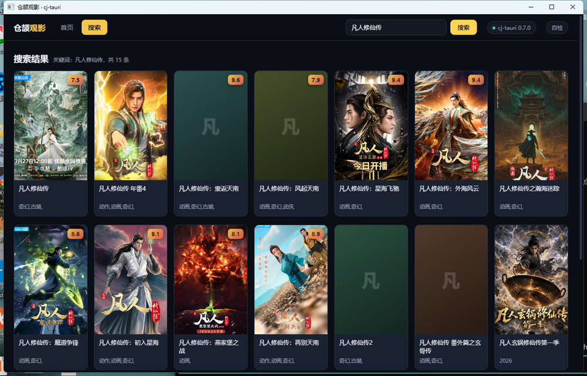
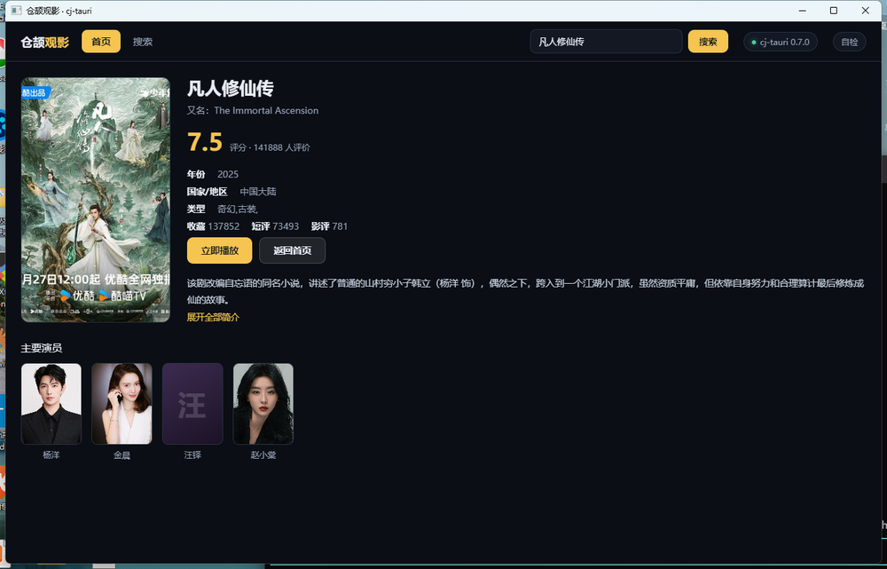

# cj-tauri 是什么，以及怎么拿它写一个观影应用

结论先放前面：**cj-tauri 是一个用仓颉写桌面应用的框架**。你写仓颉当后端，写 HTML/CSS/JS 当前端，
它负责把两边缝起来——开窗口、把页面塞进系统 WebView、传消息、管权限。跟 Tauri 的思路一模一样，
只是把 Rust 换成了仓颉，前端那套（Web 技术栈）一点没变。

这篇文章分两半。前半讲「它是什么、怎么装、怎么起一个工程」，内容不深，照着敲就行；
后半拿仓库里的 `examples/movie` 当案例——那是一个能看片的桌面应用，我把它的目录、
命令层、HTTP 层、前端逐块拆开讲。想直接跑起来，跳到第 5 节；想自己起一个，从头看。

先说清楚：这一路上我踩过的坑都会写进去（尤其是三条跟网络有关的），不粉饰。踩坑的地方我标了「实测」。

---

## 1. 它到底是个什么东西

一句话拆成三个零件，这个框架就是这三样：

| 零件 | 干什么 | 对标 Tauri 的 |
| --- | --- | --- |
| **WebView 宿主** | 开窗口、载入页面、注入桥接脚本 | tao / wry |
| **IPC 桥** | 前端 `invoke` ↔ 后端命令，双向传 JSON | tauri IPC |
| **能力白名单** | 命令和事件要显式授权，不写进清单就用不了 | capabilities |

如果你写过 Tauri，看这张表就够了：`TauriApp()` ≈ `tauri::Builder`，`CommandHandler` ≈ `#[tauri::command]`，
`capabilities/*.json` 还是那个`capabilities`。没写过也没关系，后文会讲。

平台现状（我不写「理论上支持」这种话，只写跑过的）：

- **Windows**：WebView2，实机跑通，本机 Runtime `122.0.2365.106`，截图和日志都是真跑出来的；
- **Linux**：WebKitGTK，实机跑通；
- **鸿蒙 ArkWeb**：留了条件编译位，还没实现。

仓库在 AtomGit 上：<https://atomgit.com/qq8864/cj-tauri>。当前版本 0.7.0。

那你为什么不直接用 Tauri？理由就两条：一是你想用仓颉（比如后面要上鸿蒙 PC，或者团队本来就写仓颉）；
二是想看一个只有几千行的、能读懂的实现——Tauri 那套东西工程化程度很高，改起来不轻松。
如果你既不需要仓颉也不需要读源码，Tauri 或者 Electron 都是更省事的选择，这话我得说明白。

## 2. 把环境弄对，比什么都重要

这一步有个特点：**弄错了不会告诉你哪错了**，要么报个莫名其妙的错，要么直接退出码 127、一个字都不打印。
所以我把三个前提按「出错时最像见鬼」的顺序排：

1. **仓颉 SDK**：验证过 1.2.0（含 stdx）。`CANGJIE_HOME` 指向 SDK 根目录，
   或者干脆 source SDK 自带的 `envsetup` 脚本。PATH 里需要 `runtime/lib/<平台>`、`bin`、
   `tools/bin`、`tools/lib` 这几项——官方 `envsetup` 就是这个布局。
2. **stdx**：框架和各示例的 `cjpm.toml` 都依赖它。不想改任何配置就把
   `CANGJIE_STDX` 设成 stdx 动态库目录（例如 `D:\cangjie-stdx\...\dynamic\stdx`）。
3. **平台依赖**：
   - Windows：`mingw-w64` 的 gcc（编 C 桥用）+ WebView2 Runtime（Win11 自带）+ WebView2 SDK（**只有编译桥时才需要**）。
     WebView2 有个硬规矩：**SDK 版本不得高于本机 Runtime**，本机 Runtime 是 `122.0.2365.106`，
     那就用 SDK `1.0.2365.46`。装高了不会当场报错，是运行时崩。
   - Linux：`libwebkit2gtk-4.1-dev`、`libgtk-3-dev`，外加 `gcc`、`pkg-config`。

Git Bash 用户额外记一条（这条我踩过）：往 `PATH` 里塞路径必须用 **POSIX 形式**（`/d/Program Files/...`），
写成 `D:/Program Files/...` 会被 MSYS 弄坏，结果是依赖仓颉运行时 DLL 的原生进程**退出码 127、无任何输出**。
好在 `cli/cj-tauri.sh` 内部自己做了这个转换，你用启动器就不必操心。

## 3. 起一个工程

别手写 `cjpm.toml`，那里面有一堆本机路径，手写纯属给自己找事。仓库自带 CLI（仓颉写的），
首次运行它会自己 `cjpm build` 一次：

```bat
REM Windows
D:\path\to\cj-tauri\cli\cj-tauri.bat create myapp
cd myapp
D:\path\to\cj-tauri\cli\cj-tauri.bat dev
```

```bash
# Linux / macOS / Git Bash
/path/to/cj-tauri/cli/cj-tauri.sh create myapp
cd myapp
/path/to/cj-tauri/cli/cj-tauri.sh dev
```

`dev` 干的事是：构建 C 桥 → `cjpm build` → 起窗口，一直阻塞到你把窗口关掉。
不想 clone 仓库也行，有 npm 包：`npx cj-tauri create myapp`，CLI 本体优先用包里的预编译二进制，
没有就本机构建一次缓存起来。

工程生成出来是这六个文件：

```
myapp/
├── cjpm.toml                  # 构建配置：框架依赖 + 各平台 link-option + stdx 路径
├── src/main.cj                # 仓颉入口：窗口配置 + 注册命令 + 启动
├── ui/index.html              # 前端页面（随你，Vue/React 也行，见下）
├── capabilities/default.json  # 能力白名单
├── README.md
└── .gitignore
```

三个模板可选：默认的 `app`（HTML/CSS/JS 全内联，零 Node，最省事）、
`create myapp --template vue`、`--template react`（后两个带 `ui/` 前端工程，`cj-tauri dev` 会接管 Vite dev server，
改代码在窗口里热更）。

**生成物是「本机绑定」的**：`create` 会把框架目录和你机器上 stdx 的**绝对路径**写进 `cjpm.toml`。
所以换机器、换目录，要么重跑 `create`，要么手改那两个路径。入仓库的示例都改成了相对路径（`path = "../.."`），
不然别人克隆下来编不过。

### CLI 就这几个子命令

| 命令 | 作用 |
| --- | --- |
| `create <项目名>` | 生成工程（`my-app` 会转成仓颉包名 `myApp`） |
| `dev` | 构建桥 + 构建应用 + 起窗口（阻塞） |
| `build` | 构建桥 + 构建应用，产物在 `target/release/bin/main[.exe]` |
| `run` | 只运行已经构建好的产物 |
| `info` | 环境自检：框架 / 项目 / stdx / SDK / cjpm / 桥 分别解析到哪，末段列已装配的插件（**排障第一步**） |
| `info --json` | 只吐插件清单 JSON，给工具或 CI 用 |
| `help` | 帮助 |

`dev` / `build` / `run` 会自动给子进程准备好动态库搜索路径（桥 + `native/webview2/` + stdx + 仓颉运行时），
不用像手动跑那样自己拼 `PATH` / `LD_LIBRARY_PATH`。这是我用下来最省事的一点：
同一个命令，Windows、Linux、Git Bash 下都能跑。

### 加一个自己的命令：三处联动，缺一处就用不了

这是 cj-tauri 最需要记的一条规矩，也是新人最常卡的地方。拿一个 `greet` 命令举例：

**第一处，实现 `CommandHandler`**（`src/main.cj` 或你自己拆的文件里）：

```cangjie
public class GreetCommand <: CommandHandler {
    public init() {}
    public func handle(cmd: String, args: JsonObject, ipc: IpcContext): JsonValue {
        var name = "world"
        if (let Some(n) <- args.get("name")) {
            match (n.kind()) {
                case JsonKind.JsString => name = n.asString().getValue()
                case _ => ()
            }
        }
        return JsonString("你好，${name}")
    }
}
```

**第二处，注册**：

```cangjie
let app = TauriApp()
    .window(WindowConfig("我的应用", 1000, 700))
    .register("greet", GreetCommand())   // ← 这里
```

**第三处，在能力清单里声明**（`capabilities/default.json`）：

```json
{
  "identifier": "default",
  "windows": ["main"],
  "commands": ["greet"],
  "events": []
}
```

漏了第三处，前端会拿到 `command not allowed`；漏了第二处，是 `command not registered`。
这两条报错正好是两道体检，别把它们当同一个问题。

前端调用就三行（`invoke` / `listen` / `emit`，全挂在 `window.__CJ_TAURI__` 上）：

```js
await window.__CJ_TAURI__.invoke('greet', { name: '仓颉' });  // 调后端命令
window.__CJ_TAURI__.listen('tick', p => { /* 后端推来的事件 */ });
window.__CJ_TAURI__.emit('foo', { a: 1 });                    // 前端发事件
```

一个提醒：别在模块作用域直接读 `window.__CJ_TAURI__`。桥是宿主注入的，注入时机是「页面脚本执行前」，
但发行态单文件里的内联模块脚本和它谁先谁后，不该由你的业务代码去赌。
稳妥做法是初始化时轮询等桥出现（官方 Vue / React 模板里的 `waitForBridge` 就是干这个的）。

---

## 4. 接下来看案例：`examples/movie`

讲 API 太干，我拿仓库里的观影应用当例子。选它不是因为好玩，是因为它把这条链路走到底了：

- 数据**全部**由仓颉侧取（榜单、搜索、详情、播放源、连封面图都是），前端里**一处 `fetch` 都没有**；
- 七个命令、一份收窄到最小的能力清单；
- 图片走宿主侧（因为防盗链），播放要引 hls.js，还有剧集/电影两种数据形状要分流；
- 每个命令都在 stderr 留一行日志，实机验收不用开 devtools。

> **先说清用途**：`examples/movie` 只用于技术学习与研究。它**不提供、不存储、不托管任何影视资源**，
> 片名、简介、封面、剧集与播放地址都取自第三方公开接口（`http://49.235.52.102:8000`），版权归原权利人。
> 别拿它商用、批量抓取或二次传播；自己动手时请把接口换成**自己的 mock 或测试数据**。
> 完整声明在 [`examples/movie/README.md` 的「用途与免责声明」](../examples/movie/README.md#用途与免责声明)。

它长这样——首页榜单、搜索、详情三个视图：






另外还有第四个视图：播放页。剧集片源在播放器下面会排出一列集数按钮，多源的时候上面还有一行「播放源」胶囊，
点一下换源、保留当前集数。这屏我没截图（画面里是第三方影视内容，不适合往仓库里放），
它是否正常以日志为准，第 9 节会说看哪几行。

## 5. 跑起来

前置就是第 2 节那三件（SDK + stdx + WebView2），外加一条：**C 桥要先构建一次**。
`native/libcjtbridge.dll`（Linux 是 `.so`）是本地产物、不入库，所以拉下代码得自己编一遍：

```bat
native\build_win.bat
```

然后直接双击 / 执行示例自带的启动脚本：

```bat
examples\movie\run.bat
```

`run.bat` 帮你做四件事，都是为了省掉手工拼环境的麻烦：

1. `cjpm build`；
2. 把 SDK 运行时、stdx、C 桥目录、`native\webview2` 全塞进 `PATH`；
3. **切到 `examples\movie` 再启动**——应用的 `capabilities/` 和 `ui/index.html` 都是按相对路径读的，
   工作目录不对就白搭（这条坑很常见，报错信息里也写了）；
4. 把应用 stderr 落到 `%TEMP%\cj-movie-app.log`，退出后自动摘出 `[movie]` 和 `[frontend]` 两类行。

顺带说一句为什么 `.bat` 里一个中文注释都没有：cmd.exe 是按 OEM 码页读 `.bat` 的，
UTF-8 的中文注释会把**后续整行**吞掉，甚至让脚本解析崩掉。这条是实测踩过的，
所以这个仓库有硬规矩——所有 `.bat` / `.ps1` 保持纯 ASCII，还写了脚本在检查它。

## 6. 代码是怎么分的

整个示例连前端一共七个文件，加起来不到 3000 行：

```
examples/movie/
  cjpm.toml                  # 应用包：依赖框架 + 各平台 link-option + stdx 路径
  capabilities/default.json  # 能力白名单：commands 就是命令名列表
  run.bat                    # Windows 启动脚本（纯 ASCII）
  src/main.cj                # 装配：窗口配置 → 注册七个命令 → 读页面 → run()
  src/api.cj                 # HTTP 传输层：TLS、超时、Referer、按块读流、图源白名单
  src/commands.cj            # 七个命令 + 参数读取/校验的助手
  ui/index.html              # 前端单页（HTML+CSS+JS 一体，无构建、无 Node）
```

三个仓颉文件的分工是刻意拆的：`main.cj` 只管装配，`api.cj` 只管网络，`commands.cj` 只管
「前端传上来的参数 → 该调哪个接口」。业务一多，全塞进 `main.cj` 会失控，这个尺寸的项目就该拆。

至于 `ui/index.html` 为什么是**独立文件**、而不是像仓库里其他示例那样内联进 `main.cj` 的三引号字符串——
因为一整页 UI 内联进去必然踩两个坑：① 三引号字符串会处理反斜杠转义，JS 里的 `\n`、正则会被仓颉先吃掉，
导致整段 `<script>` 语法错误，**而 stderr 一个字都不提示**，页面里一行都不执行（我们自己踩过，
排查了半天才发现是字符串的锅）；② `${...}` 插值和 JS 模板字面量同形，写模板串就等于往仓颉的插值里塞代码。
独立成文件后两个问题都没有，还能用 `node --check` 验语法。页面读进来的方式是：

```cangjie
let html = loadMovieUi()                       // 读 ui/index.html，返回 String
eprintln("[movie] 前端页面已载入：${MOVIE_UI_PATH}（${html.size} 字节）")
app.run(html)                                  // 交给宿主开窗口
```

最后那句 `eprintln` 不是随手加的。这个项目的实机取证**以 stderr 为准**：仓颉 `println` 的 stdout 有缓冲，
进程被强杀时日志就丢了，而桥和自己打的 stderr 每行即时落盘。所以整个示例的日志一律走 `eprintln`。

---

## 7. 拆开看实现

### 7.1 入口：`main.cj` 只做三件事

配窗口、注册命令、把页面交给 `run()`。真的就这些：

```cangjie
main(): Int64 {
    eprintln("[movie] main start")
    eprintln("[movie] 后台接口：${movieApiBase()}（可用环境变量 CJ_MOVIE_API 覆盖）")

    var winCfg = WindowConfig("仓颉观影 · cj-tauri", 1280, 820)

    let app = TauriApp()
        .window(winCfg)
        .register("movie:list", MovieListCommand())
        .register("movie:search", MovieSearchCommand())
        .register("movie:detail", MovieDetailCommand())
        .register("movie:source", MovieSourceCommand())
        .register("movie:sourceitem", MovieSourceItemCommand())
        .register("movie:image", MovieImageCommand())
        .register("report", ReportCommand())

    let html = loadMovieUi()
    eprintln("[movie] 前端页面已载入：${MOVIE_UI_PATH}（${html.size} 字节）")
    app.run(html)
    return 0
}
```

窗口给 1280×820 是因为片单要横着排得开。能力清单没在这里出现——`run()` 会自动去扫
`capabilities/` 目录下的所有 json，这也是为什么清单文件改了不用动代码。

`report` 这条命令值得单独提一句：它什么业务都不干，只是把前端传来的字符串打到 stderr 上。
听着简陋，但它是这个项目的验收通道——页面跑在 WebView 里，不开 devtools 你看不见它的结论，
有了这条命令，页面自检的结果就能和仓颉侧的日志落在同一个文件里。

### 7.2 命令层：页面传上来的一切都不可信

`commands.cj` 里的七个命令结构都一样：读参数 → 校验 → 调后台 → 原样返回 JSON。
真正费笔墨的是**校验**，因为页面可控的字符串有三个会被拼进 URL：

```cangjie
func isSafeSid(sid: String): Bool {        // 拼进路径 /api/v1/mvsource/<sid>
    if (sid.size == 0 || sid.size > 32) { return false }
    for (cp in sid) {                      // 迭代 String 拿到的是 UInt32 码点
        if (cp < 48 || cp > 57) { return false }   // 只放行数字
    }
    return true
}
func isSafeSourceNote(note: String): Bool  // 拼进查询串 ?note=<note>：只放行 a-z 0-9 _ -
func isSafeSourceAid(aid: String): Bool    // 只放行数字；单文件源（电影）的合法取值是空串
```

不校验会怎样？`sid` 拼的是路径，等于给后台开了一个「任意路径」入口（`../../` 那种）。
`note` 放行集我刻意收窄到 `[a-z0-9_-]`，这样拼查询串时连百分号转义都不用写——少一处转义，
就少一处「转义写错、静默换了个源」的诡异 bug。

`aid` 允许空串是有原因的：单文件源（电影）在后台的 `aid` 就是 `""`，这是**合法的真实取值**，
所以空串放行、拼接时把整个参数省掉。这种「看起来该拒其实是合法值」的边界，看接口文档看不出来，
得实测一次。

还有一个容易忽略的校验——`count` 夹上限：

```cangjie
let n = if (count <= 0) { MOVIE_PAGE_SIZE } else if (count > 60) { 60 } else { count }
```

页面要是传个 `count: 100000`，后台就会去上游抓十万条，轻则拖慢、重则被限流。
**命令层就是系统边界**，这类夹取就该在这里做。

命令里出错直接用 `throw CommandException("...")`，它的消息会变成前端 `catch` 到的错误文本，
所以别写「操作失败」这种废话，把原因写清楚（比如 `未知榜单 kind="xx"（可选 hot/new/soon/top/week/us）`）。

命令和后台接口的对应关系，一张表：

| 命令 | 参数 | 后台接口 |
| --- | --- | --- |
| `movie:list` | `kind, start?, count?, city?` | `POST /api/v1/<kind>movie`（`kind` = hot/new/soon/top/week/us） |
| `movie:search` | `q, start?, count?` | `POST /api/v1/searchmovie` |
| `movie:detail` | `id` | `POST /api/v1/detailmovie` |
| `movie:source` | `sid` | `GET /api/v1/mvsource/{sid}` |
| `movie:sourceitem` | `sid, note, aid?` | `GET /api/v1/mvsourceitem/{sid}?note=&aid=` |
| `movie:image` | `url` | 无（仓颉侧把图片取回来） |
| `report` | `line` | 无（只打 stderr） |

### 7.3 HTTP 层：三个必踩的地方

`api.cj` 是这个示例里信息量最大的文件，因为它替所有命令做了同一件事——发请求。这里有三条
「不知道就会栽」的事。

**第一，TLS 必须显式配。** 仓颉的 HTTP 客户端不带默认 TLS，发 https 请求直接抛
`HttpException: TLS must be configured when HTTPS requests are sent.`：

```cangjie
func newMovieHttpClient(): Client {
    return ClientBuilder()
        .tlsConfig(TlsClientConfig())        // ← 少这一行，https 请求全灭
        .readTimeout(Duration.second * MOVIE_API_TIMEOUT_SECONDS)
        .writeTimeout(Duration.second * MOVIE_API_TIMEOUT_SECONDS)
        .autoRedirect(true)
        .build()
}
```

这条坑的阴险之处在于：后台接口是 `http://` 的，所以一直好好的；等我去取封面（`https://`）时，
**54 次取图全军覆没**，才回头看出来是 TLS 没配。`TlsClientConfig()` 默认走系统证书库校验，
别图省事关掉校验——那等于把这条通道交给中间人。

**第二，响应体不能 `readToEnd` 一把梭。** `std.io.readToEnd(resp.body)` 编译不过：
它的约束是 `T <: InputStream & Seekable`，而 `HttpResponse.body` 的**静态类型只有 `InputStream`**，
能 seek 的是它的实现类，编译期看不见。所以得自己按块读到 EOF：

```cangjie
func readBodyBytes(body: InputStream): Array<Byte> {
    let buf = ByteBuffer()
    let chunk = Array<Byte>(8192, repeat: 0)
    var n = body.read(chunk)
    while (n > 0) {
        if (n == chunk.size) { buf.write(chunk) } else { buf.write(chunk[0..n]) }
        n = body.read(chunk)
    }
    return buf.bytes()
}
```

**第三，取响应头用 `getFirst`，没有 `get`。** 写成 `resp.headers.get("Content-Type")` 会得到
「enum pattern is not matched」这种完全不指向问题本身的报错——这种错误信息值得记下来，
下次见到就知道大概是什么类型不对。

另外两个设计上的选择：

- **每次调用现建一个 client**，不做连接池共享。因为命令是在 worker 线程上执行的，
  跨线程共用一个 client 的连接池属于我没验证过的用法；宁可多花一次建连，也不埋一个偶发串包的雷。
- **超时设 20 秒**。后台有一半接口是「现抓上游」的，上游不通它自己会卡到超时然后回 503；
  这边不设超时的话，前端那条 `invoke` 就一直转圈，用户看到的是「卡住」而不是「失败」——这两种体感差很多。

失败还要分两级处理，这个分类影响前端显示：

| 级别 | 形状 | 处理 |
| --- | --- | --- |
| 传输级 | 连不上 / 非 200 / 响应不是 JSON | 抛 `CommandException`，前端 `catch` 到错误 |
| 业务级 | HTTP 200，但 `data` 是空的，`message` 写着 `403 Forbidden` 之类 | **原样返回给页面**，由页面显示成一行提示 |

第二级如果也在命令层抛异常，页面就只能整页报错；而它其实是「这一个接口今天被限流了」，
应该显示在列表位置上。所以 `movieApiCall` 把后台的 JSON 原封不动交给前端，不裁字段。

### 7.4 封面图：为什么非得绕仓颉侧

这是整个示例里我最想让人看见的一段，因为它的失败形状特别坑：**HTTP 200，但 body 是 0 字节**。

后台给的封面全是防盗链资源。实测对比（同一张图）：

| 请求 | 结果 |
| --- | --- |
| 百度图片代理 + `Referer: https://image.baidu.com/` | 200，26628 字节，`image/jpeg` |
| 同一地址 + 其它 Referer（或不带） | **200，0 字节** |
| 豆瓣原图 + `Referer: https://movie.douban.com/` | 200，26628 字节 |
| 同一原图不带该 Referer | 418 |

页面侧没法补救：浏览器只允许用 `Referrer-Policy` **减少** Referer、不允许**替换**，
何况页面是宿主塞进来的（来源是 opaque），根本发不出图源要的那个 Referer。
所以封面只能由仓颉侧取——想带什么头就带什么头：

```cangjie
let resp = client.send(HttpRequestBuilder()
    .url(url).get()
    .header("Referer", referer)                  // 图源认这个
    .header("User-Agent", MOVIE_BROWSER_UA)      // 有些图源还要看 UA
    .header("Accept", "image/avif,image/webp,image/apng,image/*,*/*;q=0.8")
    .build())
```

取回来的字节转成 `data:image/jpeg;base64,...` 交给页面。这里有两个细节：

- **图源要白名单**。`movie:image` 的参数是页面可控的**任意地址**，不校验的话这个命令就是
  「让后端替你请求任意 URL」的跳板（SSRF）。所以只放行后台确实会给的两家图源，
  其它一律拒掉。
- **单张限 5MB**。不然一次 `invoke` 能把几十 MB 塞进 IPC。

前端那边配了一个取图队列：**并发 4、同一地址去重、失败不留缓存**，取不到就落在一张
「生成式占位」上——标题首字 + 按标题散列的色相渐变。这比破图好看，也比转圈诚实。
实机一轮 38 次取图、30 次拿到字节，8 次是上游回的 200 空 body（含它自己的占位图），
这个比例你大概有个数。

### 7.5 前端：四个视图，一处 `fetch` 都没有

`ui/index.html` 是一整页单文件，深色影院风：首页榜单（6 个 tab + 主角位大图 + 卡片网格 + 加载更多）、
搜索结果、详情、播放。所有取数都走 `invoke`。开头第一件事是等桥：

```js
async function waitForBridge() {
  for (let i = 0; i < 200; i++) {          // 轮询等宿主把桥注入进来
    if (window.__CJ_TAURI__) return window.__CJ_TAURI__;
    await new Promise(r => setTimeout(r, 10));
  }
  throw new Error('桥没出现——检查页面是不是由宿主载入的');
}
```

然后有几个地方值得说：

**剧集和电影是两种数据形状，得分开。** 电视剧回的是 `urls: [""]`（占位空串）+ `tvurls: [...]`，
电影才在 `urls` 里有内容。所以页面按「`tvurls` 有值就是剧集」来分流；
空串一律当位置占位丢掉，不当可播地址（不然播放器会拿着空地址去加载）。

**切播放源比切集要麻烦一层。** 一部片子在后台往往挂着 20 个源（不同站点，甚至同名不同版本），
而 `mvsource/{sid}` 这个接口**只回主源那一份** `urls` / `tvurls`；别的源要按 `note` + `aid` 现取，
走的是另一条命令 `movie:sourceitem`。所以播放页在集数按钮**上方**还有一行「播放源」胶囊，
点一下就是：取新源的剧集列表 → **保留当前集数**重渲 → 从同一集起播（新源集数不够就落到它最后一集），
标题也跟着换（切到那个「重制版」的源，片名就变了）。只有一个源的时候整行不显示，没得选就别占地方。

**失败要显式判，不能只看有没有抛错。** 页面的 `invoke` 被拒时确实会抛（比如 `CommandException`），
但这个后台有个习惯：**源不存在时它回 HTTP 200 + `code:404` + `message:"source not found"`**。
所以页面的判断是「拿到 JSON 了，但 `code` 不对」，而不是「有没有异常」。这一条是我实测出来的，
文档里没写——所以切源失败会明确显示在播放器上，不做静默回退。

**播放的事单独说一句。** 后台给的多是 `.m3u8`，而 WebView2（Chromium）不原生支持 HLS，
所以第一次播放 m3u8 时要从 CDN 取一个 `hls.js`（失败会回落到另一个 CDN）；直链 mp4 走原生播放器，
不联网取库。离线环境下首页、搜索、详情照常能用，播放会明确提示加载失败并把地址列出来——
播放页底部那行「当前集地址 + 复制」就是给这种情况准备的，拷到 VLC 里试，比盯着一个黑屏有用。

**自检面板。** 页面加载完会自动跑一遍：`system:version`、首页榜单、详情，外加一次**故意的越权调用**
（`movie:nope`，这个命令不在白名单里）。结论显示在右下角，同时经 `report` 命令打到 stderr。
所以日志里会出现一条 `command not allowed`——那是**预期行为**，是「白名单真的在拦」的证据，不是故障。
（第一次看到它时我确实以为哪儿配错了，翻回代码才想起来是自己埋的对照组。）

## 8. 三个真踩过的坑

按「会让你白折腾多久」排序，都是实测的。

### 8.1 `stdx.net.http` 不带默认 TLS

上面 7.3 提过，这里说它为什么会耽误事。后台接口是 `http://`，所以你的代码在很长一段时间里
「看起来完全正常」；等到某个功能用了 `https`（这里是取封面），直接全灭。而报错只是一句
`TLS must be configured when HTTPS requests are sent.`，跟「图片为什么不出来」隔着好几层。
我的第一次表现是：看到 54 次取图全失败，先怀疑防盗链、再怀疑 CDN、最后才回去看客户端构造。

**如果你只用 http 就用不到这条**，这也正是它危险的地方——它只在你不注意的时候出现。
记一句就够了：`ClientBuilder().tlsConfig(TlsClientConfig())`。

### 8.2 「网络问题」得分层，四层修法完全不同

这条我踩了两次，两次表象一模一样，原因却各不相同：

| 现象 | 真实原因 | 怎么确认 |
| --- | --- | --- |
| 封面全不显示，`` 报错 | **防盗链**：HTTP 200 + 0 字节 | 同一地址换 Referer 对照，字节数就变了 |
| 播放页 `manifestLoadError` | **DNS**：域名没有 A/AAAA 记录 | `curl` 报 `Could not resolve host` |
| 页面 opaque 来源 + 源站无 CORS 头 | 跨域 | 这是最常见的那一层，但**未必是你这次遇到的那层** |

第二行那个例子特别典型：某个播放源的集地址域名 `cdn.wlcdn99.com`，用 DoH 查返回
`NOERROR` 却**没有任何 A/AAAA/CNAME 记录**，连 DNS 都没过。可它在页面上报的是
`manifestLoadError`——和跨域被拒**一模一样的错误**。如果照着「跨域」去调，只能是白折腾。

所以排查顺序就记这三个字：**先解析域名 → 再看 TLS → 最后看跨域**。别跳步。

顺带说，播放失败那句提示语我后来改成了中性描述（「原因可能是域名解析、跨域限制或源站失效」），
因为原来的写法一口咬定是跨域——那是**没验证过的断言**，写进代码就等于骗下一个读它的人。

### 8.3 三引号字符串会吃反斜杠（内联 HTML+JS 必踩）

前面提过一半，这里补齐。仓颉的三引号字符串**会处理反斜杠转义**，所以你把一整页 HTML+JS 内联进去时：

```
写 "\n" → 变成真换行 → 把 JS 字符串或单行注释拆断 → 整段 <script> 语法错误
```

最要命的是**没有任何提示**：stderr 干干净净，页面里一行 JS 都不执行，你会以为是桥没注入、
是编码问题、是宿主限流，一路查下去。我们当时是靠拿 `examples/hello` 对照才定位到的。

两个规避办法，按推荐度排：

1. **前端放独立文件**（本例就是这么干的），改完 `node --check ui/index.html` 之外的那段 JS 验一遍语法；
2. 非要内联，就避开反斜杠：换行用 `String.fromCharCode(10)`，正则改用 `indexOf` 判断，
   改完再拿 `node --check` 验一次。

### 8.4 顺手记几个工程上的小坑

- **工作目录必须是项目根**。`capabilities/`、`ui/` 都是相对路径读的，脚本里不 `cd` 到项目根就启动，
  页面直接读不到。
- **`.bat` 保持纯 ASCII**。cmd.exe 按 OEM 码页读它，UTF-8 中文注释会吞掉后续行——
  这个仓库有脚本专门检查这条，别去挑战它。
- **C 桥的产物不入库**。所以拉到一个「改了 C 桥导出函数」的提交后，**先重建桥**再构建应用；
  否则会在**链接期**炸出一串 `undefined reference to cj_bridge_*`。那不是你的代码错了，
  是桥的 DLL 还是旧的（我第一次遇到时对着这串报错查了半天业务代码）。
- **日志过滤要按整行前缀**。用 `findstr /C:"menu "` 这种带空格的中缀去筛，可能一条都匹配不上，
  于是「没有失败日志」被读成「没有失败」。按 `[cj-bridge]` 这样的整行前缀取证据。

## 9. 怎么验收：看日志，不用开 devtools

应用的 stderr 落在 `%TEMP%\cj-movie-app.log`（`run.bat` 帮你收的）。看这几类行就够判断了：

| 日志行 | 说明 |
| --- | --- |
| `[movie] main start` | 装配进到 `main()` 了 |
| `[cj-bridge] set window: … hr=0x00000000` | 宿主窗口创建成功，`hr` 是全 0 才算数 |
| `[movie] 前端页面已载入：ui/index.html（N 字节）` | 页面读到了，N 要和磁盘上的字节数一致 |
| `[movie] /api/v1/hotmovie -> 200 ok bytes=…` | 页面点了，请求经仓颉侧发出去并拿到 200 |
| `[movie] image … -> 200 ok bytes=… image/jpeg` | 封面经仓颉侧取回（`bytes=0` 就是被防盗链拒了） |
| `[frontend] …` | 页面侧的结论（含那条预期的越权对照组） |
| `[frontend] movie:source(…) 剧集模式：N 集，从第一集起播` | 剧集分流命中，集数按钮已渲染 |
| `[frontend] 切集：第 N 集 -> …` | 点了第 N 集（电影模式下不会有这行） |
| `[frontend] 切源成功：<note>/<aid> -> N 集，起第 M 集（标题 …）` | 换源成功并且保住了集数 |

一次真实运行的开头就长这样（2026-10-06）：

```
[movie] main start
[movie] 后台接口：http://49.235.52.102:8000（可用环境变量 CJ_MOVIE_API 覆盖）
[movie] 前端页面已载入：ui/index.html（63632 字节）
[cj-bridge] set window: title=仓颉观影 · cj-tauri 1280x820 hr=0x00000000
```

**两条硬指标**，比「窗口看起来能开」有用得多：

1. 所有 `hr=` 都是 `0x00000000`；
2. 除了那条**故意的** `command not allowed`（`movie:nope` 对照组），没有别的拒绝或未注册报错。

播放页那两屏（在播画面、剧集与播放源切换）我没有截图，验收就看上面表里带 `[frontend]` 的几行——
`切集`、`切源请求` / `切源成功` 出现，就说明那两屏是活的。这比截图可靠：截图只能证明「那一刻」，
日志能证明「点了之后发生了什么」。

⚠️ 有个提醒：后台那套接口的上游状态是会变的。实测里 `newmovie` / `weekmovie` 会回
HTTP 200 但 `code=0` + `message=403 Forbidden`（上游限流），`getmvmenus` 直接超时。
这跟框架没关系，但会让你误以为是自己代码的问题——先把「请求发出去了、后台回了什么」这两段日志看完，
再动代码。

## 10. 最后

仓库在 AtomGit：<https://atomgit.com/qq8864/cj-tauri>，当前 0.7.0，代码是 MIT。
想自己起一个应用，最快的一条路还是那三行：

```bash
./cli/cj-tauri.sh create myapp --template app     # 或 vue / react
cd myapp
./cli/cj-tauri.sh dev
```

再想往下读的话，仓库里有几份文档是按不同目的写的：想按步骤学前端用
[前端入门教程](前端入门教程.md)；当手册查 API 用[使用文档](使用文档.md)；
想知道 IPC 协议本身长什么样、性能多少，看 [IPC 通信机制](IPC-通信机制.md)；
要接现成能力（文件读写、原生对话框、执行子进程）看[插件体系教程](插件体系教程.md)。
而 `examples/movie` 那份 [README](../examples/movie/README.md) 是这个过程最细的版本，
连我改过哪些参数、日志哪一行对哪一步都写了。

说点实话，免得有人抱错期望：

- 这个项目在 **0.x**，接口还会变，别拿它交付严肃产品；
- **鸿蒙 ArkWeb 后端还没实现**（只留了条件编译位），macOS 也没做——如果你冲的是鸿蒙 PC，
  现在能拿到的是一套已经跑通 Windows / Linux 的实现，和一个不用改上层就能接新平台的结构；
- 它最有价值的部分大概不是「能开窗口」，而是**平台差异只被关在两个地方**：
  仓颉侧的 `@When` 条件编译和 C 桥的 `native/bridge_*.c`，IPC、能力校验、命令分发这些全平台共用。
  加一个平台，理论上就是补这两个位置里的实现。

最后再重复一句正事：`examples/movie` 只是拿第三方公开接口做的**技术演示**，
不提供也不托管任何影视资源。你自己动手时，请把接口换成自己的 mock 或测试数据——
既合规，也免得给别人的服务器添麻烦。
