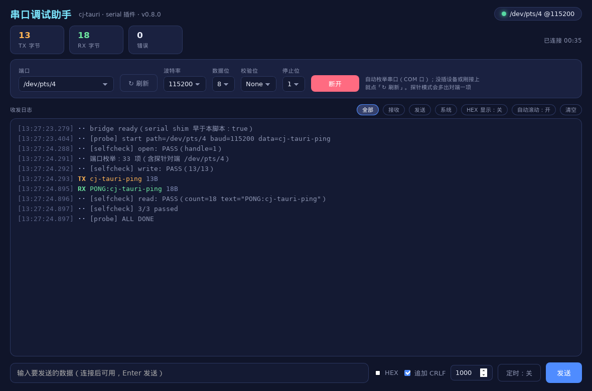

# 用仓颉写一个串口调试助手：cj-tauri 实战

> 从一条脚手架命令开始，做一个自己每天都用的串口工具，
> 以及我在 Windows 侧把串口桥从「同名桩」写到实机跑通的全过程。

## 起因：我要的不是「又一个串口助手」

我桌上常年插着几块开发板，串口线一插就是两三天。这些年用过的串口助手大概有十来个：Windows 上那几款商业软件功能全但界面停在十年前，Linux 上 `minicom` / `screen` 够用但每次都要查参数，写脚本时又得回到 `pyserial`。真正让我别扭的是三件事：

1. **配置记不住**。波特率、数据位、校验、停止位每次重开都要重填一遍，还要先猜一下现在插的是 `COM3` 还是 `COM5`。
2. **看不到字节**。我想同时看文本和 HEX，想过滤只看 RX，想知道这一轮到底收了多少字节——这些在轻量工具里往往要装插件。
3. **它不是一个「窗口」**。我想要的形状很简单：双击就开、不装运行时、不联网、界面我熟。

第三条直接把选型定死了。桌面 GUI 那三档我权衡过：

| 选择 | 结果 |
|---|---|
| Electron | 写起来最快，但一个只收发字节的工具要背一整个 Chromium，安装包上百 MB，不值 |
| Qt / 原生 GUI | 体积和性能都对，可列表、日志、下拉这些 Web 里闭眼就写的东西要重画一遍 |
| 系统 WebView + 原生后端 | 界面用 HTML/CSS/JS，后端编译成原生可执行文件——正是 Tauri 的思路 |

第三档就是我要的。而我一直在写的 [cj-tauri](https://atomgit.com/qq8864/cj-tauri) 恰好就是这个东西。于是有了仓库里的 `examples/serial-assistant`：**仓颉后端（串口读写）+ 系统 WebView 前端（收发日志界面）**。



## cj-tauri 是什么

一句话：**用仓颉写的 Tauri**。

Tauri 的卖点是「Rust 后端 + 系统 WebView 前端」——界面交给系统自带的浏览器内核渲染，而不是像 Electron 那样把整个 Chromium 打包进去。cj-tauri 把这一套搬到仓颉上，三件套严格对位：

| Tauri | cj-tauri | 干什么的 |
|---|---|---|
| `tauri::Builder` | `TauriApp` | 装配应用：窗口、命令、插件 |
| `#[tauri::command]` | `CommandHandler` 接口 | 前端能调的后端函数 |
| `@tauri-apps/api` | `window.__CJ_TAURI__` | 前端的 `invoke` / `listen` / `emit` |
| `capabilities/*.json` | `capabilities/*.json` | 命令 / 事件白名单，**默认最小权限** |
| `tao` + `wry` | `src/host.cj` + `native/bridge_*.c` | WebView 宿主（Windows Win32 + WebView2 / Linux GTK + WebKitGTK） |

架构从上到下四层，很好记：

```text
前端 (HTML/CSS/JS)  ← window.__CJ_TAURI__.invoke / listen / emit
        │  JSON over postMessage
        ▼
IPC 消息桥（src/ipc_hub.cj）      命令注册 / 分发 / 校验
        ▼
能力安全模型（src/capability.cj）  白名单，没声明的一律拒绝
        ▼
WebView 宿主（src/host.cj + 各平台实现）
   ├─ Windows: WebView2（Win32 消息循环跑在宿主线程）
   ├─ Linux:   webkit2gtk-4.1（C 桥跑在原生 pthread 上）
   └─ 鸿蒙:    ArkWeb（架构预留位）
```

平台状态我也说清楚，免得你照着做发现跑不起来：

- **Windows + WebView2：已实机跑通**——这篇讲的串口实现就是在 Windows 上验收的；
- **Linux + WebKitGTK：已实机跑通**（串口的 Linux 侧用 POSIX termios，虚拟串口对用 `pty` 造）；
- **鸿蒙 ArkWeb：只有架构预留位**，还没实现。

开源地址（AtomGit 与 GitHub 双托管，一次 `git push` 两个远端都同步）：

- AtomGit：<https://atomgit.com/qq8864/cj-tauri>
- 示例源码：`examples/serial-assistant/`、插件源码：`src/plugin_serial.cj` + `native/bridge_win.c` / `native/bridge_linux.c`

## 第一步：脚手架起骨架

我不喜欢从空目录手写 `cjpm.toml`，所以第一步就是脚手架：

```bash
npx cj-tauri create serial-assistant        # 缺省就是 app 模板：内联 HTML、零 Node
cd serial-assistant
npx cj-tauri dev                            # 起窗口，前端改一行刷新一次
```

`create` 默认用 `cli/templates/app` 模板，生成 6 个文件：

```text
serial-assistant/
├── cjpm.toml            # 包配置：依赖 cj-tauri、平台链接段（mingw 链接桥的 DLL）
├── capabilities/
│   └── default.json     # 能力清单：哪些命令/事件允许被前端调用
├── src/
│   └── main.cj          # 入口：TauriApp().window(...).run(html)
└── ui/
    └── index.html       # 前端页面
```

模板另外有 `--template vue` / `--template react` 两档（带 `ui/` 工程，`cj-tauri dev` 会接管 Vite dev server）。这个工具我是纯手写 HTML + 原生 JS，用不上框架，所以选了缺省模板。

脚手架生成完，先在 `cjpm.toml` 里确认两件事（Windows 上尤其要看）：

```toml
[target.x86_64-w64-mingw32]
  # GUI 子系统：双击不弹 DOS 黑窗口，stderr 仍走重定向
  link-option = "-L../../native -lcjtbridge --subsystem=windows"

[target.x86_64-w64-mingw32.bin-dependencies]
    path-option = ["D:/cangjie-stdx/windows_x86_64_cjnative/dynamic/stdx"]
```

`-lcjtbridge` 是 C 桥（WebView 宿主与平台能力的落点），stdx 路径给的是**动态库目录**而不是包根——给错了一样能 `create` 成功，直到 `cjpm build` 才报 `dependency info is missing`。

## 第二步：一行接上串口能力

串口读写不是我自己从零写的——cj-tauri 自带官方 `serial` 插件，接入就一行：

```cangjie
let app = TauriApp()
    .window(WindowConfig("串口调试助手 · cj-tauri", 1180, 780))
    .plugin(SerialPlugin())          // 串口能力：一行接入
    .register("report", ReportCommand())

app.run(html)
```

`.plugin(SerialPlugin())` 做的事是「把插件声明的命令按 `<插件名>:<短名>` 注册」，于是前端能调到的就是 `serial:list` / `serial:open` / `serial:read` / `serial:write` / `serial:close` 五条。

**但插件只声明「我提供什么」，不自动放行**——这是 cj-tauri 的铁律（默认最小权限）。所以还得改能力清单 `capabilities/default.json`：

```json
{
  "identifier": "default",
  "windows": ["main"],
  "commands": ["report", "quit", "system:version"],
  "permissions": ["serial:default"],
  "events": []
}
```

插件除了命令，还可以声明**命名权限集**——`serial:readonly`（`list` + `open` + `read` + `close`）与 `serial:default`（再多一个 `write`）。我这里是调试助手，天生要双向收发，所以引用 `default`；如果你要写的是「只监听设备日志」那种只读工具，引用 `readonly` 就好，**写能力不会被顺带打开**。

清单里两种写法是等价的，也能混用：命名集 `serial:readonly` 与明文 `"serial:write"` 同时出现时，成员展开后同权（`examples/plugin-serial` 就是这么写的，专门用来证明这点）。引用了没有插件提供的集名，启动时只会提示一句，不报错。

前端那边，插件会注入一段 shim（经宿主**预执行脚本**通道，早于页面第一行脚本），于是 `window.__CJ_TAURI__.serial.*` 直接可用：

| 命令 | 入参 | 返回 |
|---|---|---|
| `serial:list` | 无 | `{ ports: ["COM1", "COM2", …] }`（字典序） |
| `serial:open` | `{ path, baud, dataBits?, parity?, stopBits? }` | `{ handle, path, baud, dataBits, parity, stopBits }` |
| `serial:read` | `{ handle, maxBytes?, timeoutMs? }` | `{ count, hex, text? }` |
| `serial:write` | `{ handle, data, encoding?, timeoutMs? }` | `{ written, bytes }` |
| `serial:close` | `{ handle }` | `true` |

两个口径值得单独记一笔，因为它们决定了前端怎么读代码：

- **`read` 超时无数据返回 `count=0`，不是错误**。串口读天生是「轮询式」的，把「这次没数据」当异常会让前端淹没在 `catch` 里。
- **不是合法 UTF-8 的二进制帧只给 `hex`，不给 `text`**。调试助手最常干的事恰恰是看一串裸字节，这条让 HEX 视图不用猜。

## 第三步：界面——把「调试」这件事做顺手

页面我放在独立的 `ui/index.html`，没有内联进仓颉的三引号字符串。原因很实在：这个前端是一整页 UI（样式 + 收发日志 + 自动读循环），内联进 `"""` 会同时踩两个坑——**三引号字符串会先吃掉反斜杠转义**（JS 里的 `\n` 会变成真换行，把 `<script>` 拆断，页面一行都不执行，stderr 还毫无提示），而字符串插值 `${...}` 又和 JS 的模板字面量同形。独立成文件后两个坑都不存在。

界面结构是我用串口助手十几年攒下来的「顺手」清单：

- **端口下拉自动枚举 + ↻ 刷新**：进页面就 `serial.list()` 填下拉。设备是热插拔的，所以刷新按钮必须显眼（这也是为什么 `list` 被归进只读集——连接前的「选端口」离不开它）。
- **参数面板**：波特率 / 数据位 / 校验 / 停止位在**打开时定稿**（`open` 一次把配置交给驱动），改参数要重连，这点跟其它串口工具一致。
- **TX/RX 分色日志**：每行带时间戳、方向、字节数；HEX 显示可切；可按方向过滤。看字节时我不想在一堆文本里找十六进制。
- **计数徽标**：TX 字节 / RX 字节 / 错误数，加连接时长——「这一轮到底收了几个字节」是要能一眼看到的。
- **发送区**：HEX 输入、追加 CRLF、Enter 直发，以及**定时发送**（间隔 ≥50ms，框空跳拍、断开自动停）。定时发送看起来是个小功能，实际上它是我用这个工具最多的东西——周期往设备打心跳时，没人愿意每秒钟点一次鼠标。

界面代码里唯一「不 Web」的地方，是第一次在 Linux 上跑起来的 `select`——**WebKitGTK 的下拉框会用原生 combo 的浅色样式盖掉页面配色**，深色页里白底浅字几乎不可读，页面 CSS 的 `background` / `color` 完全不生效。修法是给 `select` 加 `-webkit-appearance:none; appearance:none` 自绘（箭头用两段 `linear-gradient` 画三角），展开列表里的 `option` 也要各自重写一遍底色与文字色——它也吃原生样式。这条已经记进项目的踩坑清单了。

## 第四步：Windows 侧的串口，从「同名桩」写成真实现

前面说的五条命令，落到平台层就是 C 桥里的四个原语（`open` / `read` / `write` / `close`）加一个错误串接口。**返回码口径两个平台一字不差**，所以上层的仓颉代码里没有一处 `@When` 平台分支——这正是 cj-tauri 的架构契约：平台差异只允许出现在 `@When` 条件编译和 `native/bridge_*.c` 两处。

Linux 侧一开始就是真实现（POSIX termios + `poll`），Windows 侧则长期挂着一句 `serial: Windows 侧串口尚未实现（接口已留）`——**先留同名桩、返回可读的「未实现」，而不是静默失败或链接期缺符号**。这样上层代码可以两边同时写、同时测，谁也不用等谁。这轮我把 Windows 侧补成了真实现，四个原语加一个枚举，全部实机跑通。

### open：独占打开 + DCB 配置 + 超时归零

```c
/* 独占打开（共享模式 0）：串口是物理独占资源，两个进程同开一个口只会互咬数据 */
hd = CreateFileW(wpath, GENERIC_READ | GENERIC_WRITE, 0, NULL, OPEN_EXISTING,
                 FILE_FLAG_OVERLAPPED, NULL);
```

三处细节都不是随手写的：

1. **路径要补设备命名空间前缀**。`COM3` 这种写法在 Win32 里会被当成「当前目录下的同名文件」，必须写成 `\\.\COM3`。但白名单放行的是 `COM3`（用户和页面看到的也是它），所以补前缀这一步放在平台层做，`open` 调用方不用关心。
2. **DCB 不能从零起步**。`GetCommState` 先拿驱动现状打底再覆盖我们关心的那几个字段——DCB 里有几十个流控/二进制位，全零起步会把 `fBinary=0` 这种非法组合交给驱动，行为随驱动版本漂移。流控（`fOutxCtsFlow` / `fRtsControl` / `fOutX` 等）**一律不替应用打开**，跟 Linux 侧同一条铁律：框架自作主张会改握手语义。
3. **超时全部归零，等待自己控制**。`SetCommTimeouts` 的总超时只对「等到第一个字节」可控，而我要的是「在预算内等，预算用完就干净地交回」。所以读写都走 `OVERLAPPED`：

```c
ok = ReadFile(hd, buf, (DWORD)len, &got, &ov);
if (!ok && GetLastError() == ERROR_IO_PENDING) {
    DWORD w = WaitForSingleObject(ov.hEvent, timeout_ms > 0 ? (DWORD)timeout_ms : 0);
    if (w == WAIT_TIMEOUT) {
        CancelIo(hd);                              /* 撤销这次读，驱动里不留未完成请求 */
        GetOverlappedResult(hd, &ov, &got, TRUE);  /* 等 CancelIo 本身落定 */
        CloseHandle(ov.hEvent);
        return 0;                                  /* 0 = 超时无数据，与 Linux poll 口径一致 */
    }
    …
}
```

`write` 是同一个套路，只是等在**总预算**上：每轮用 `deadline - now` 作为等待上限，预算用尽就返回「已写入多少字节」而不是报错——调用方拿到 `written` 自己决定要不要补写。这条语义跟 Linux 侧完全一致，前端不用分平台写两套。

### list：用 QueryDosDeviceW 枚举端口

端口下拉要给得出东西，就得枚举本机串口。Linux 侧扫 `/dev` 顶层（按设备类前缀收）加上 `/dev/serial/by-{id,path}/` 整目录，Windows 侧则交给 C 桥：

```c
/* QueryDosDeviceW 扫全部 MS-DOS 设备名，收「COM + 全数字」的形状 */
got = QueryDosDeviceW(NULL, buf, need);
...
if (wcsncmp(p, L"COM", 3) != 0) continue;
p += 3;
while (*p >= L'0' && *p <= L'9') { p++; digits++; }
if (digits == 0 || digits > 3 || *p != L'\0') continue;   /* COMfoo / 超长号一律不要 */
```

选它的理由：一次调用给全**系统当前真实存在**的设备名，`com0com` 这类虚拟口也在其中；翻注册表反而会随驱动形态漂移（有 `00xx` 子键的、有 `Device Parameters` 的，各有各的写法）。缓冲不够时 `QueryDosDeviceW` 只回一个 `ERROR_INSUFFICIENT_BUFFER`、不告诉你到底要多大，所以按翻倍重试。

Linux 侧这个导出返回 `-4`（未实现），仓颉侧的 `serialPortList()` 见到它就回落到 `/dev` 目录扫描——**pty 与 `by-id` 稳定链接仍然能收**。上层只有一处「优先走 C 桥、不行再回落」的分支，不是两套实现。

### 为什么这套东西能被验证

光有实现不算数，得能证明它真的摸到了硬件。这个示例带了两套一键探针：

| 平台 | 入口 | 对端怎么造 |
|---|---|---|
| Linux | `bash run.sh` | python3 `pty` 造一对内核虚拟串口（不需要真设备，也不需要 `socat`） |
| Windows | `run.bat` | PowerShell 脚本开另一端（`serial-peer-win.ps1`） |

探针的原理是「配置注入 + 页面自检」。设 `CJ_SERIAL_PROBE_PATH=COM1` 后启动，应用把配置经**宿主预执行脚本**（document-start）注入页面：

```cangjie
let js = "window.__SERIAL_PROBE__ = { path: " + JsonString(probePath).toJsonString() + ", … };\n"
match (app.hostOf("main")) {
    case Some(host) => host.addInitScript(js)
    case None => eprintln("[serial-assistant] 探针模式：主窗未登记，配置没注入")
}
```

页面读到它就跑一轮 open → write → read → close 自检，每步经 `report` 命令回投 stderr——**诊断一律走 stderr**，因为 stdout 有缓冲，进程被强杀时日志会丢。于是整轮结果就是一份可直接 `findstr` / `grep` 的文本证据：

```text
[frontend] [sys] port enum: 2 item(s)
[frontend] [sys] [selfcheck] open: PASS（handle=1）
[frontend] [sys] [selfcheck] write: PASS（13/13）
[frontend] [tx] cj-tauri-ping
[frontend] [rx] PONG:cj-tauri-ping | 504f4e473a636a2d74617572692d70696e67
[frontend] [sys] [selfcheck] read: PASS（count=18 text="PONG:cj-tauri-ping"）
[frontend] [sys] [selfcheck] close: PASS（true）
[frontend] [sys] [selfcheck] 4/4 passed
[frontend] [sys] [probe] ALL DONE
[cj-bridge] serial win32: path=COM1 baud=115200 data=8 parity=0 stop=1 handle=000000000000044C
[cj-bridge] serial open: handle=1 path=COM1 baud=115200 data=8 parity=0 stop=1
[cj-bridge] serial close: handle=1
```

**最关键的一条证据不在应用进程里。** 「我写了 13 个字节」是应用自己说的，不能当凭证；凭证是对端进程的日志：

```text
[peer] opened COM2, initial PONG sent
[peer] rx 13 bytes: cj-tauri-ping
```

对端在 COM2 上真收到了这 13 个字节，还把它落了一份盘。这才叫「字节真的上过线」。整轮 `run.bat` 断言 8 条、退出码 0：

```text
  ok    probe started
  ok    port enumeration ran
  ok    open succeeded
  ok    bridge logged win32 open
  ok    probe ALL DONE
  ok    app returned
  ok    peer saw app bytes
  ok    peer answered
[run] PASS -- the serial chain is live on Windows: enumerated COM ports,
[run]        opened COM1, wrote to the wire, read the peer PONG back, closed.
```

日常手测另有 `run.bat manual`：不带探针、不起对端，开窗让你自己点——同一个 PATH、同一个工作目录、同一份日志，只是不自动跑自检、不自动退出。

## 踩过的坑（这次真金白银换的）

这部分是我最想留在文章里的东西。功能代码你照抄大概能跑，坑不写出来你一定重踩。

**仓颉语言侧**

1. **三引号字符串会先处理反斜杠转义**。把 HTML+JS 内联进 `"""` 时，JS 里的 `\n` 会先被仓颉吃掉变成真换行，把 JS 字符串或单行注释拆断——整段 `<script>` 语法错误，页面里一行都不执行，而 stderr 毫无提示。内联 JS 里要么别出现反斜杠（换行用 `String.fromCharCode(10)`），要么像这个示例一样把页面放独立文件。
2. **`const X: Array<String> = ["a","b"]` 编译不过**：仓颉的 `const` 只收「编译期常量表达式」，`Array` 字面量不是。顶层不可变集合一律用 `let`（全局 `let` 就是不可变量）。
3. **字符串插值 `${名字}` 会撞同名函数**：局部变量叫 `main` 时写 `"${main}"` 会报 `unexpected main function in string interpolation`。换个变量名就好。
4. **lambda 不能捕获可变的局部变量**：想让闭包把数据带出来，就用 `ArrayList<String>()` 之类的容器装（实测就是这么记下 `system:host` 询问过哪些窗口 label 的）。
5. **迭代 `String` 得到的是 `UInt8` 字节**，不是码点也不是 `Rune`，`String.size` 同样是字节数。把字节当码点数，ASCII 的检查照样对，**只有汉字会错成 3 倍**——我一开始的素材自检就把「鹅鹅鹅」数成了 9。

**Windows / 脚本侧（这轮新踩的）**

6. **`.bat` 里 `timeout /t N` 会被 MSYS 的 GNU `timeout` 抢走**。从 Git Bash 里跑 `cmd //c run.bat` 时，PATH 里 MSYS 的 Coreutils 排在 Windows 同名命令前面，脚本直接报 `timeout: invalid time interval '/t'` 然后继续往下跑（那一轮应用起得比对端早，探针读到空）。等几秒一律用 `ping -n N 127.0.0.1 >nul`。同源坑还有 `find`——`find /c /v ""` 会被 GNU find 当成路径去遍历整个盘。
7. **`start` 这一层的重定向抓不到子窗输出**。`start "peer" /min cmd /c "… > "%LOG%" 2>&1"` 里，那个 `>` 若写在 `start` 外层，日志文件是 **0 字节**、命令照跑不报错——看起来就像「对端一个字都没输出」。重定向必须写进内层 `cmd /c` 的字符串里。
8. **PowerShell 的错误报告按父进程的 OEM 码页输出**。`$OutputEncoding` / `[Console]::OutputEncoding` 只管脚本自己 `Write-Output` 的行；脚本抛终止性错误时那份报告由**外层宿主**在设置失效之后打印，仍是 GBK——落进日志就是「Unicode 格式」警告加一堆乱码，`findstr` 计数为 0，于是「没有这条日志」被误读成「没发生」。修法是起 PowerShell 的那层先 `chcp 65001`，整份日志就是纯 ASCII。
9. **`if (…)` 块里的 `echo` 正文不能含英文括号**。`echo … wrote to the wire (peer-side proof), …` 里的 `)` 被 cmd 当成 if 块收尾，后续执行流错位，报的是 `此时不应有 read。` 这种跟括号八竿子打不着的错，PASS 文案永远打不出来。要写括号就 `^(` `^)` 转义，或者换措辞。
10. **判脚本真假一律看副作用，别只看退出码**。上面第 7 条的退出码是 0，日志是 0 字节；`MSYS_NO_PATHCONV=1` 与 `cmd //c` 同时用还会造出「批处理一行没跑、退出码 0」的假成功。核心判断依据永远是**日志行数 / 断言计数 / 文件 mtime**。

**WebView 侧**

11. **`<select>` 在 WebKitGTK 上会用原生 combo 样式**（第 3 步详述），深色页面一律自绘。
12. **页面的视口尺寸要每帧自检，不能只等 `resize` 事件**：WebView2 建 WebView 时视口还是临时尺寸，随后窗口才定到最终大小，而那次变化**没有 `resize` 事件送到页面**。只按 `resize` 更新的页面会停在旧尺寸上，3D 场景整幅走样。做法是把「`innerWidth/Height` 与上次应用值比一次」放进 `requestAnimationFrame` 循环，顺带覆盖 DPI / 缩放变化。

顺带说一句，这些坑的归宿不是文章，而是项目根目录的 `AGENTS.md`——那是项目的「开发契约」，人类和 AI 助手共同遵守、开工前自动加载。**踩一次就写一条，禁止重踩**，这也是这个仓库能一路长到 0.8.x 的原因之一。

## 小结：怎么把它跑起来

```bash
# 1. 拿源码（双托管任选，内容一致）
git clone https://atomgit.com/qq8864/cj-tauri.git

# 2. 平台一键脚本（自带虚拟串口对端与断言，不需要真设备）
cd cj-tauri/examples/serial-assistant
bash run.sh          # Linux：pty 造对端
run.bat              # Windows：PowerShell 对端，8 条断言
run.bat manual       # Windows：开窗手测，自己点
```

想从零自己搭一个的话，就是文章开头那三行：`npx cj-tauri create <名字>` → 在 `capabilities/default.json` 里引用 `serial:default`（或 `serial:readonly`）→ 页面里 `window.__CJ_TAURI__.serial.*` 直接调。

写到这里回头看，这个工具真正花掉我时间的不是「串口怎么读写」——那部分两个平台加起来不到 500 行 C。真正花时间的是三件事：**把平台差异关进 C 桥**（所以上层零分叉）、**把失败做成可读的返回**（未实现回可读原因、超时不报错、二进制帧给 hex）、**把验证做成一条命令**（探针 + 对端 + 断言 + 退出码）。

第三件事尤其值得吹一下：因为这个仓库是「人类开发者与 AI 助手共同维护」的，一条 `run.bat` 就能给出「跑通 / 没跑通」的确定答案，比任何口头承诺都重要。文章里那份 `8/8 PASS` 的日志，就是它给的。

**相关链接**

- 项目仓库：<https://atomgit.com/qq8864/cj-tauri>
- 示例源码：`examples/serial-assistant/`（`run.bat` / `run.sh` / `serial-peer-win.ps1`）
- 插件源码：`src/plugin_serial.cj`、`native/bridge_core.c`、`native/bridge_win.c`、`native/bridge_linux.c`
- 设计文档：`docs/RFC-插件体系.md`、`AGENTS.md`（架构契约与踩坑清单）


