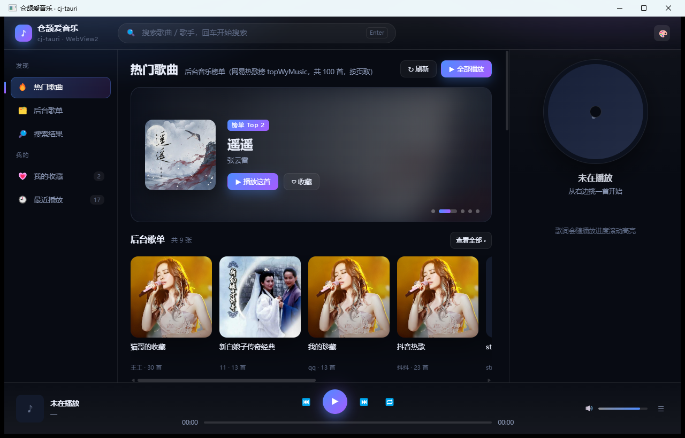
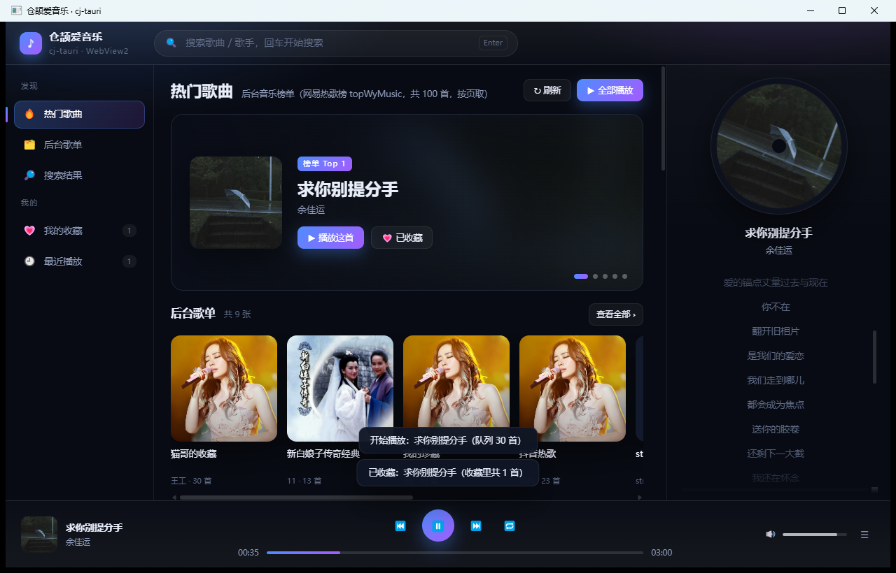

# 用仓颉写一个桌面音乐播放器：cj-tauri 实战

> 从一条脚手架命令开始，做一个能拉榜单、能搜歌、能看同步歌词的桌面播放器，
> 以及我在这个过程中定下来的取舍和踩过的坑。

## 起因：我想要一个「双击就开」的播放器

我写代码的时候习惯开着歌。这些年试过的在线播放器都差不多：一个标签页，切来切去就忘了它还在放；十几个标签页开下来，浏览器先把内存吃满；偶尔还会弹一个会员提示框，把我的注意力从代码上拽走。

我真正想要的很简单：**一个双击就开的窗口**。小、快、不联网也能开（当然取数据要联网）、收藏和最近播放存在自己机器上、歌词跟着播放进度滚。它不需要曲库——我只想让它把我常听的榜单和搜索摆在我面前。

需求清楚了，接下来是技术选型。摆在我面前的是三档：

| 选择 | 结果 |
|---|---|
| Electron | 上手最快，但一个只为播 `<audio>` 的窗口要背一整个 Chromium（安装包上百 MB、内存几百 MB），我不甘心 |
| Qt / 原生 GUI | 体积和性能都对，但界面要重画一遍，歌词滚动、主题色、卡片悬停这些 Web 最擅长的事全得手写 |
| 系统 WebView + 原生后端 | 界面用 HTML/CSS/JS（我最熟的那套），后端编译成原生可执行文件——正是 Tauri 的思路 |

第三档就是我要的。而我在写的 [cj-tauri](https://atomgit.com/qq8864/cj-tauri) 恰好就是这个东西——**用华为仓颉语言实现的类 Tauri 2 框架**。于是就有了仓库里的这个示例：`examples/music`，一个桌面音乐播放器。



## cj-tauri 是什么

一句话：**用仓颉写的 Tauri**。

Tauri 的卖点是「Rust 后端 + 系统 WebView 前端」——界面交给系统自带的浏览器内核渲染，而不是像 Electron 那样把整个 Chromium 打包进去。cj-tauri 把这一套搬到仓颉上，三件套严格对位：

| Tauri | cj-tauri | 干什么的 |
|---|---|---|
| `tauri::Builder` | `TauriApp` | 装配应用：窗口、命令、插件 |
| `#[tauri::command]` | `CommandHandler` 接口 | 前端能调的后端函数 |
| `@tauri-apps/api` | `window.__CJ_TAURI__` | 前端的 `invoke` / `listen` / `emit` |
| `capabilities/*.json` | `capabilities/*.json` | 命令 / 事件白名单，**默认最小权限** |
| `tao` + `wry` | `src/host.cj` + `native/bridge_*.c` | WebView 宿主（Windows Win32 + WebView2 / Linux GTK + WebKitGTK） |

架构从上到下就四层，很好记：

```text
前端 (HTML/CSS/JS)  ← window.__CJ_TAURI__.invoke / listen / emit
        │  JSON over postMessage
        ▼
IPC 消息桥（src/ipc_hub.cj）      命令注册 / 分发 / 校验
        ▼
能力安全模型（src/capability.cj）  白名单，没声明的一律拒绝
        ▼
WebView 宿主（src/host.cj + 各平台实现）
   ├─ Windows: WebView2（Win32 消息循环跑在宿主线程）
   ├─ Linux:   webkit2gtk-4.1（C 桥跑在原生 pthread 上）
   └─ 鸿蒙:    ArkWeb（架构预留位）
```

平台状态我得说清楚，免得你照着这篇做却发现跑不起来：

- **Windows + WebView2：已实机跑通**——这个播放器就是我日常在 Windows 上用的；
- **Linux + WebKitGTK：已实机跑通**（框架与示例的自检都在上面跑过）；
- **鸿蒙 ArkWeb：只有架构预留位**，还没实现。

开源地址（双托管，一次 `git push` 两个远端都同步）：

```bash
git clone https://atomgit.com/qq8864/cj-tauri.git          # AtomGit（国内直连推荐）
git clone https://github.com/yangyongzhen/cj-tauri.git     # GitHub
```

我写这篇的时候框架是 **0.7.0**：`README.md` 有总览，`docs/使用文档.md` 是使用指南，
`docs/前端入门教程.md` 适合第一次上手，`AGENTS.md` 是开发契约（也是我踩坑的登记簿）。

## 五分钟起一个自己的应用

先说实话：这个「五分钟」是指**装好仓颉 SDK 之后**五分钟。

SDK 去 [cangjie-lang.cn](https://cangjie-lang.cn) 下载（要华为账号，没有匿名直链），再配上 stdx。
我这边用的是 **仓颉 SDK 1.2.0 + stdx 1.2.0.1**。Windows 上要么把 SDK 的
`runtime/lib/<平台>`、`bin`、`tools/bin`、`tools/lib` 都塞进 `PATH`（也就是官方 `envsetup.bat` 的那套布局），
要么只设 `CANGJIE_HOME`、让启动器自己补齐——后者省事得多。这一步没对，症状是**进程退出码 127 且一行输出都没有**，
很难猜，所以先验证 `cjc --version` 能跑通再往下。

环境好了，一条命令就够。CLI 就在框架仓库里（仓颉源码，`cli/src/` 5 个文件），**不用单独安装**——
首次运行它会自动用 `cjpm build` 构建 CLI 本体，并按 SDK `envsetup.bat` 的目录布局设好 PATH：

```bash
# Windows
cli\cj-tauri.bat create music

# Linux / Git Bash
bash cli/cj-tauri.sh create music
```

真实输出（本机实跑，两处本机绝对路径已换成占位符）：

```text
[cj-tauri] 已创建项目 music/（6 个文件）

  项目名   : music
  模板     : app
  仓颉包名 : music
  框架依赖 : <框架仓库根目录>
  stdx     : <stdx 动态库目录>

下一步:
  cd music
  cj-tauri dev          # 构建 C 桥 + 编译 + 启动窗口
  cj-tauri build        # 仅构建

提示: cjpm.toml 里的路径是本机绝对路径；换机器需重新执行 create 或手改这两处。
```

生成的 6 个文件（行数是实测的）：

| 文件 | 行数 | 里面是什么 |
| --- | --- | --- |
| `cjpm.toml` | 22 | 应用构建配置：`[dependencies] cjTauri = { path = … }` + `[target.<triple>]` 链接参数 |
| `src/main.cj` | 88 | 入口：`greet` / `timer`（推事件）/ 菜单演示 + `app.run(html)` |
| `ui/index.html` | 118 | 演示页：`invoke` / `listen` / 插件 shim 的用法样板 |
| `capabilities/default.json` | 7 | 白名单：`greet` / `timer` / `system:*`，权限集 `menu:state`，事件 `tick` / `menu:click` |
| `README.md` | 80 | 模板自带说明：加命令、推事件、窗口配置怎么写 |
| `.gitignore` | 13 | 构建产物 + 平台动态库 |

几条 `create` 的规矩，我第一次用的时候都撞过：

- **项目名要能推出仓颉包名**：必须以字母开头，只含字母 / 数字 / `-` `_` `.`；分隔符后面首字母会转大写
  （`my-app` → 包名 `myApp`）。推不出来直接报错退出。
- **目标目录必须不存在**：已存在就报 `[cj-tauri] 错误: 目录已存在: …`，不会覆盖——我一开始想在空目录里
  「重跑一遍」看输出，结果每次都得多改一个名字。
- **模板有四种**：`--template app`（缺省，内联 HTML 单文件、零 Node 依赖）、`vue`（Vue 3 + Vite）、
  `react`（React 18 + Vite），也可以直接写仓库里自建的模板目录名（`cli/templates/<名字>`）。
  `vue` / `react` 会多带一套 `ui/` 前端工程，`cj-tauri dev` 会接管它的 Vite dev server，
  改前端源码不重启应用就能看到效果。
- **换机器要重新 `create` 或手改两处**：`cjpm.toml` 里的框架依赖路径与 stdx `path-option` 是本机绝对路径。

日常就六个子命令：

| 子命令 | 干什么 | 什么时候用 |
| --- | --- | --- |
| `cj-tauri dev` | 构建 C 桥 + `cjpm build` + 启动窗口 | 开发时最常用（Vue / React 模板还会顺带起 dev server） |
| `cj-tauri build` | 构建 C 桥 + `cjpm build` | 只想要产物 |
| `cj-tauri run` | 运行已构建产物（不再编译） | 产物是最新的、只想再开一次 |
| `cj-tauri info [--json]` | 环境自检 / 打印插件装配清单 | 排障第一站；`--json` 给 CI 用 |
| `cj-tauri create` / `help` | 建项目 / 帮助 | —— |

有一个坑我要提前说，因为它不是「代码错」而是「环境错」：**`native/libcjtbridge.dll`（或 `.so`）是本地产物、不入库**。
`dev` / `build` 会替你构建它，但如果你拉了「改过 C 桥导出」的提交却没重建，会在**链接期**炸出一串
`undefined reference to cj_bridge_*`——看着像代码问题，其实是产物过期。重建一条命令：
Windows 是 `native\build_win.bat`，Linux 是 `bash native/build_linux.sh`。

## 从空模板到播放器：先画界面，再分文件

模板给的是一个「问候 + 计时器」的演示页。我要把它改成一个播放器，所以第一件事不是写代码，而是**把界面画出来**——
因为一个播放器的信息密度决定了它的布局，布局定了，后端要提供什么数据也就定了。

我想要的是这样的一个窗口（1280×820）：

```text
┌───────────────────────────────────────────────────────────────────────┐
│  仓颉爱音乐        🔍 搜索歌曲 / 歌手            🎨                    │
├──────────┬────────────────────────────────────────┬───────────────────┤
│ 发现     │  热门歌曲  后台音乐榜单 [刷新] [全部播放] │                   │
│ · 热门歌曲│  ┌───────────────────────────────────┐ │    ╭─────────╮    │
│ · 后台歌单│  │  榜单 Top 5 轮播（封面+信息+按钮）  │ │    │  唱片    │    │
│ · 搜索结果│  └───────────────────────────────────┘ │    ╰─────────╯    │
│ 我的     │  后台歌单  共 9 张        [查看全部]     │     正在播放       │
│ · 我的收藏│  ┌────┐┌────┐┌────┐┌────┐┌────┐┌────┐  │   歌名 / 歌手      │
│ · 最近播放│  └────┘└────┘└────┘└────┘└────┘└────┘  │                   │
│          │  1  缩略图  曲名 / 歌手    时长    ▶     │   同步歌词        │
│          │  2  ……                              │   跟着进度滚动     │
├──────────┴────────────────────────────────────────┴───────────────────┤
│  正在播放   ⏮  ▶  ⏭   ⏹    00:18 ──────●────── 03:00    🔊 ───        │
└───────────────────────────────────────────────────────────────────────┘
```

左侧导航 212px、右侧「正在播放 + 歌词」320px、中间自适应——在这个宽度下三栏都不用折行。想清楚了就是分文件：

```text
examples/music/
├── cjpm.toml              应用构建配置（框架依赖 + 两个平台的链接参数）
├── capabilities/
│   └── default.json       能力白名单：12 条命令
├── src/                   仓颉后端（6 个文件，1 371 行）
│   ├── main.cj            装配：窗口 + 注册命令 + 读页面
│   ├── commands.cj        命令层：参数校验 → 调接口 / 读写收藏 / 取封面
│   ├── api.cj             HTTP 传输层（超时、redirect、TLS、浏览器 UA）
│   ├── cover.cj           封面取回：图源白名单、剥代理、缩略计划
│   ├── lrc.cj             LRC 解析（多时间戳行、毫秒换算）
│   └── store.cj           本机收藏库（JSON 读写 + 上限夹取）
├── ui/
│   └── index.html         整个前端界面与交互（3 657 行，独立文件）
├── run.bat                一键构建 + 起窗口 + 两档自检 + stderr 落盘
└── README.md              这个示例的用法 / 取证 / 踩坑清单
```

**为什么前端不内联在仓颉的三引号字符串里**，而是单独一个 `ui/index.html`？模板默认是内联的，但一个播放器的前端是
一整个页面（左侧导航 + 榜单 / 搜索 / 歌单三个视图 + 播放器 + 歌词 + 弹窗 + 样式），内联会同时踩两个坑：

1. 仓颉的**三引号字符串会处理反斜杠转义**——JS 里的 `\n`、正则表达式会被仓颉先吃掉，整段 `<script>` 静默变成
   语法错误，页面里一行都不执行，而 stderr 毫无提示；
2. 字符串插值 `${...}` 与 JS 的模板字面量同形，写模板串就等于往仓颉的插值里塞代码。

改成「启动时读文件、把 HTML 字符串交给 `run(html)`」之后，这两个问题一起消失，而且页面还能用编辑器的 JS 语法检查
（`node --check` 验一遍）。代价是**必须从项目根启动**——`ui/` 与 `capabilities/` 都是按相对路径读的：

```cangjie
let MUSIC_UI_PATH = "ui/index.html"

func loadMusicUi(): String {
    var bytes: Array<Byte> = []
    try {
        bytes = File.readFrom(MUSIC_UI_PATH)
    } catch (e: Exception) {
        throw Exception("读不到前端页面 ${MUSIC_UI_PATH}（${e}）——请在 examples/music 目录下启动：" +
            "capabilities/ 与 ui/ 都按项目根相对路径读")
    }
    return String.fromUtf8(bytes)
}
```

从空模板到成品，改动的就是这几处：

| 位置 | `create music` 生成的 | 这个播放器 |
| --- | --- | --- |
| `cjpm.toml` | 依赖是本机绝对路径，只有本机那一个 `[target.<triple>]` | 依赖改仓库内相对路径 `../..`；补上 **Linux + Windows 两个 target**；包名 `music` → `music_app` |
| `src/` | 单文件 88 行（`greet` / `timer` / 菜单演示） | **6 个文件 1 371 行**，按单一职责拆分 |
| `ui/index.html` | 118 行演示页 | **3 657 行**：深色三栏播放器 + 同步歌词 + 页面自检 |
| `capabilities/default.json` | `greet` / `timer` / `system:*`，事件 `tick` | **12 条命令**（`music:*` / `fav:*` / `report` / `system:version`），不再用事件 |
| `.gitignore` | 构建产物 + `*.dll` | 多一行运行期数据 `music-library.local.json`（本机收藏与最近播放） |
| `run.bat` | 无（模板只给 `cj-tauri dev`） | 新增纯 ASCII 的 `run.bat`：一键构建 + 起窗口 + 两档自检 + stderr 落盘 |
| `README.md` | 模板自带「怎么写命令 / 事件」 | 换成这个示例的用法、取证与踩坑清单 |

一句话总结：**脚手架负责「能跑起来」，我负责「业务 + 取证」**。

## 后端：一个命令就是十来行仓颉

框架的设计很「Tauri」——**加一个前端能调的后端函数，要三处联动，漏一处就用不了**：

| 要加的东西 | 三处联动 |
| --- | --- |
| 一个命令 | ① 实现 `CommandHandler` ② `app.register("名字", …)` ③ 在 `capabilities/default.json` 的 `commands` 里声明 |
| 一个插件 | ① 实现 `Plugin` ② `app.plugin(XxxPlugin())` ③ 能力清单里声明 `"<插件名>:<短名>"` |
| 一个宿主能力 | ① 扩 `WebViewHost` 接口 ② 改各平台实现 ③ C 桥加**同名同签名**的 `cj_bridge_*` 导出 |

漏 ① 或 ③ 会得到 `command not registered`；只注册不声明会得到 `command not allowed`。这行日志我见过太多次，
现在是我排障的第一判据——**报错说得很具体，不用猜**。

装配长这样（`src/main.cj`，这里只留关键几行）：

```cangjie
main(): Int64 {
    eprintln("[music] main start")
    // ... 读收藏库、打日志

    // 1280×820：三栏（导航 212 / 内容自适应 / 正在播放 320）在这个宽度下不用折行
    let winCfg = WindowConfig("仓颉爱音乐 · cj-tauri", 1280, 820)

    var app = TauriApp().window(winCfg)
    app.register("music:hot", MusicHotCommand())
    app.register("music:search", MusicSearchCommand())
    // ... 其余 9 条（`system:version` 由框架在 run() 里注册）

    let html = loadMusicUi()
    app.run(html)          // 阻塞；能力清单由 run() 自动扫 capabilities/ 目录
    return 0
}
```

命令本身很薄——校验参数，拼请求，把结果交给页面：

```cangjie
/**
 * `music:hot` —— 热门歌曲：`{start?, count?}` → `POST /api/v1/musicmenus`
 */
public class MusicHotCommand <: CommandHandler {
    public init() {}

    public func handle(cmd: String, args: JsonObject, ipc: IpcContext): JsonValue {
        let (start, count) = pagedArgs(argInt(args, "start", 0), argInt(args, "count", MUSIC_PAGE_SIZE), 50)
        var body = JsonObject()
        body.put("kind", JsonString(MUSIC_HOT_KIND))
        body.put("start", JsonInt(start))
        body.put("count", JsonInt(count))
        return musicApiCall("/api/v1/musicmenus", Some(body))
    }
}
```

能力清单就是一条一条列出来，没写的调不动（默认最小权限）：

```json
{
  "identifier": "default",
  "windows": ["main"],
  "commands": [
    "music:hot", "music:search", "music:menus", "music:lyric",
    "music:image", "music:share", "fav:get", "fav:set",
    "music:config", "music:quit", "report", "system:version"
  ],
  "events": []
}
```

这个应用一共 12 条命令，跟后台的对应关系是：

| 命令 | 参数 | 后台 | 备注 |
| --- | --- | --- | --- |
| `music:hot` | `{start?, count?}` | `POST /api/v1/musicmenus`（`kind=topWyMusic`） | 实测只有这一个 kind 有数据，其余一律 400 `mongo: no documents in result` |
| `music:search` | `{q, start?, count?}` | `POST /api/v1/musicsearch` | 空 `q` 在仓颉侧就拦掉，不发请求 |
| `music:menus` | `{start?, count?}` | `GET /api/v1/getsongmenu` | 不带 `start` 会 400（`field start is not set`），参数必须给全 |
| `music:lyric` | `{sid, kind?}` | `GET /api/v1/musicsearchlrc` | 返回 LRC 文本，解析在仓颉侧做 |
| `music:image` | `{url, size?}` | —— | 宿主侧取图；`size` 是缩略边长，`0` 表示原图 |
| `music:share` | `{title, user, email, note?, cover?, songs[]}` | `POST /api/v1/createsongmenu` | 把收藏当歌单提交；必填项在仓颉侧校验 |
| `fav:get` / `fav:set` | `{}` / `{songs?, recent?}` | —— | 读写本机收藏库 |
| `music:config` | `{}` | —— | 把 `apiBase / libraryPath / selfCheck / pageSize` 告诉页面 |
| `music:quit` | `{}` | —— | 退出应用（自检收尾用） |
| `report` | `{line}` | —— | 页面把结论回投仓颉侧 stderr |
| `system:version` | `{}` | —— | 框架内置命令，界面上显示框架版本 |

### 参数校验是**系统边界**，不是可选动作

这一点我吃过教训，所以单独写一段：命令的参数全部来自页面，**页面可控的字符串一个都不能直接信**。
它们要么拼进 URL、要么落盘、要么原样提交给后台——不校验就等于把后端变成别人的跳板。我在命令层做的三件事：

- **拼 URL 的字段只放行允许的字符**：`sid` 只接受数字（它要拼进 `?id=<sid>`），歌词源的 `kind` 只接受字母；
- **长度一律按字节夹取，而且不能切断汉字**：UTF-8 的汉字占 3 字节，从中间切开就是非法序列——`clipText`
  从切点往回退掉续接字节；
- **数组类参数逐条过一遍白名单**：分享歌单时的每一首歌都重新抽成 `{sid, song, sing, url, cover}` 五个字段，
  脏条目直接跳过，不让它带坏整份收藏。

分页这类数字同样是边界：`start` 夹进 `[0, 1000]`、`count` 夹进 `[1, 该命令自己的上限]`
（榜单与搜索 50、后台歌单 30），页面传什么都不当真。

### 命令是异步分发的，所以慢命令不会冻窗口

框架的 `IpcHub.handleInvoke` **只做校验**：「未授权 / 未注册」在调用线程上同步拒绝，
通过校验的命令会被 `spawn` 到 worker 线程执行，结果再回投给页面。

这对音乐应用很关键：榜单、搜索、歌词、取封面都是网络请求（我给了 20 秒超时），如果跑在宿主 UI 线程上，
窗口会直接卡住。**契约上的代价**是同一命令被并发调用时不保证执行顺序——页面按 promise id 匹配就好。
另外 worker 线程里只能通过框架给的 `jsSink` 回投结果，不能直接碰宿主（Linux 上直接调 GTK 会被运行时的栈边界校验 abort）。

## 前端：只经 window.__CJ_TAURI__，一处 `fetch` 都没有

桥（`window.__CJ_TAURI__`）是宿主在 **document-start** 时注入的——两平台对齐（Linux 用
`WEBKIT_USER_SCRIPT_INJECT_AT_DOCUMENT_START`，Windows 用 `AddScriptToExecuteOnDocumentCreated`），
都比页面里的 `<script>` 早。但应用侧仍然不该假设「脚本一跑桥就在」，所以我照框架模板的做法先等它：

```js
/*
 * 等桥出现再跑页面逻辑。
 * 两平台的桥都是 document-start 注入，但应用侧仍不该假设「脚本一跑桥就在」。
 */
function waitForBridge() {
  return new Promise(function (resolve) {
    (function poll() {
      if (window.__CJ_TAURI__) { resolve(window.__CJ_TAURI__); return; }
      setTimeout(poll, 30);
    })();
  });
}

/* 所有后端能力都走 invoke——本文件没有一处 fetch / XMLHttpRequest */
function invoke(cmd, args) {
  return api.invoke(cmd, args || {});
}

/* 页面侧的结论回投仓颉 stderr（report 命令）：实机取证以 stderr 为准，不开 devtools 也能看 */
function report(line) {
  if (api) { api.invoke('report', { line: line }); }
}
```

**为什么不让页面直接 `fetch` 后台**，三条理由（写在这里是因为这是整个示例最容易被"优化"掉的设计）：

1. **契约**：前端只经 `invoke` / `listen` / `emit` 说话，业务代码里不出现 `postMessage`，也不出现 `fetch`；
2. **页面来源是 opaque**：界面由宿主经 `run(html)` 从字符串载入，`Origin: null`——直连后台要靠对方 CORS 放行，
   那是不该写进业务代码的依赖，**失败形状还是静默的**（请求发出去了、控制台一行红字，用户只看到空白）；
3. **取证**：走 `invoke` 才有端到端日志——每次调用都在 stderr 留一行 `[music] …`，
   实机验收时不开 devtools 就能看到「哪个命令调了、后台回了几字节」。

调用的形状就这样，没有中间层：

```js
invoke('music:hot', { start: 0, count: 30 })
  .then(function (res) {
    S.hot = Array.isArray(res.data) ? res.data : [];
    report('[music-page] 热门已加载 ' + S.hot.length + ' 首');
  })
  .catch(function (e) { report('[music-page] 热门加载失败：' + e); });
```

页面上有一处细节值得抄走：后台同一个接口回的音频地址**scheme 不统一**（搜索接口回 `http`、榜单接口回 `https`），
两个实测都能播。页面统一**优先改用 https**（少一层混合内容的风险），万一带 `https` 播不了，
播放器的 `error` 处理会换回另一种 scheme 再试一次。

至于界面本身——深色主题（默认蓝紫 / 日落 / 森林 / 深海四套配色）、左侧导航、中间榜单 / 搜索 / 歌单三个视图、
右侧「正在播放 + 同步歌词」、底部播放条，首页顶部是榜单 Top 5 轮播，下面一行横滑的后台歌单：



CSS 里有几条是我抓图之后**人眼**才发现的（自检断言全绿也照样错），后面「踩坑清单」里会讲。

## 五个值得单独讲的设计

### 1. 封面：防盗链 + 缩略，709 KB → 4 KB

后台给的封面**全是百度图片代理**（`image.baidu.com/search/down?url=…`），而这个代理按 `Referer` 放行。
我用同一张网易封面实测了一轮（2026-10-08）：

| 取法 | 结果 |
| --- | --- |
| 百度代理 + `Referer: https://image.baidu.com/` | 200 + 真图（149 706 / 709 326 字节） |
| 百度代理 + 别的 Referer 或不带 | **200 + `image/jpeg` + 0 字节** |
| 直连网易图床，不带 Referer | 200 + 原图（709 326 字节） |
| 直连网易图床 + `?param=200y200` | 200 + **4 194 字节** |
| 直连网易图床 + `?param=500y500` | 200 + 21 996 字节 |

「**200 + 空 body**」是最坑的失败形状——不是 403、不是 404，日志里看着像成功。而**页面侧无解**：
浏览器只允许用 `Referrer-Policy` *减少* Referer、不允许替换，何况本应用的页面来源是 opaque 的。
所以封面只能由仓颉侧带对 `Referer` 取回，再以 `data:` URL 交给页面。

缩略只对**网易图床**做（地址在代理串里是明文，`?param=` 是它自己的参数——注意是 `y` 不是 `x`），
其它图源保持原尺寸：没实测过的图源，宁可大一点也不要猜错参数把图取空。榜单一次 30 首，
按原图就是约 21 MB base64 灌进 DOM，而列表里那个框只有 56 px——**列表按 200 取、主视觉与「正在播放」按 500 取**，
拿不到就回退原图；尺寸一律在仓颉侧夹进 `[48, 2048]`，页面传来的值不当真。

前端跟着做了三件事：**按 url 缓存 Promise**（同一张图只取一次）、**并发上限 4**（一次 30 张不至于把命令线程打满）、
**失败 resolve 成 `null` 而不是 reject**（一张图取不到不该让整屏报错）。

### 2. 歌词在仓颉侧解成「毫秒 → 行」

页面拿到的不是 LRC 原文，而是 `{at, text}` 数组。三个理由：

- **页面拿不到文件**：内联来源是 opaque origin，相对地址与 `file://` 都不成立，读歌词只能走 `invoke`；
  既然要走 IPC，就别把「解析」这件确定的事拆两次做——仓颉侧解完，页面只管显示；
- **口径统一**：多时间戳行（`[00:12.34][01:20.00]同一句`）、`[ti:]` / `[ar:]` 元信息、空行、
  半角与全角空白、1／2／3 位小数，全部在一处收口；页面侧只做一次二分查找定位当前行；
- **可断言**：自检能直接数出行数、跳到第 5 行的时刻再看高亮索引——「歌词跟得上」变成一条日志。

解析里踩过一个坑：去空白只该去 **ASCII** 空白。仓颉里 `String.size` 与迭代 `String` 得到的都是**字节**
（见「踩坑清单」），拿「字符数」当长度去找文本，汉字（3 字节）就会错位。

### 3. 音频播放留在页面侧，不走 IPC

播放地址由 `music:hot` / `music:search` 随条目一起返回，页面直接 `audio.src = item.url`。
把音频字节搬进 IPC 再解码成 blob 是没必要的（几十 MB 走一次 `invoke`，还得自己管缓冲），
而进度条、`duration`、`error` 这些事件本来就在页面侧。

两个实证细节：

- **自动播放策略会拦下「带声音的起播」**：自检里先 `muted = true` 起播，验完再解除静音——
  否则只会拿到一句 `NotAllowedError`，什么都没验到；
- **`currentTime > 0 && duration > 0 && readyState >= 2`** 才算「真的在解码播放」，
  光看 `src` 设上了没用。

### 4. 收藏与「最近播放」写在本机 JSON，不用 localStorage

`fav:get` / `fav:set` 读写项目根下的 `music-library.local.json`（路径可用 `CJ_MUSIC_LIBRARY` 覆盖）。
放仓颉侧的理由：清浏览器缓存不该把收藏清掉；而且这份数据还要参与「分享歌单」——数据在仓颉侧，
提交时不用再从页面搬一遍。三条纪律：

- **整份回写 + 上限夹取**：`songs` 最多 500、`recent` 最多 100，写入前夹一次（页面可控的数组长度不当真）；
- **落盘失败必须喊**：写不进去要打 `[music] fav set … saved=false` 并把错误回投给页面，
  不能让界面以为存上了——「日志里没有错误行」不等于「成功了」；
- **写后读回**：`fav:set` 返回前会把文件重新读一次再报 `songs=N`，自检拿这个数对账。

### 5. 后台没有时长字段，我就不编

这是个很小的取舍，但我觉得它比上面四条更值得写：后台的歌曲对象**只有**
`{sid, song, sing, url, cover}` 五个字段，**没有时长**。

第一版我给列表的「时长」列填了看起来很像样的数字（按文件大小估的），抓图的时候盯着那一列越看越不对：
那是我编的。于是改成：**只在真的播放过一次之后，把播放器报上来的 `duration` 记在内存里再显示**
（`durTextOf`），没播过的就是 `--:--`。

同一个原则也用在歌词、封面、歌单上：取不到就显示「暂无歌词 / 暂无封面 / 没有数据」，
不拿占位数字把界面填满——用户分不出真假数据，但迟早会发现。

## 踩坑清单（这个示例真正踩到的）

### 网络与后台

1. **仓颉的 HTTP 客户端不带默认 TLS**。发 https 请求会直接抛
   `HttpException: TLS must be configured when HTTPS requests are sent.`——必须显式
   `ClientBuilder().tlsConfig(TlsClientConfig())`。这个坑我是先在 `examples/movie` 上撞的：
   后台接口本身是 `http://`，一直正常，一旦取 https 封面就 54 次全败。**只跑 http 的代码完全看不出来。**
2. **百度图片代理按 `Referer` 放行，失败形状是「200 + 0 字节」**——所以每行取图日志我都带上字节数
   （`[music] image … bytes=…`），光看状态码会以为成功。
3. **网易图床的缩略参数是 `?param=WxH`（`y` 分隔）**，不是常见的 `?w=&h=`；而且**必须先剥掉百度代理**，
   直接对代理串拼参数没用。只对实测过的图源做缩略。
4. **`GET /api/v1/getsongmenu` 不带 `start` 直接 400**（`field start is not set`），参数要一次给全。
5. **`/api/v1/musicmenus` 只有 `kind=topWyMusic` 有数据**，其余 kind 一律 400 `mongo: no documents in result`。
   所以命令层干脆不暴露 `kind`——让页面能传只会传出一堆 400。

### 界面（这几条只能靠眼睛）

6. **三栏布局里标题会被挤成两行**。`.view-head` 是 flex 行，标题默认可以收缩，中间那栏一窄就把
   「热门歌曲」折成「热门歌 / 曲」。修法是标题 `flex: 0 0 auto; white-space: nowrap`，
   让说明文字那段（`min-width: 0; flex: 1 1 auto`）去收缩截断。**这条是抓图时人眼发现的**，
   自检断言全绿照样有这种毛病。
7. **封面被拉伸，根因是给 `div` 写了 `object-fit`**。封面是用 `innerHTML` 插进去的 ``，
   **没有类别、也没有内联尺寸**，所以只写 `.hero .art { object-fit: cover }` 是写在 `div` 上的死规则——
   换来的是每张封面都被拉长。正确做法是给**每个容器各配一条 `img` 规则**
   （`.banner .art img { width: 100%; height: 100%; object-fit: cover }` 这类）。
8. **`aspect-ratio` + `max-height` 会把宽度反推回去**。首页顶部那个榜单轮播我写的是
   `aspect-ratio: 16/6` + `max-height: 268px` + `width: auto`——浏览器为了同时满足前两条，
   把宽度**反算**成了 714px，于是轮播右边缘比下面的列表短了 260 多像素，怎么调都"对不齐"。
   修法很反直觉：补一个 `width: 100%`。**高度用什么封顶都行，宽度必须由容器给**，
   永远不要让它从比例反推。这条同样是抓图后发现的——断言的"能渲染"证明不了"对得齐"。

### 平台与工具链

9. **窗口最大化后内容不铺满，一半是设计、一半是 bug**。我一开始以为整个都是 bug，查完发现两件事：
   ① 页面里有一条 `max-width: 1560px; margin: 0 auto` 的护栏（**故意的**：三栏在大屏上拉太长反而难读），
   所以窗口从 1280×820 拉到 1936×1048 时内容是**居中 + 两侧留白**，但内部确实在重排
   （中间栏 628 → 1028px、歌单从 4 张变 6 张）；② 真正的问题是上面第 8 条那个轮播宽度。
   我把护栏留下了，也把「这是设计，不是 bug」写进了文档——**不然下一个看到的人会重新查一遍**。
10. **`.bat` 必须保持纯 ASCII**：cmd.exe 按 OEM 码页读 `.bat`，UTF-8 的中文注释会吞掉后续行，
    脚本解析直接崩。所以 `run.bat` 里所有说明都是英文的（应用自己的日志仍然是中文，日志不受这个约束）。
11. **`PATH` 里的 SDK 路径在 Git Bash 下必须是 POSIX 形式**（`/d/Program Files (x86)/Cangjie/...`）。
    写成 `D:/...` 会被 MSYS 破坏，症状是**依赖仓颉运行时 DLL 的原生进程退出码 127 且一行输出都没有**。
12. **别在用户正听歌时起第二个实例取证**：两个实例会共用同一个 WebView2 用户数据目录，
    而且都要写同一个收藏库。要跑自检就复制一份独立副本（见下一节）。

### 仓颉语言本身

13. **三引号字符串会先处理反斜杠转义**。内联 HTML + JS 写进 `"""…"""` 时，JS 里的 `\n` 会被仓颉先
    变成真换行，把 JS 字符串或单行注释拆断 → 整段 `<script>` 语法错误 → 页面里一行都不执行，
    **而 stderr 毫无提示**。这个示例干脆把整个界面放进独立的 `ui/index.html`（启动时读文件），
    绕开转义与 `${}` 插值的全部问题；改完用 `node --check` 验一遍。
14. **迭代 `String` 得到的是 `UInt8` 字节**（`String.size` 也是字节数）。拿字节数当"字符数"，
    ASCII 的检查照样对，只有汉字会错成 3 倍——`isSafeSid` 判数字、`clipText` 防切断汉字都建立在这条上。
15. **子包（单测）调不了框架的 `foreign func`**：`foreign func` 没有函数体、也就没有跨包符号，
    在 `src/tests/` 里直接调会在**链接期**报 `undefined symbol: cjTauri:cj_bridge_create`（编译期不报）。
    办法是框架包内包一层包装函数。

## 怎么证明它真的能用

桌面应用最难受的一点是"看起来能跑"和"真的能跑"之间隔着一层。我给自己定的规矩是：
**行为变更必须给出可观测证据**，而证据落到 **stderr**——仓颉的 `println` 走 stdout 有缓冲，
进程被强杀时日志会丢，桥和框架的 `eprintln`、C 桥的 stderr 才是每行即时落盘的。

所以 `run.bat` 干的事就是：构建 → 从项目根启动 → 把 stderr 收进日志 → 按三个前缀分段打出来：

| 前缀 | 谁写的 | 能看出什么 |
| --- | --- | --- |
| `[music]` | 仓颉后端（命令层 / 接口层） | 装配到了 `main()`、页面读了多少字节、每条接口调用的状态码与字节数、歌词解出几行、收藏落盘结果 |
| `[cj-bridge]` | C 桥（宿主） | 窗口建起来了、WebView2 就绪、脚本执行 `hr=0x00000000`（这个值不是 0 就说明注入失败） |
| `[frontend]` | 页面（经 `report` 命令回投） | 页面的判断：真的在解码播放、歌词高亮跟上了、某项断言失败在哪 |

日志里我重点看这几行：

```text
[music] main start                    -- 装配真的走到了 main()
[music] ui page loaded (N bytes)      -- ui/index.html 读到了
[cj-bridge] ... window ...            -- 宿主窗口起来了
[music] music:hot -> 200 ok bytes=…   -- 页面的一次点击真的经仓颉打到了后台
[music] lyric sid=… lines=N           -- LRC 在仓颉侧解出了 N 行
[music] fav set: songs=N saved=true   -- 本机收藏库写成功
```

还有一条纪律：**失败必须留痕**。框架在命令抛异常时会打两行不同前缀的 stderr——
应用级拒绝是 `[cj-tauri] command rejected (<命令>): <message>`，非预期失败是
`… command failed (<命令>): <异常>`，前缀不同，`grep` 就能分流。
但我还是把这条教训写在 README 里：**「日志里没有错误行」不等于「命令成功了」**——
页面没接 `catch` 时失败只在页面上可见。所以页面侧每条请求都挂了 `catch` 并 `report`。

### 两档无人值守自检

应用支持 `CJ_MUSIC_SELFCHECK=1/2`：页面启动后自己走一遍全链路，每条结论经 `report` 回投 stderr，
跑完调 `music:quit` 退出——这样 `run.bat selfcheck` 才有终点（退出码约定照搬 `examples/typing-poem`）。

| 等级 | 覆盖 | 会不会写东西 |
| --- | --- | --- |
| 1（`run.bat selfcheck`） | ①～⑩：榜单 / 可播地址 / 封面 / **真的在解码播放** / 歌词行数 / 高亮跟随 / 收藏落盘与读回 / 最近播放 / 后台歌单列表 | 只写本机收藏库（临时的收藏会撤掉），后台**只读** |
| 2（`run.bat selfcheck2`） | 追加 ⑪ 分享歌单到后台、⑫ **写后读回**（在后台列表里读到刚提交的标题） | 会往共享后台提交一条歌单 |

第 ⑫ 项存在的理由很实在：只断言 `code=0` 证明不了「别人也能看到」。后台这条链路的承诺是
「提交完出现在歌单页」，所以取 50 张列表、按标题精确比一遍（实测新提交的排在列表**尾部**，
一开始按 20 张取差点刚好漏掉）。默认那档**不去动别人的共享数据**——这条我认为比"多验一项"重要。

实测日志（2026-10-08，Windows 实机）：

```text
[frontend] [自检] PASS ③ 封面经宿主代理取回 — 5615 字节，前缀 data:image/jpeg;base64…
[frontend] [自检] PASS ④ 音频真的在解码播放 — paused=false currentTime=0.44s duration=180.2s readyState=4
[frontend] [自检] PASS ⑥ 歌词高亮跟随播放位置 — 跳到第 5 行（35220ms）后 lyricIdx=4
[frontend] [自检] PASS ⑩ 后台歌单列表取回 — 7 张；首张「猫哥的收藏」（30 首，分享者 王工）
[music] share title=自检歌单 10/8 22:03 songs=1 skipped=0 -> code=0 message=Success
[frontend] [自检] PASS ⑫ 分享的歌单能在后台列表里读到 — 第 8/8 张，含 1 首
[frontend] [自检] 汇总：10 passed / 0 failed      ← 等级 1
[frontend] [自检] 汇总：12 passed / 0 failed      ← 等级 2
```

想自己取证、又不想打扰正在跑的窗口，就在 `.atomcode/probe/` 里放一份**独立副本**
（拷 `ui/` + `capabilities/` + `main.exe`，副本自己带 `music-library.local.json` 与 `main.exe.WebView2/`），
和真实示例完全隔离。

最后一句是给「只能靠眼睛」的那部分留的：**自检证明不了"好看"**。上面第 6～8 条坑全都是断言全绿时
截图抓出来的。Windows 上抓 WebView2 的窗口还得用 `PrintWindow(handle, dc, 2)`（PW_RENDERFULLCONTENT），
普通 `BitBlt` 拍到的是一片空白。

## 打包分发

和 `examples/movie` 一样，仓库脚本可以直接打成**免 SDK 的便携包**：

```bash
bash scripts/pack-win.sh examples/music            # 目录式便携包（exe + DLL + ui/ + capabilities/）
bash scripts/pack-win-single.sh examples/music      # 单文件 exe（loader 内嵌释放）
```

有一条必须记住：便携包要自带 `WebView2Loader.dll` 与 `libssl-3-x64.dll` / `libcrypto-3-x64.dll`
（仓颉运行时的 TLS 加载器，**SDK 与 stdx 都不带**）。这两类依赖**不在 PE 导入表里**，
所以"递归解析导入表收 DLL"一定会漏——漏掉 OpenSSL 的症状极像网络问题：窗口照起、页面照加载、
`http://` 照 200，**只有 https 全灭**（`TlsException: Can not load openssl library or function …`）。
**直接用脚本，别手写 DLL 清单。**

单文件这条路，这个播放器也真打了一遍：`music.exe` **9 956 864 字节**，导入表里只剩系统 DLL。多出来的
`CRYPT32` 是 https 的代价——静态链接下 `stdx.net.tls` 读根证书要走 Windows 证书库，链接期少写
`-lcrypt32` 就会炸一串 `undefined symbol: CertOpenSystemStoreA`（打第一次时才撞上，打包脚本已补）。

第一版打出来还有个更直观的毛病：**双击 `music.exe` 会先弹一个黑窗口（DOS 窗口）**。原因不在应用代码，
在链接时的 PE 子系统——工具链默认按 console 程序生成，Windows 见到 console 程序就给它配一个控制台。
改法是在 `link-option` 里写 `--subsystem=windows`，产物 PE 头里的子系统从 3（console）变成 2（Windows GUI）。
这里有个容易踩空的细节：cjc 的 `--link-options` 是**直接交给链接器**的、不是交给 gcc 驱动，
所以 gcc 那句 `-mwindows` 会被链接器当面拒掉（`lld: error: unknown parameter: -mwindows`），
取值也只有 GNU 那一套（`console` / `windows` / `native` / `posix`，写 `gui` 会报
`ld.lld: error: unknown subsystem: gui`）。子系统只管「分不分配控制台」：从终端带重定向启动时 stderr
照旧落到文件，自检与取证一行都不用改；打包脚本末尾另加一道**事后复核**（`objdump -p` 读出的
`Subsystem` 必须是 `00000002`，否则直接失败退出），免得哪天被改回 console 又靠人眼发现。同一个开关也加进了
**各示例自己的 `cjpm.toml`**（`[target.x86_64-w64-mingw32]` 那段；Linux 段那串 `-lwebkit2gtk-4.1` 不能动），
所以目录式便携包（`scripts/pack-win.sh`）打出来的产物同样是「双击不弹黑窗口」的 GUI 程序。

在任意空目录里直接跑它，**不需要** `ui/`，也不需要本机装 SDK：

```bash
CJ_MUSIC_SELFCHECK=2 /path/to/dist-single/music.exe    # [自检] 汇总：12 passed / 0 failed
```

日志里 `能力清单来自内嵌资源（1 份，共 408 字节 base64）` 与 `前端页面已载入：ui/index.html（126350 字节）`
说明页面与清单确实来自二进制，而不是随行文件——为了这个，应用侧只多加了两个文件：一份空存根
（`src/packed_assets.cj`）和一份取用函数（`src/packed_resources.cj`）。

## 小结

这个示例一共 6 个仓颉文件 1 371 行 + 一个 3 657 行的 `ui/index.html`，做到了：榜单浏览、搜索、
后台歌单、播放、同步歌词、收藏与最近播放落本机、把收藏当歌单分享到后台，外加两档无人值守自检和
一套 stderr 取证通道。整个过程里我改框架代码的次数是 **0**——脚手架给的模板、能力清单、命令接口，
一路用下来没有被逼着动框架，这大概是对"框架是否够用"最直接的答案。

如果你也想试：

```bash
git clone https://atomgit.com/qq8864/cj-tauri.git
bash cj-tauri/cli/cj-tauri.sh --version              # 首次运行会自动构建 CLI 本体

cd <你要放项目的父目录>                               # create 在父目录里执行
bash <框架仓库>/cli/cj-tauri.sh create myplayer      # Windows: <框架仓库>\cli\cj-tauri.bat create myplayer
cd myplayer
bash <框架仓库>/cli/cj-tauri.sh dev                  # 构建 C 桥 + 编译 + 起窗口
```

想先看这个播放器本身的代码，它在仓库的 [`examples/music`](../examples/music)：
`README.md` 里有更细的接口表、取证命令与完整踩坑清单；`run.bat selfcheck` 是零动手的验收入口。

相关文档：

- `docs/使用文档.md`——框架整体用法（环境 → 创建 → 开发 → 排障）
- `docs/前端入门教程.md`——第一次上手：目录约定 → 桥 API → 事件 → 能力清单 → 调试
- `docs/cj-tauri-介绍与movie实战.md`——另一个业务向示例（观影应用）的逐层拆解
- `docs/仓颉版Tauri-打字游戏实战.md`——同系列实战：3D 场景、注入通道与版面自检
- `docs/IPC-通信机制.md`——IPC 报文协议、完整时序与实测性能
- `AGENTS.md`——开发契约：架构约束 + 「禁止重踩」的坑清单
