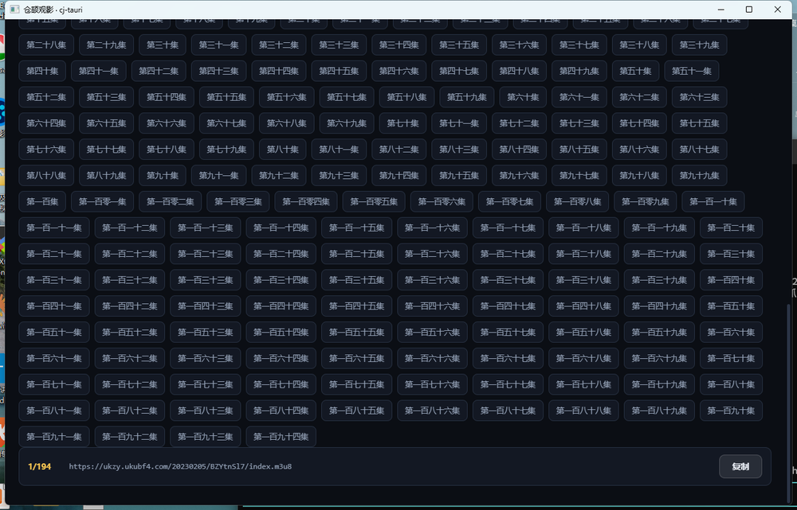

# 观影应用示例（examples/movie）

一个用 **cj-tauri** 写的 Windows PC 观影应用：榜单浏览 → 搜索 → 详情 → 播放，
一部片子还能在十来个播放源之间切换。后端是**仓颉**（静态编译），前端是**系统 WebView**（HTML/CSS/JS），
中间由 cj-tauri 的 IPC 桥接起来。影视数据来自开源接口服务 `http://49.235.52.102:8000`。


> 这篇 README 是**照着做**用的：先带你 5 分钟跑起来，再一步步拆开「这个示例是怎么搭出来的」，
> 最后是实机验收与两个真踩过的坑。想让自己的 cj-tauri 应用长成什么样，照着抄即可。

## 目录

- [1. cj-tauri 是什么：三件套](#1-cj-tauri-是什么三件套)
- [2. 5 分钟跑起来](#2-5-分钟跑起来)
- [3. 本例是怎么一步步做出来的](#3-本例是怎么一步步做出来的)
- [4. 前端怎么和仓颉说话](#4-前端怎么和仓颉说话)
- [5. 命令 ↔ 后台接口](#5-命令--后台接口)
- [6. 三个值得单独讲的设计](#6-三个值得单独讲的设计)
- [7. 实机验收](#7-实机验收)
- [8. 踩坑记录](#8-踩坑记录)
- [9. 文件](#9-文件)

## 1. cj-tauri 是什么：三件套

cj-tauri 是「仓颉后端 + 系统 WebView 前端」的混合开发框架，一个应用由三件东西拼起来。
本例把这三件都用上了，位置如下——**看懂这张表，后面每一步都只是填它**：

| 三件套 | 它负责什么 | 在本例里具体是 | 代码位置 |
| --- | --- | --- | --- |
| **WebView 宿主** | 开窗口、载入前端、注入桥 | 窗口 `仓颉观影 · cj-tauri` 1280×820，载入 `ui/index.html` | `src/main.cj` |
| **IPC 桥** | 前端 `invoke` ↔ 后端命令，双向传 JSON | 页面 `invoke("movie:list", {...})` → 仓颉发 HTTP → 结果回填 promise | `src/commands.cj` + `ui/index.html` |
| **能力白名单** | 不是写在代码里就等于放行，要显式授权 | `capabilities/default.json` 的 `commands` 数组 | `capabilities/default.json` |

一条硬规矩贯穿全例：**前端只经 `window.__CJ_TAURI__` 的 `invoke` / `listen` / `emit` 说话**，
页面里没有一处 `fetch`（为什么这么设计见 [§4](#4-前端怎么和仓颉说话)）。

## 2. 5 分钟跑起来

### 前置

- 仓颉 SDK **1.2.0**（含 stdx，路径里要有 `runtime/lib` / `bin` / `tools/bin` / `tools/lib`）；
  默认装在别处就设好 `CANGJIE_HOME`、`CANGJIE_STDX`（`run.bat` 认这两个变量）。
- Windows 10/11 + **WebView2 Runtime**（Win11 自带；本机实测 `122.0.2365.106`）。
- C 桥产物 `native/libcjtbridge.dll`：**本地产物不入库**，第一次跑之前先 `native\build_win.bat` 构建一次。

### 跑

```bat
examples\movie\run.bat
```

`run.bat` 做四件事：`cjpm build` → 把 SDK 运行时 / stdx / C 桥 / WebView2Loader 塞进 `PATH`
→ **切到 `examples\movie` 再启动**（应用按相对路径读 `capabilities\` 与 `ui\index.html`，工作目录必须是项目根）
→ 把应用 stderr 落到 `%TEMP%\cj-movie-app.log`，退出后自动摘出 `[movie]` 与 `[frontend]` 两类行。

`run.bat` 按项目规范保持**纯 ASCII**（cmd.exe 以 OEM 码页读 `.bat`，非 ASCII 字节会吞掉后续行）。

### 应该看到什么

| 画面 | 截图 |
| --- | --- |
| 首页榜单：6 个 tab + 主角位大图 + 卡片网格 + 加载更多 |  |
| 搜索：关键词进、结果出 |  |
| 详情：海报 / 评分 / 简介 / 演员 |  |
| 播放：`<video>` 真在播（HLS 经 hls.js） |  |
| 剧集：集数按钮（下标即集数）+ 当前集地址 + 复制 |  |

封面取不到的卡片会显示**生成式占位**（标题首字 + 按标题散列的色相渐变）——这是设计内的降级，不是破图。

## 3. 本例是怎么一步步做出来的

### 3.1 起工程：**先让脚手架生成骨架**，别手搓

起工程这件事不该手写——用框架自带的 CLI 生成骨架，它会连本机 SDK / stdx 路径一起写对：

```bat
:: Windows（Linux 同理，把 .bat 换成 cli/cj-tauri.sh）
D:\path\to\cj-tauri\cli\cj-tauri.bat create movie
cd movie
```

生成的工程长这样（`--template app` 为缺省，另有 `vue` / `react` 两个带 `ui/` 前端工程的模板）：

| 生成物 | 内容 |
| --- | --- |
| `cjpm.toml` | 构建配置：依赖框架 + 桥链接参数 + **本机 stdx 路径**（写入的是绝对路径） |
| `src/main.cj` | 入口：`WindowConfig` + 注册两个示范命令 + `run()` |
| `ui/index.html` | 前端页面（任意 Web 技术栈） |
| `capabilities/default.json` | 能力白名单骨架 |
| `README.md` / `.gitignore` | 工程说明 + 忽略 `target/` 等 |

两点要记住：

- **骨架是「本机绑定」的**：`create` 会把框架与本机 stdx 的**绝对路径**写进 `cjpm.toml`。
  换机器、换目录就要重跑 `create`，或手改 `cjTauri` 依赖路径——本例为了入仓，把它改成了
  相对路径 `../..`，这样克隆到任何机器都能直接编。
- **骨架自带两个示范命令**：`greet`（一问一答，演示返回值）和 `timer`（`ipc.emit` 定时推事件，
  演示后端主动推）。这两条正好覆盖 IPC 的两个方向，本例把它们换成了七个 `movie:*` 命令。

本例在这两处的位置长这样（`main()` 里那串 `movie:*` 注册，就是骨架里 `greet` / `timer` 的替换）：

```toml
[dependencies]
  cjTauri = { path = "../.." }        # 脚手架写的是绝对路径；本例入仓后改成相对路径

[target.x86_64-w64-mingw32]
  link-option = "-L../../native -lcjtbridge"          # Windows：链 C 桥
[target.x86_64-unknown-linux-gnu]
  link-option = "-L../../native -lcjtbridge -lwebkit2gtk-4.1 -lgtk-3 ..."   # Linux：再链 GTK/WebKit
```

`main()` 只干三件事——**配窗口、注册命令、把页面交给 `run()`**：

```cangjie
main(): Int64 {
    eprintln("[movie] main start")
    let winCfg = WindowConfig("仓颉观影 · cj-tauri", 1280, 820)   // 片单要横向排得开

    let app = TauriApp()
        .window(winCfg)
        .register("movie:list", MovieListCommand())                // ① 注册命令
        .register("movie:detail", MovieDetailCommand())
        // ... 其余命令同理

    let html = loadMovieUi()                                       // 读 ui/index.html
    eprintln("[movie] 前端页面已载入：${MOVIE_UI_PATH}（${html.size} 字节）")
    app.run(html)                                                  // ② 开窗口跑起来
    return 0
}
```

诊断一律走 **stderr**（`eprintln`）：仓颉 `println` 的 stdout 有缓冲，进程被强杀时日志会丢，
所以本项目的实机取证以 stderr 为准——`run.bat` 也正是把 stderr 落盘后再摘 `[movie]` / `[frontend]` 行。

#### 本例在骨架上的五处改造

`examples/movie` 与 `create` 生成的骨架**同构**（`cjpm.toml` / `src/` / `ui/index.html` /
`capabilities/default.json` 四个位置一一对应），业务代码是在它上面改出来的：

| 改造 | 从骨架的什么 → 变成什么 | 为什么 |
| --- | --- | --- |
| 1. 依赖路径 | 框架绝对路径 → `path = "../.."` | 入仓后任何人克隆都能编 |
| 2. 拆 `src/` | 单个 `main.cj` → `main.cj`（装配）/ `api.cj`（HTTP 层）/ `commands.cj`（七个命令） | 单一职责：业务一多，全塞 `main.cj` 会失控 |
| 3. 换前端 | 骨架的演示页 → 整页观影 UI（`ui/index.html`，无构建） | 前端是独立文件，才能 `node --check` 验语法（见 §3.4） |
| 4. 改能力清单 | 骨架的命令名 → 只留本例真的用到的 `movie:*` + `report` + `system:version` | 最小权限：清单里没声明的命令一律被拒 |
| 5. 加 `run.bat` | 骨架不带启动脚本（只有 `cjpm` 与 CLI 的 `dev` / `run`） | 仓内示例要能一键跑：拼 SDK 的 `PATH` + 切到项目根 + stderr 落盘 |

> 一句话记住顺序：**`create` 起骨架 → 拆 `src/` → 换页面 → 收窄能力清单 → 加启动脚本**。
> 这四个动作是所有 cj-tauri 应用共通的，只有第 2、3 步的深度不同。

### 3.2 加一个命令要动三处（漏一处就用不了）

这是 cj-tauri 最容易踩的规矩，也是理解「能力白名单」的最好入口。加 `movie:list` 为例：

**第 1 处——实现 `CommandHandler`**（`src/commands.cj`）：

```cangjie
public class MovieListCommand <: CommandHandler {
    public init() {}

    public func handle(cmd: String, args: JsonObject, ipc: IpcContext): JsonValue {
        let kind = argString(args, "kind", "hot")
        var path = ""
        match (movieListPathOf(kind)) {
            case Some(p) => path = p
            case None => throw CommandException("未知榜单 kind=\"${kind}\"（可选 hot/new/soon/top/week/us）")
        }
        // count 夹上限：页面传 100000 不该让后台去抓十万条（见 §3.3）
        return movieApiCall(path, Some(pagedBody(argInt(args, "start", 0), argInt(args, "count", 20), city))
        )
    }
}
```

`args` 是前端 `invoke` 传上来的 JSON 对象，返回值会被序列化成 JSON 回投给页面的 promise。
出错就用 `throw CommandException("...")`——它变成前端 `catch` 到的错误消息。

**第 2 处——在 `main()` 里注册**（见 §3.1）；**第 3 处——在能力清单里声明**（`capabilities/default.json`）：

```json
{
  "identifier": "default",
  "windows": ["main"],
  "commands": ["movie:list", "movie:search", "movie:detail", "movie:source",
               "movie:sourceitem", "movie:image", "report", "system:version"],
  "events": []
}
```

配套的两种报错正好是这两处的体检：

| 只做哪几处 | 运行时会看到 |
| --- | --- |
| 实现 + 声明，**忘了注册** | `command not registered` |
| 实现 + 注册，**忘了声明** | `command not allowed` |

例子：页面自检里故意调了一次没声明的 `movie:nope`，日志里那一条 `command not allowed` 就是**预期行为**——
它是「白名单真的在拦」的证据，不是故障。

### 3.3 页面可控的字符串，校验就放在命令层

页面传上来的东西全部不可信。本例有三个参数会**拼进 URL**，于是命令层各有一道白名单：

```cangjie
func isSafeSid(sid: String): Bool {          // sid 拼进路径 /api/v1/mvsource/<sid>
    if (sid.size == 0 || sid.size > 32) { return false }
    for (cp in sid) { if (cp < 48 || cp > 57) { return false } }   // 只放行数字
    return true
}
func isSafeSourceNote(note: String): Bool    // note 拼进查询串 ?note=<note>：只放行 a-z 0-9 _ -
func isSafeSourceAid(aid: String): Bool      // aid 只放行数字；单文件源（电影）合法取值是空串
```

不校验就等于给后台开了一个「任意路径 / 任意查询串」的入口（`../../` 之类）。
同类还有 `movie:image`：它的参数是**任意地址**，所以 `src/api.cj` 对图源做了白名单——
否则这个命令就是「让后端替你请求任意 URL」的 SSRF 跳板。

> 迭代 `String` 得到的是 `UInt32` 码点（不是 `Rune`），所以上面直接拿码点和 `48` / `57` 比。

### 3.4 前端四个视图，取数全部走桥

`ui/index.html` 是一整页单文件（无构建、无 Node）：Dark 影院风，
`首页榜单`（6 个 tab + 主角位 + 卡片网格 + 加载更多）、`搜索结果`、`详情`、`播放`。
页面里**没有一处 `fetch`**，连封面图都是经 `invoke("movie:image")` 取回来的（原因见 §6.1）。

**为什么前端是独立文件，而不是内联进仓颉的三引号字符串**（框架其他示例的写法）：
三引号字符串会处理反斜杠转义、`${}` 又和 JS 模板字面量同形——一整页 UI 塞进去必然踩坑
（`AGENTS.md` §4 有「整段 `<script>` 静默全灭」的实测记录）。独立成文件后，`node --check` 就能验语法。

## 4. 前端怎么和仓颉说话

只有三个 API，全挂在 `window.__CJ_TAURI__` 上：

```js
const r = await window.__CJ_TAURI__.invoke('movie:list', { kind: 'hot', start: 0, count: 20 });
// r 就是命令返回值（JSON）；被 CommandException 拒掉时这里会抛错，用 try/catch 接

window.__CJ_TAURI__.listen('插件名:事件名', (payload) => { ... });   // 后端推事件
window.__CJ_TAURI__.emit('事件名', { ... });                        // 前端发事件
```

两条实践建议：

- **等桥出现再初始化**。桥是宿主在 document start 注入的，但前端模块拿到 `window.__CJ_TAURI__`
  的时机并不保证——本例开头的 `waitForBridge()` 就是轮询等它出现，然后再跑页面逻辑。
  （Linux 侧如果注入晚于页面的 `<script type="module">`，模块作用域里直接读会拿到 `undefined`。）
- **`invoke` 的参数就是 JSON**，命名与仓颉侧 `args.get("...")` 一一对应；
  命令里的 `throw` 会变成这里的异常，所以业务级失败要**显式判**而不是只看有没有抛错
  （例：后台源不存在时回的是 HTTP 200 + `code:404`，见 §6.3）。

## 5. 命令 ↔ 后台接口

命令在 `src/commands.cj` 实现、`src/main.cj` 注册、`capabilities/default.json` 声明（三处缺一不可，见 §3.2），
后台路径与请求体在 `src/api.cj`。

| 命令 | 参数 | 后台接口 | 说明 |
| --- | --- | --- | --- |
| `movie:list` | `kind, start, count, city?` | `POST /api/v1/<kind>movie` | `kind` 取 `hot/new/soon/top/week/us`；只有 `hot`（hotmovie）要 `city` |
| `movie:search` | `q, start, count` | `POST /api/v1/searchmovie` | 关键词必填 |
| `movie:detail` | `id` | `POST /api/v1/detailmovie` | 返回片名、评分、简介、演员 |
| `movie:source` | `sid` | `GET /api/v1/mvsource/{sid}` | 播放源总表：**主源**的 `tvurls`（剧集各集）/ `urls`（电影线路），外加全 20 个源的元信息（`items[]` 全字段 / `sources[]` 精简版，`primary` 标出哪个是主源） |
| `movie:sourceitem` | `sid, note, aid?` | `GET /api/v1/mvsourceitem/{sid}?note=&aid=` | 切源用：某个具体源的完整 `tvurls`（按源 1–13KB）。`note` / `aid` 是页面可控串，命令层白名单（见 §3.3） |
| `movie:image` | `url` | —（取回图片字节） | 封面/海报/演员头像：仓颉侧带正确 `Referer` 取回，转 `data:` URL 交给页面（见 §6.1） |
| `report` | `line` | —（只打 stderr） | 页面侧结论回传，实机取证用 |
| `system:version` | — | — | 框架内置命令（前端自检第一句就调它） |

后台文档页 `docs_script.js` 指向的 `swagger/imovie.json` 是接口清单来源；`getmvmenus` /
`musicmenus` 这类菜单接口本示例未使用。

## 6. 三个值得单独讲的设计

### 6.1 封面图必须绕仓颉侧取（页面的 `` 永远出不来）

后台给的封面全是**防盗链**资源。实测（2026-10-05，同一张图对照）：

| 请求方式 | 结果 |
| --- | --- |
| `image.baidu.com/search/down?url=…` + `Referer: https://image.baidu.com/` | **200，26628 字节**，`image/jpeg` |
| 同一地址 + 其它 Referer（或不带） | **200，0 字节**（注意不是 4xx） |
| `img*.doubanio.com` 原图 + `Referer: https://movie.douban.com/` | 200，26628 字节 |
| 同一原图 + 不带该 Referer | 418 |

失败形状是「**HTTP 200 + 空 body**」——前端只能从 `` 的 `onerror` 知道它没成，
而页面**没法补救**：浏览器只允许用 `Referrer-Policy` *减少* Referer、不允许替换，
何况页面是宿主 `NavigateToString` 载入的（来源 opaque），根本发不出图源要的那个 Referer。

所以 `movie:image` 走仓颉侧：想带什么 Referer 就带什么头，取回字节转 `data:` URL 交给页面。
前端 `posterHtml()` 刻意**不给 `` 设 src**，地址放在 `data-cover` 里，
由「并发 4、同址去重、失败不留缓存」的取图队列去填；取不到就干净地留在一张
**生成式占位**（标题首字 + 按标题散列的色相渐变）上，而不是破图。
实机一轮（2026-10-06）38 次取图、30 次拿到字节，8 次是上游回 **HTTP 200 空 body**（含 `tv_default` 占位图）。

> 顺带一条教训：**同一个「看起来是网络问题」的现象，先分清 DNS / TLS / 跨域 / 防盗链哪一层**。
> 这里表面上是「跨域」，实际是「防盗链」；而 §6.2 里那个播不出来的源表面也是「跨域」，
> 实际是「域名解析不了」——三者修法完全不同。

### 6.2 HLS：WebView2 不原生支持，得靠 hls.js

后台给的多是 `.m3u8`，而 WebView2（Chromium）不原生支持 HLS，所以首次播放 m3u8 时
从 CDN（jsdelivr，失败回落 unpkg）取 `hls.js`；直链（mp4）走原生播放器，不联网取库。
离线环境下首页 / 搜索 / 详情照常可用，播放会明确提示「HLS 播放器加载失败」并列出地址。

**播放是可用的**（2026-10-06 实机，日志与截图同源）：主源 `uku` 的集地址域名
`ukzy.ukubf4.com` 解析正常，页面拿到 20:07 的 manifest 并播出画面
（`[frontend] HLS 交给 hls.js: https://ukzy.ukubf4.com/…/index.m3u8`，
播放器显示 `0:00–0:04 / 20:07`），点集数按钮也能换集（`切集：第 194 集 -> …`）。

但**别的源会失败**，而且失败形状各不相同——按源说，不能一句话概括整站：

| 源 | 集地址域名 | 实机结果 |
| --- | --- | --- |
| `uku`（主源） | `ukzy.ukubf4.com` / `ukzy.ukubf3.com` | **正常起播**（20:07，可切集） |
| `wwzy` 那个源 | `cdn.wlcdn99.com`（及 `:777`） | **解析不到**：DoH 查是 `NOERROR` 却**没有 A/AAAA/CNAME**，`curl` 报 `Could not resolve host` → hls.js `manifestLoadError` |
| 其它源 | `play.modujx10.com` / `play.modujx17.com` / `1080p.huyall.com` / `hd.kuktxu.com` 等 | 可正常拉起 |

注意 `cdn.wlcdn99.com` 那条**跟跨域无关**：页面是 opaque 来源、源站又没给 ACAO 时确实也报
同一个 `manifestLoadError`，但这条连 DNS 都没过。所以排查顺序应该是
「**先解析域名 → 再看 TLS → 最后看跨域**」，先动跨域配置会白折腾。
页面在失败时会说明「原因可能是域名解析、跨域限制或源站失效」并列出地址供复制到 VLC——
这是**提示语、不是判因结论**：真正哪一层坏了，看 §7 的日志与上面这张表。

### 6.3 一个接口两种形状：剧集 / 电影分流，以及「切播放源」

电视剧回的是 `urls: [""]`（占位空串）+ `tvurls: […]`，电影才在 `urls` 里有内容。
页面按「**`tvurls` 有值就是剧集**」分流：

- 剧集：播放器下方出「第一集 / 第二集 …」集数按钮（**下标即集数**，0 = 第一集；超过四位直接回阿拉伯数字），
  点集数即切集，下面一行跟着显示当前集的地址 + 复制；
- 电影：`tvurls` 为空、`urls` 有值，是原来的线路列表。

空串一律当位置占位丢掉，不当可播地址。

**播放源切换**（后台 2026-10-06 改版后新增的一层）：一部片子在后台往往挂着 **20 个源**
（不同站点、甚至同名不同版本，如「优酷 动漫 194 集」与「优酷 国产剧 30 集」），
而 `mvsource/{sid}` 返回的 `urls` / `tvurls` **只是主源那一份**——其余源的剧集要按 `note` + `aid`
现取（`movie:sourceitem`）。所以页面在剧集按钮**上方**加了「播放源」胶囊区（比剧集更外层的一层选择）：

- 胶囊写「源名 + 分类 + 集数」，同名两版本靠分类区分；`primary` 那个标「主源」并默认高亮；
- **只有一个源时整个区不显示**（电影实测只有 1 条源，没得选）；
- 点某个源即切：`movie:sourceitem{sid, note, aid}` → 拿到该源 `tvurls` → **保留当前集数**
  重渲染集数按钮并从同一集起播（新源集数不够就落到它最后一集），播放页标题也跟着换
  （切到极速那个源标题会变成《凡人修仙传 重制版》）；
- 失败一律显示在播放器上，不静默回退：源不存在时后台回 **HTTP 200 + `code:404` +
  `message:"source not found"`**（不是 4xx），所以页面判的是 `code`，不能只看 invoke 有没有被拒。

命中的三条实机证据（`%TEMP%\cj-movie-app.log`）：

```
[frontend] 切源请求：uku/348 保留第 30 集
[frontend] 切源成功：uku/348 -> 194 集，起第 30 集（标题 凡人修仙传）
[frontend] 切源被拒：nope/1 -> code=404 message=source not found
```

**页面自检**：加载后自动跑 `system:version`、首页榜单、详情，并做一次**未授权对照组**
（`movie:nope` 期望被能力校验拒掉）；结论在右下角面板可见，同时经 `report` 命令落到 stderr。

## 7. 实机验收

### 7.1 日志怎么读

看 `%TEMP%\cj-movie-app.log`（本项目以 stderr 为准——`println` 的 stdout 有缓冲，进程被强杀会丢）：

| 期望日志 | 说明 |
| --- | --- |
| `[movie] main start` | 装配到了 `main()` |
| `[cj-bridge] set window:` 一行 | 宿主窗口创建成功 |
| `[movie] 前端页面已载入：ui/index.html（N 字节）` | 页面读到了（N 应与磁盘字节数一致） |
| `[movie] /api/v1/hotmovie -> 200 ok bytes=…` | 页面点下去，请求经仓颉侧发出并拿到 200 |
| `[movie] image … -> 200 ok bytes=… image/jpeg` | 封面经仓颉侧取回（页面的 `` 直连取不到，见 §6.1） |
| `[frontend] …` | 页面侧自检结论（含未授权对照组被拒一行） |
| `[frontend] movie:source(…) 剧集模式：N 集，从第一集起播` | 剧集分流命中（`tvurls` 有值），集数按钮已渲染 |
| `[frontend] 切集：第 N 集 -> …` | 点了第 N 集的按钮（电影模式下不会有这行） |
| `[frontend] 切源请求：uku/348 保留第 N 集` | 点了「播放源」里的某个源（切到谁、保留第几集） |
| `[frontend] 切源成功：<note>/<aid> -> N 集，起第 M 集（标题 …）` | 切源拿到该源的剧集并起播（集数按钮已按新源重渲染） |
| `[frontend] 切源被拒：… code=404 message=source not found` | 该源后台没有（HTTP 200 + `code:404`），播放器上同时显示错误 |

一条真日志（2026-10-06，一次真实运行的开头）：

```
[movie] main start
[movie] 后台接口：http://49.235.52.102:8000（可用环境变量 CJ_MOVIE_API 覆盖）
[movie] 前端页面已载入：ui/index.html（63632 字节）
[cj-bridge] set window: title=仓颉观影 · cj-tauri 1280x820 hr=0x00000000
```

**取证的硬指标**：`hr=` 全为 `0x00000000`，日志里除**预期的那一条** `command not allowed`
（未授权对照组 `movie:nope`）之外没有别的拒绝/未注册报错。这两条比「窗口看起来能开」有用得多。

### 7.2 窗口里应该看到什么

卡片网格与主角位大图 → 点卡片进详情 → 点「立即播放」进播放页。
剧集会看到集数按钮组、当前集高亮，**上方还有一行「播放源」胶囊**（多源时才有，点一下即切源）；
电影看到线路列表。

### 7.3 上游接口现状（2026-10-05 实测，2026-10-06 复核）

| 接口 | 现状 |
| --- | --- |
| `hotmovie` / `soonmovie` / `topmovie` / `usmovie` / `detailmovie` | 可用（HTTP 200 + 数据） |
| `newmovie` / `weekmovie` | HTTP 200，但 `code=0` + `message=403 Forbidden`（上游限流） |
| `searchmovie` | 可用（HTTP 200 + 数据；实测关键词返回 20 条） |
| `mvsource/{sid}` | 可用（HTTP 200）。改版后只回**主源**的 `urls` / `tvurls`，另带 `items[]`（20 条全字段）/ `sources[]`（精简版，含 `primary`）；实测 `sid=35861087` 回 18738 字符 / 194 集（改版前同片是 ~139KB） |
| `mvsourceitem/{sid}?note=&aid=` | 可用（HTTP 200）。实测 `note=uku&aid=348` 10778 字符 / 194 集，`note=jszy&aid=25010` 1163 字符 / 21 集，`note=uku`（不带 aid）194 集。源不存在时**照样 HTTP 200**，靠 `code:404` + `message:"source not found"` 判 |
| `getmvmenus` | Request Timeout（未使用） |

因此页面把「业务级失败」（HTTP 200 但 `data` 为空）与「传输级失败」（503）**分开**显示：
前者露出后台的 `message`，后者给出可重试的提示，播放页还会把拿到的地址列出来供复制到系统播放器。

`mvsource` 改版的真实形状（2026-10-06 实测，`sid=35861087` 凡人修仙传）：`sid` 就取影视 `id`
（两者都是豆瓣 id），主源回 194 集；`items[]` / `sources[]` 列出全 20 个源
（`uku` 同名两版本 `348` / `58817`，`jszy` 21 集的《凡人修仙传 重制版》等）。
**能不能播是另一件事，而且要按源看**——主源正常起播，个别源的域名解析不了，
详见 [§6.2](#62-hlslwebview2-不原生支持得靠-hlsjs)。

## 8. 踩坑记录

写这个示例时真踩过的坑，按「会白折腾多久」排序：

### 8.1 仓颉 / stdx

- **`stdx.net.http` 的 `ClientBuilder` 不带默认 TLS**：发 https 请求直接抛
  `HttpException: TLS must be configured when HTTPS requests are sent.`。
  后台 API 是 `http://`，所以这条一直没暴露；封面是 `https://`，第一轮 54 次取图**全军覆没**。
  修法是显式挂 `TlsClientConfig()`（默认走系统证书库校验，别图省事关校验）：
  `ClientBuilder().tlsConfig(TlsClientConfig()).build()`。
- **`readToEnd(resp.body)` 编译不过**：它要求 `T: InputStream & Seekable`，而 `resp.body` 的静态类型
  只有 `InputStream`——得自己按块读到 EOF（`src/api.cj` 的 `readBodyBytes`）。
- **取响应头用 `resp.headers.getFirst("Content-Type")`**，**没有 `get`**；
  写成 `get` 会得到「enum pattern is not matched」这种指向不明的报错。
- **三引号字符串会处理反斜杠转义**（内联 HTML+JS 的示例必踩）：写 `\n` 会变成真换行，
  把 JS 字符串或单行注释拆断 → 整段 `<script>` 语法错误 → 页面里一行都不执行，而 stderr 毫无提示。
  本例因此把前端放成独立文件；内联写法里要避免反斜杠（换行用 `String.fromCharCode(10)`，
  正则改用 `indexOf`），改完用 `node --check` 验一遍。
- **迭代 `String` 得到 `UInt32` 码点**（不是 `Rune`）：参数白名单就是这么写的（见 §3.3）。

### 8.2 工程与工具链

- **工作目录 = 项目根**：`capabilities/`、`ui/` 都按相对路径读，启动器/脚本必须切到
  `examples/movie` 再启动应用，否则页面读不到（报错信息已把这条写进去）。
- **`.bat` 保持纯 ASCII**：cmd.exe 按 OEM 码页读 `.bat`，UTF-8 中文注释会吞掉后续行（实测踩过）。
- **C 桥产物不入库**：`native/libcjtbridge.dll` 是本地产物。拉取「改了 C 桥导出」的提交后要先重建桥
  再构建，否则会在**链接期**炸出一串 `undefined reference to cj_bridge_*`——那不是代码错。
- **应用进程名是 `<示例>/target/release/bin/main`**：实机取证时按包名 `pkill -f movie_app` 匹配不上，
  陈旧实例会继续往同一个日志写（上一轮旧输出混进本轮证据）。

### 8.3 取证本身也会骗人

- **日志过滤器带空格会把自己骗了**：按前缀取证据要用 `[cj-bridge]` 这样的**整行前缀**，
  不要用会在正文里撞词的中缀——本项目有过「过滤词带空格 → 一条都没匹配上 → 误读成没有失败」的实测。
- **抓屏会冻住 UI 几秒**：别在「命令进行中」抓屏，否则会污染「心跳是否中断」这类证据。
- **判断失败在哪一层再动手**：见 §6.1 / §6.2 两条——表面都是「跨域」，实际分别是防盗链与 DNS。

## 9. 文件

```
examples/movie/
  cjpm.toml                  # 应用包（依赖框架 + stdx，各平台 link-option）
  capabilities/default.json  # 能力白名单：commands 与 §5 表格一一对应
  run.bat                    # Windows 启动脚本（纯 ASCII）
  src/main.cj                # 装配：窗口配置 → 注册命令 → 读页面 → run()
  src/api.cj                 # HTTP 传输层（TLS / Referer / 按块读流）+ 榜单路径映射 + 图源白名单
  src/commands.cj            # 七个命令 + 参数读取/校验助手
  ui/index.html              # 前端单页（HTML + CSS + JS，无构建；取图队列、生成式占位、
                             #   剧集集数按钮、播放源切换、自检面板）
```

想从零起一个自己的应用（而不是改本例），可以用脚手架：
`cli\cj-tauri.bat create <名字> --template app|vue|react`，
生成的工程自带内联页面的最小样板（`app`）或 `ui/` 前端工程（`vue` / `react`）。
