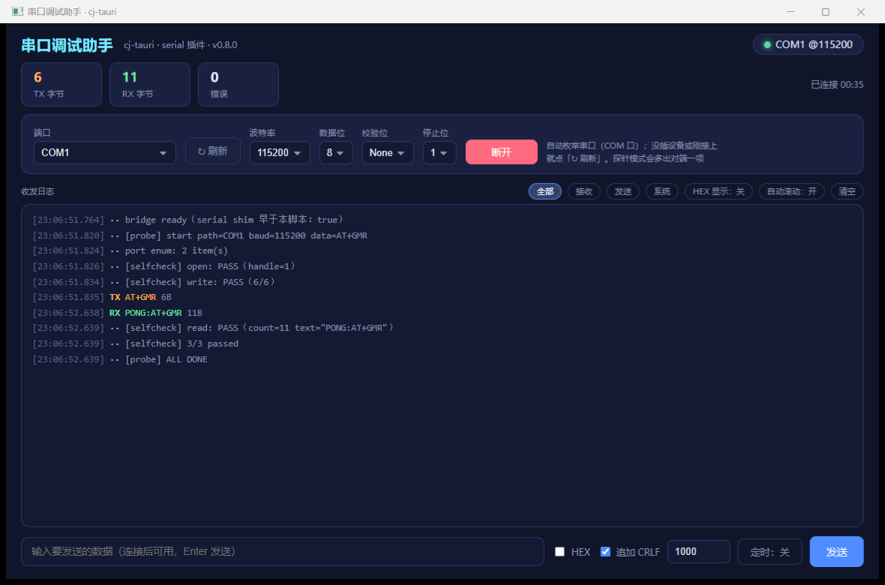

# 串口调试助手（serial-assistant）

cj-tauri 官方 `serial` 插件的业务向示例：**端口下拉自动枚举**（`serial:list`，↻ 刷新）+
参数面板（波特率 / 数据位 / 校验 / 停止位）+ TX/RX 分色收发日志（时间戳、字节数、HEX 显示、按方向过滤）+
收发计数与连接态 + 发送区（HEX、「追加 CRLF」、**定时发送**、Enter 直发）。
由 `cj-tauri create serial-assistant --template app` 起骨架，再一行 `.plugin(SerialPlugin())` 接入。



上图是 Windows 实机（COM1↔COM2 虚拟串口对）：右上角是连接态与已连时长，左上角是 TX/RX 计数与错误数；
日志区里 `[probe]` 一轮 `open / write / read` 三条自检全 PASS，TX/RX 分色带时间戳与字节数；
下方发送区是 HEX、追加 CRLF、定时发送与 Enter 直发。

## 怎么跑

```bash
cd examples/serial-assistant
cjpm build
bash run.sh        # Linux：pty 造虚拟串口对端，探针自动跑一轮 收→发→收 自检并断言
run.bat            # Windows：PowerShell 造对端，8 条断言（需先有 COM1/COM2 这样一对口）
run.bat manual     # Windows：不带探针、不起对端，开窗手测（关窗即退出）
```

手动模式：直接 `cjpm run`（工作目录必须是本示例根），从「端口」下拉选设备（下拉由 `serial:list`
自动枚举；没插设备或刚接上点「↻ 刷新」）→ 连接 → 收发。

Windows 侧串口桥**已实机跑通**（2026-10-10，COM1↔COM2 虚拟对，`run.bat` rc=0、8/8 断言全绿）：
枚举走 C 桥 `QueryDosDeviceW`，open 用 `CreateFileW("\\.\COMx", …, FILE_FLAG_OVERLAPPED)` 独占打开、
读写按 `WaitForSingleObject` 的剩余预算控制（超时不报错，返回 `count=0`）。

## 探针环境变量

设 `CJ_SERIAL_PROBE_PATH` 即进探针模式（配置经 document-start 预执行脚本注入页面）：
`CJ_SERIAL_PROBE_BAUD` / `_DATA` / `_READ_MS` / `_QUIT(0|1)`（默认 1：跑完自退；0：保持连接便于截图）。
探针对端（pty）不算「本机串口」，会额外补进端口下拉便于复现。

`_QUIT=0` 是「展示轮」：探针跑完一轮后**不关连接**，窗口留在「已连接」态，方便抓图或对着界面讲——
它同样会接上接收循环，对端之后推来的帧照样落进 RX 日志（2026-10-10 修：此前展示轮只在
`connect()` 里起接收循环，探针自己连的口没接上，窗口看着「已连接」却一个字节都收不到）。


