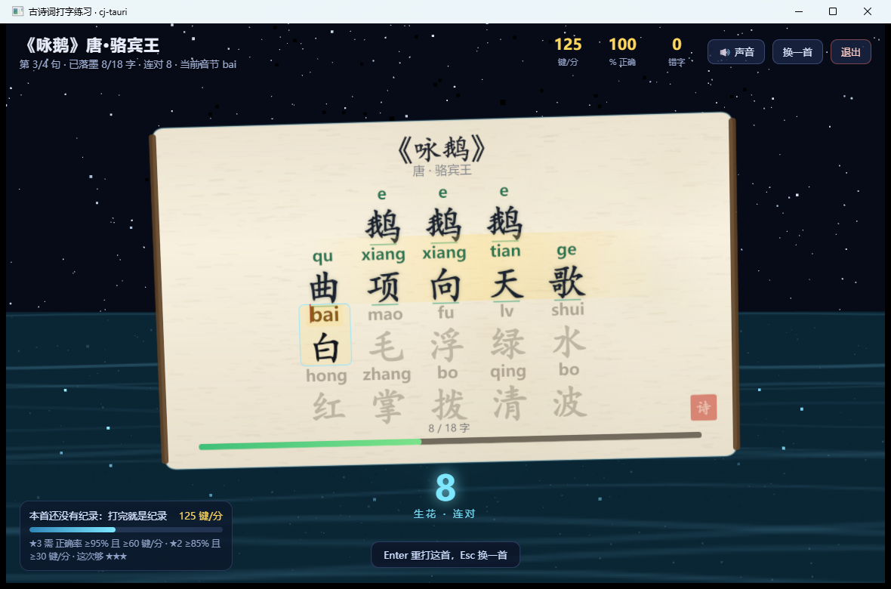
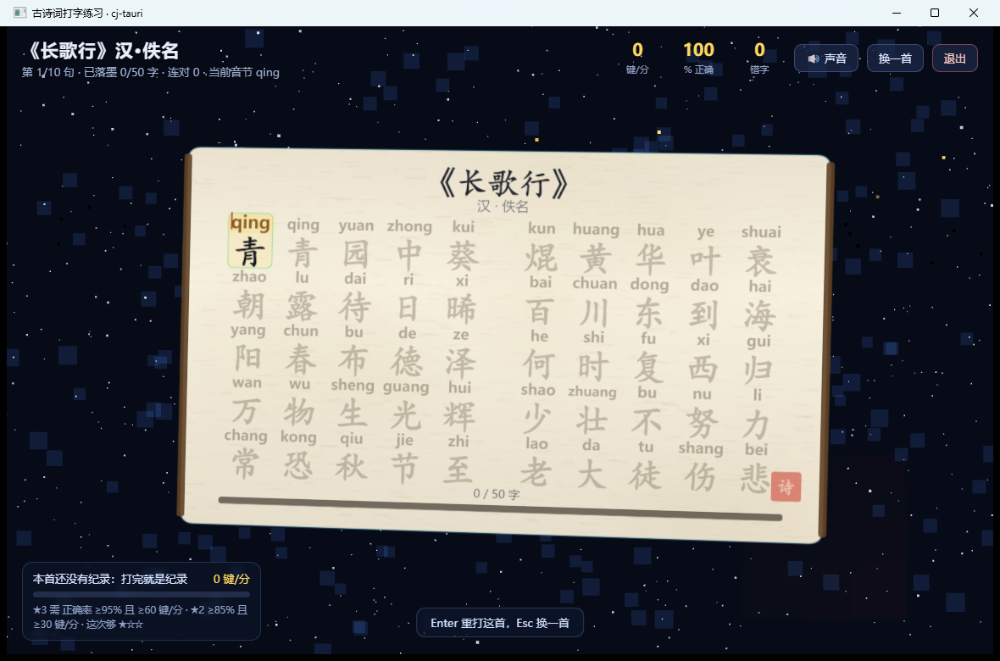

# 古诗词打字练习示例（examples/typing-poem）

一个用 **cj-tauri** 写的 Windows PC 打字练习小游戏：屏幕上一张 3D 古诗词卡片，
每个汉字上方标着拼音，小朋友照着拼音敲键盘——打对一个字就点亮一个字、冒一点星光，
整首打完放礼花、结算速度与正确率。后端是**仓颉**（静态编译），前端是**系统 WebView**（HTML/CSS/JS），
3D 场景与卡面由 **three.js** 画出来。


> 这篇 README 是**照着做**用的：先带你 5 分钟跑起来，再讲玩法与几个值得单独拎出来的实现细节，
> 最后是实机验收办法、素材来源与两个真踩过的坑。
> 想连「为什么这么设计」一起看，可以读同主题的实战文章
> [`docs/仓颉版Tauri-打字游戏实战.md`](../../docs/仓颉版Tauri-打字游戏实战.md)。

## 目录

- [1. 给孩子用，所以有这么几条取舍](#1-给孩子用所以有这么几条取舍)
- [2. 5 分钟跑起来](#2-5-分钟跑起来)
- [3. 玩法：怎么打、怎么算星](#3-玩法怎么打怎么算星)
- [4. 命令 ↔ 页面](#4-命令--页面)
- [5. 三个值得单独讲的实现细节](#5-三个值得单独讲的实现细节)
- [6. 实机验收与两个验收钩子](#6-实机验收与两个验收钩子)
- [7. 素材从哪来（108 首）](#7-素材从哪来108-首)
- [8. 踩坑记录](#8-踩坑记录)
- [9. 文件](#9-文件)

## 1. 给孩子用，所以有这么几条取舍

这个示例的技术难点不多，**取舍**才是它的主体。每一条都对着一个「小学生练打字会怎样」的具体场景：

| 取舍 | 为什么 | 落在哪 |
| --- | --- | --- |
| **正确率与速度都要，正确率优先** | 打字练习最容易变成「乱敲求快」。三星要求正确率 ≥95% **且** 速度 ≥60 键/分，二星才放宽到 85% / 30 | `src/commands.cj` 的 `starsFor()` |
| **汉字要大到不费力** | 一屏 18–50 个字要读得清。字号随行数自适应，长诗自动分栏（下面 §5.3） | `ui/index.html` |
| **拼音逐字对位** | 「这个字读什么」不能靠猜。拼音画在每个字的正上方，当前字加金框 | `ui/index.html` 的 `cardPoint()` |
| **只跟自己比** | 成绩按「一首诗」存自己的历史最好，不排行、不联网、不上传 | `src/commands.cj` 的 `ScoreStore` |
| **只认字母键** | 不做输入法、不判大写锁定、不弹「你打错了」的窗口——敲错就是连击清零、继续 | `ui/index.html` |
| **离线可跑** | 诗库与 three.js 都在本地，全程不发一个网络请求 | `src/poems.cj` + `ui/vendor/three.min.js` |

## 2. 5 分钟跑起来

### 前置

- 仓颉 SDK **1.2.0**（含 stdx）；默认装在别处就设好 `CANGJIE_HOME`、`CANGJIE_STDX`（`run.bat` 认这两个变量）。
- Windows 10/11 + **WebView2 Runtime**（Win11 自带；本机实测 `122.0.2365.106`）。
- C 桥产物 `native/libcjtbridge.dll`：**本地产物不入库**，第一次跑之前先 `native\build_win.bat` 构建一次。

### 跑

```bat
examples\typing-poem\run.bat
```

`run.bat` 做三件事：`cjpm build` → 把 SDK 运行时 / stdx / C 桥 / WebView2Loader 塞进 `PATH`
→ **切到 `examples\typing-poem` 再启动**（应用按相对路径读 `capabilities\` 与 `ui\index.html`），
退出后自动摘出日志里的 `[typing]` / `[cj-bridge]` / `[frontend]` 三类行。

诊断一律走 **stderr**，落在 `%TEMP%\cj-typing-poem.log`：仓颉 `println` 的 stdout 有缓冲，
进程被强杀时日志会丢，所以本项目的实机取证以 stderr 为准。
`run.bat` 按项目规范保持**纯 ASCII**（cmd.exe 以 OEM 码页读 `.bat`，非 ASCII 字节会吞掉后续行）。

还有一个人眼验收用的姿势——**指定某一首直开**它的卡片，跳过选诗面板：

```bat
set CJ_TYPING_POEM=changgexing
examples\typing-poem\run.bat
```

`changgexing` 是诗 id（见 `src/poems.cj`，如 `yonge` / `jingyesi` / `youziyin`）；写错 id 会退回选诗面板。

### 应该看到什么

| 画面 | 截图 |
| --- | --- |
| 选诗面板：108 首按难度排开，右侧淡金滚动条；有纪录的诗显示「最好 ★3 · 130 键/分」 |  |
| 打字中：当前字金框 + 拼音、已落墨的字变深、句末有星点、HUD 报速度与正确率 |  |
| 结算：星级 + 评语 + 速度/正确率/用时/最长连对，并按「星级优先、同级看速度」判破纪录 |  |
| 长诗换版式：《长歌行》10 行自动排成 **5+5 两栏**，字不缩、行不串 |  |

上面的截图都是本机 Windows 实机（WebView2）跑出来的原图，不是示意图。
卡片背后的场景随诗换（《咏鹅》是绿水白鹅、《静夜思》是月夜），没有专属场景的落回通用「墨卷星云」。

## 3. 玩法：怎么打、怎么算星

一轮的流程是：**选诗 → 照拼音敲 → 整首打完结算**。

- 卡片上每个汉字上方标着拼音（如 `qu` `xiang`），**当前字**是金色方框 + 放大的拼音。
- 敲对一个**音节**：这个字立刻「落墨」（变深色）、冒一点星光、HUD 里的连对 +1；
  整句打完还有一次句末的高潮（一串浮起的 3D 文字）。
- 敲错一个键：**连击减半、错字 +1**，然后继续——不弹窗、不打断、不清零重来。
- `Enter` 重打这首，`Esc` 换一首，右上角「退出」关窗口。

结算面板给三样东西：星级、一句评语、以及速度 / 正确率 / 用时 / 最长连对。星级门槛（`starsFor()`）：

| 星级 | 门槛 | 用意 |
| --- | --- | --- |
| ★★★ | 正确率 **≥95%** 且 速度 **≥60 键/分** | 又快又准才算满星 |
| ★★ | 正确率 **≥85%** 且 速度 **≥30 键/分** | 先求稳 |
| ★ | 其余 | 打完就是成绩 |

纪录按「一首诗」存自己的历史最好，判据是**星级优先、同级看速度**（正确率已经含在星级门槛里）。
所以结算里会出现两句话：「本首第一次练习：成绩已记下，下次就来追它」/「新纪录！」——
成绩写在本机文件 `typing-scores.local.json`（相对项目根，`.gitignore` 里按 `*.local.json` 排除），
刷页面也不会丢。

## 4. 命令 ↔ 页面

命令在 `src/commands.cj` 实现、`src/main.cj` 注册、`capabilities/default.json` 声明
（三处缺一不可，这是 cj-tauri 的硬规矩）。

| 命令 | 参数 | 回什么 | 说明 |
| --- | --- | --- | --- |
| `poem:list` | — | 诗库数组（id / 标题 / 作者 / 朝代 / 逐字拼音 / 难度星级） | **素材在仓颉侧**，页面不自带一份，两边不会漂移 |
| `score:list` | — | `{诗 id → 记录}` | 选诗面板显示「最好 ★3 · 130 键/分」 |
| `score:save` | `id, title, seconds, correct, errors, syllables` | `updated / attempts / stars / kpm / accuracy / bestStars / bestKpm / persisted` | 结算时调一次。`correct` / `errors` 计的是**键数**（不是字数）：正确率 = `correct/(correct+errors)`、速度 = `correct×60/seconds`；`seconds` 必须是**浮点**（截成整数会把「一秒内打完」算成 0 键/分） |
| `typing:config` | — | `selfCheck / startPoem / scoresPath / three / poems` | 页面启动先问「这次是什么模式」（见 §6） |
| `report` | `line` | `true` | 页面把自检结论回传，仓颉侧打 stderr——端到端取证通道 |
| `typing:quit` | — | `true` | 页面「退出」按钮 → `app.quit()` |
| `system:version` | — | 版本号 | 框架内置命令，页面自检第一句就调它 |
| `poem:nope` | — | 应报错 | **刻意留的负面对照**：清单里声明了、但没有注册，日志里那句 `command not registered` 是「闸门真的在工作」的证据，不是故障 |

页面侧只经 `window.__CJ_TAURI__` 的 `invoke` / `listen` / `emit` 说话，页面里没有一处网络请求。

## 5. 三个值得单独讲的实现细节

### 5.1 three.js 为什么要走 `addInitScript()`，而不是 `<script src>`

卡片、星光、礼花都由 three.js 画（`ui/vendor/three.min.js`，**r160 UMD**，670 KB，随仓入库）。
注入方式不是页面里写 `<script src="vendor/three.min.js">`，而是仓颉侧的

```cangjie
app.webviewHost().addInitScript(three)   // document-start 注入，排在桥 JS 之后
```

原因在于本示例的页面是 `app.run(html)` 的**内联来源**（Windows 下由 `NavigateToString` 载入，
**没有真实来源、origin 是 opaque 的**），于是两种常规做法都不成立：

| 常规做法 | 为什么不成立 |
| --- | --- |
| `<script src="vendor/three.min.js">` | 没有 base URL，相对路径取不到 |
| ES module（`import ... from './three.module.js'`） | opaque / `file:` 来源下被 CORS 拦 |

而 `addInitScript()` 是框架现成的 document-start 通道（插件 `jsShim()` 走的就是它）：
整份 UMD 注入后页面里 `window.THREE` 直接可用，两平台语义一致，且**离线可跑**（不走 CDN）。
这也是选 **r160** 的原因——它是最后一个带 UMD 构建的版本（`three@0.161+` 只剩 ESM）。
许可证随仓入库在 `ui/vendor/three.LICENSE.txt`（MIT）。

### 5.2 卡面几何只有一套坐标

放大卡面、改字号这件事最容易变成「改了一处、看着对、点着不对」。本示例把卡面的所有位置
收在一组函数上：`rowTop()` / `pinyinBaseY()` / `charBaseY()` / `vScale()`，**画纹理的 `paintCard()`
与判命中的 `cardPoint()` 共用这一套**；`cardPoint()` 再按**纹理坐标**换算回世界坐标。
好处很直接：`charPx` 从 100 调到 156、格子从 250 调到 300，都只动常量，不会出现「金框在这儿、
要点在别处」。

### 5.3 长诗分栏：门槛不是写死的行数

《长歌行》10 行、《敕勒歌》7 行七言——行数一多，单栏就得缩字，缩到看不清就失去意义了。
所以分栏的判据不是「超过 N 行就分栏」，而是**「两栏各算一遍，取字更大者」**：
单栏算一次字号、分栏算一次字号，谁的字大用谁。实测在本机 1180×780 下，
单栏分界到 94 个音节左右、更长就转两栏（`poems.cj` 里最长的几首因此是 5+5 / 4+3 的排布）。

还有一个 WebView2 特有的坑让「每帧自检视口」成了必需品：建 WebView 时视口是**临时尺寸**
（实测 961×1032），窗口随后定到 1180×780 却**没有 `resize` 事件送到页面**。所以页面不是等事件，
而是每帧比对视口（`fitViewport()`），尺寸不对就重排——只等 `resize` 的写法在本例里会一直是错的版式。

## 6. 实机验收与两个验收钩子

### 6.1 无人值守自检：`run.bat selfcheck`

```bat
examples\typing-poem\run.bat selfcheck
```

它会设 `CJ_TYPING_SELFCHECK=1`，页面据此进入自检模式：**自己把《咏鹅》从头打完**
（走的是同一套打字逻辑，不是「跳过」），每条断言的结论经 `report` 命令打到 stderr 的 `[frontend]` 行，
跑完自己退出。有 `FAIL` 行时 `run.bat` 以**退出码 2** 收场，便于挂进脚本。

当前 **57 条断言**，覆盖四类：

| 类别 | 断言例子 |
| --- | --- |
| 素材不漂移 | 每句的汉字数与音节数一一对齐；第一首是《咏鹅》，难度星级在 1..3；星级门槛显示副本与仓颉侧一致 |
| 桥通路 | `score:save 回投了星级与成绩`；`score:list 返回 JSON 对象`；成绩已落盘（`persisted=true`） |
| 玩法手感 | 敲错时连击**减半**而不是清零；打完一整句触发句末高潮；浮起的是真的 3D 文字；世界随输入推进一幕 |
| 版式 | 单栏 / 两栏的判据与仓颉侧一致；滚动条的样式确实被浏览器认了 |

一次 `run.bat selfcheck` 的真实日志（`%TEMP%\cj-typing-poem.log`，原样摘录）：

```
[typing] main start
[typing] three.js 已注册为预执行脚本（669884 字节，r160 UMD）
[typing] 前端页面已载入：ui/index.html（107962 字节）
[cj-bridge] set window: title=古诗词打字练习 · cj-tauri size=1180x780
[typing] typing:config -> 自检（window=main）
[typing] poem:list -> 108 首（window=main）
[typing] score:save 《咏鹅》 用时 0.900000s 正确率 94.500000% 速度 3291.100000 键/分 星级 2 破纪录=false 第 2 次 落盘=true
[frontend] 自检结束：57 passed, 0 failed, 用时 3.2s
```

（自检是无人值守跑的，所以速度和用时是机器的高速值；人手打同一首见上方结算截图：24.0s / 100% / 130 键/分 / ★★★。）

**取证的硬指标**两条：桥的每次宿主调用都回 `hr=0x00000000`（`WebView2 runtime` /
`CreateCoreWebView2EnvironmentWithOptions` / `NavigateToString` / `ExecuteScript` 各一行）；
日志里除**预期的那一条** `command not registered`（负面对照 `poem:nope`）之外没有别的拒绝 / 未注册报错。
这两条比「窗口看起来能开」有用得多。上一次对交付版本跑自检的结果是 **57 passed / 0 failed**。

### 6.2 人眼验收钩子：`CJ_TYPING_POEM=<诗 id>`

版式好不好看，几何断言只能证明「放得下、不重叠」，证明不了「字够大、不串行」。所以留了这个钩子：
设好环境变量再跑，开窗就是那一首的卡片，截图可以归档对比（本 README 里的《长歌行》两栏图就是这么来的）。

三条**如实说明**：

1. 长诗分栏目前只**人眼看过少数几首**（《长歌行》10 行等），其余靠几何断言兜着；
2. 拼音只做了「**汉字数与音节数逐字对齐**」的机器校验，**读音没有逐字人工校对**（多音字按常见读法标）；
3. 本示例**只在 Windows（WebView2）实机跑过**，Linux（WebKitGTK）侧未验证。

另外两条已知限制：音节只认 26 个字母键，不处理输入法与大写锁定；成绩只看「这一首」，没有跨诗的排行。

## 7. 素材从哪来（108 首）

诗库在 `src/poems.cj`（488 行，**108 首 / 2996 个音节**），每首是一个 `Poem`：
`id` / `title` / `author` / `dynasty` / `lines`（逐字拼音与汉字一一对应）。
清单取自公开的**「小学生必背古诗词 75 首」**与**「部编版小学语文 1–6 年级古诗词汇总」**两份列表，
去重后 108 首——覆盖的正是小学生课内会背的那一批（《咏鹅》《静夜思》《长歌行》《敕勒歌》…），
所以「打字练习」和「背诗」是同一件事，不用另外找素材。

启动时会跑一遍 `checkPoemData()`：**逐字比对汉字数与拼音音节数**，对不上就在 stderr 里报出来
（「X 首 / Y 音节」和对不上的位置）——写错诗库的代价是小朋友卡在那一个字上，所以宁可启动就喊。

## 8. 踩坑记录

### 8.1 一个**静默**的存分 bug（真踩过）

症状是「成绩忽然再也存不下去」，而且**日志里一个字都没有**。根因是同一个字段的**读写口径不一致**：

| 环节 | 单位 |
| --- | --- |
| 落盘 JSON 里的 `bestAccuracy` | **百分比**（94.5） |
| 读回来当作「分数」去比较 | **0..1**（应该是 0.945） |

于是每存一轮，旧值就被当成 0..1 放大 100 倍，一路涨到 `9.63e15`；此时 `round1()` 里
`Int64(x * 10.0)` 的转换**溢出抛异常**（仓颉里是抛异常、不是回绕），`score:save` 从此每次抛错——
而且当时那两处 catch 只回 `reject`、不打日志，所以前端只是「结算面板不显示新纪录」，
后台一声不响。前 11 次写入全都「成功」，靠自检的 PASS 发现不了。

修法是两件事：**读写同口径**（内部一律用 0..1，只在吐给页面 / 落盘时 ×100），
以及 `round1()` 前对越界值与 `NaN` 兜底（页面可控的 `seconds` 是最容易送进坏数的地方）。

> 教训可以带走：**同一字段跨边界时要问一句「这一边是什么单位」**；
> 以及**「没有报错日志」不等于「没出错」**——静默的失败比报错的失败贵得多。

### 8.2 cmd 的 `set` 会把 `&&` 前的空格吃进变量值

人眼验收那条钩子（§6.2）我用脚本起了好几次，一直看到的是**选诗面板**而不是指定的那首诗。
日志里唯一的线索是这一行——注意括号里的**尾空格**：

```
[typing] typing:config -> 指定诗（yonge ）（window=main）
```

原因是我把启动命令拼成了 `set CJ_TYPING_POEM=yonge && call run.bat`：cmd 的 `set` 会把 `&` 之前的
**所有字符（含空格）**都算进值里，于是 id 成了 `"yonge "`——页面按「id 不存在就退回选诗面板」的约定
（这条约定本身是对的）静默退回。正确写法是与 `&&` 之间**不留空格**：

```bat
set CJ_TYPING_POEM=yonge&& examples\typing-poem\run.bat
```

### 8.3 抓图与取证的三个坑

- **前台 bash 起的 GUI 进程会被会话收掉**（表现为日志没有 `host destroyed` 就不动了），
  要让它跨调用存活得用 WMI 创建进程；抓图本身用 `PrintWindow` 抓窗口，不抓整屏。
- **不点击，按键根本不进页面**：窗口即使在前台，WebView 内容区也需要一次点击才拿得到键盘焦点。
  但**点击的位置要挑**——落在选诗面板上就等于替用户选了一首诗（我第一次就误开了《池上》）。
  安全的落点是顶部 HUD 那一条（远离卡片与按钮）。
- **`CJ_TYPING_SELFCHECK=1` 跑出来的成绩会留在 `typing-scores.local.json` 里**（无人值守跑得快，
  会留下「3828.2 键/分」这种假数据）。要给人看的面板截图，先把成绩文件挪开再来。

其余通用坑（**工作目录 = 项目根**、`.bat` 保持**纯 ASCII**、C 桥产物不入库等）与
`examples/movie` 完全相同，见那份 [README](../movie/README.md) 的 §8，这里不重复。

## 9. 文件

```
examples/typing-poem/
  cjpm.toml                  # 应用包（依赖框架 + stdx，各平台 link-option）
  capabilities/default.json  # 能力白名单：commands 与 §4 表格一一对应
  run.bat                    # Windows 启动脚本（纯 ASCII；支持 run.bat selfcheck）
  README.md                  # 本文件
  src/main.cj                # 装配：窗口配置 → 注册命令 → 读页面与 three.js → run()
  src/packed_resources.cj    # 内嵌资源取用（base64 解码 / 内嵌优先 / 逗号切分），单文件包用
  src/packed_assets.cj       # 内嵌资源常量：仓库里为空存根（⇒ 读盘），打包脚本覆盖成 base64
  src/poems.cj               # 诗库（108 首 / 2996 音节）+ 星级 + 启动自检 checkPoemData()
  src/commands.cj            # 六个命令 + 成绩存储 ScoreStore + 星级门槛 + 两个验收钩子
  ui/index.html              # 前端单页：样式 + three.js 场景 + 打字逻辑（无构建）
  ui/vendor/three.min.js     # three.js r160 UMD（随仓入库）
  ui/vendor/three.LICENSE.txt# 它的 MIT 许可证
  typing-scores.local.json   # 本机成绩（运行后生成；.gitignore 排除，不入库）
```

想从零起一个自己的应用（而不是改本例），用脚手架：
`cli\cj-tauri.bat create <名字> --template app|vue|react`。
想先把「cj-tauri 是怎么用的」读一遍，见 [`docs/仓颉版Tauri-打字游戏实战.md`](../../docs/仓颉版Tauri-打字游戏实战.md)。

## 10. 单文件打包（一个 exe 发出去）

`scripts/pack-win-single.sh` 把本示例打成**一个 exe**（仓颉运行时 / std / stdx 静态链接、C 桥静态归档、
loader 与页面全部内嵌），目标机不需要仓颉 SDK、也不需要任何随行文件：

```bash
bash scripts/pack-win-single.sh                       # 在仓根执行，默认打本示例
bash scripts/pack-win-single.sh examples/typing-poem   # 也可以显式指定
```

产物 `examples/typing-poem/dist-single/typing-poem.exe`——**这份 exe 随仓库分发**（不装 SDK 也能直接拿到），
`work/` 临时构建副本与 `*.WebView2/` 用户数据不入库。实测（2026-10-07，Windows）：

| 指标 | 值 |
|---|---|
| 体积 | 28.8 MB → strip 后 **5.5 MB** |
| 子系统 | **GUI**（`--subsystem=windows`）：双击不弹控制台黑窗口 |
| 导入表 | 只剩系统库：msvcrt / KERNEL32 / SHELL32 / dbghelp / comdlg32 / USER32 / ole32 / WS2_32 |
| 内置自检 | `[frontend] 自检结束：57 passed, 0 failed, 用时 3.6s` |
| 内嵌资源 | 页面 107962 字节、three.js 669884 字节（**与源文件逐字节吻合**） |
| 桥日志 | `set window: title=古诗词打字练习 · cj-tauri size=1180x780`、`ExecuteScript -> hr=0x00000000` |

自己复验：双击 exe，或按 §6.1 的自检钩子（先 `set CJ_TYPING_SELFCHECK=1` 再启动），stderr 会给出上表那几行。
实现细节与踩到的两条坑（`WebView2LoaderStatic.lib` mingw 链不上、mingw `swprintf` 的 `%s` 是 `char*`）
见 [`docs/使用文档.md`](../../docs/使用文档.md) §11 与 `AGENTS.md` §4。
